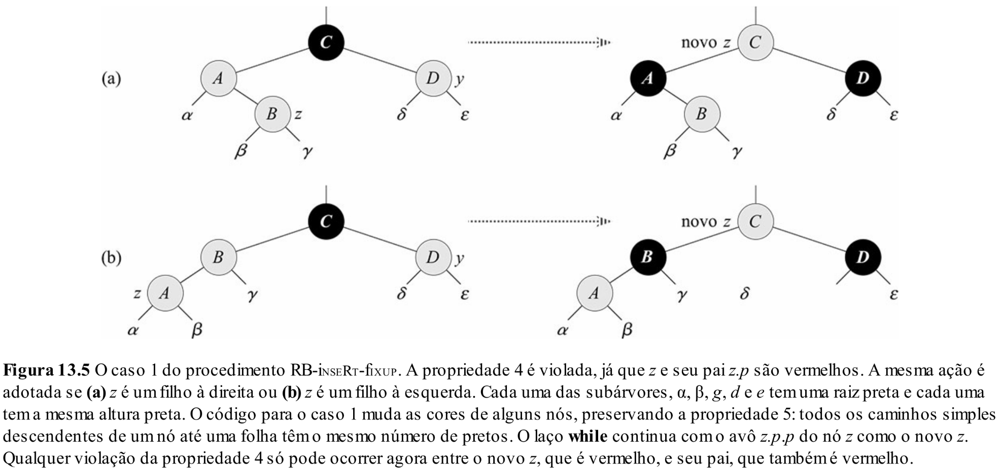
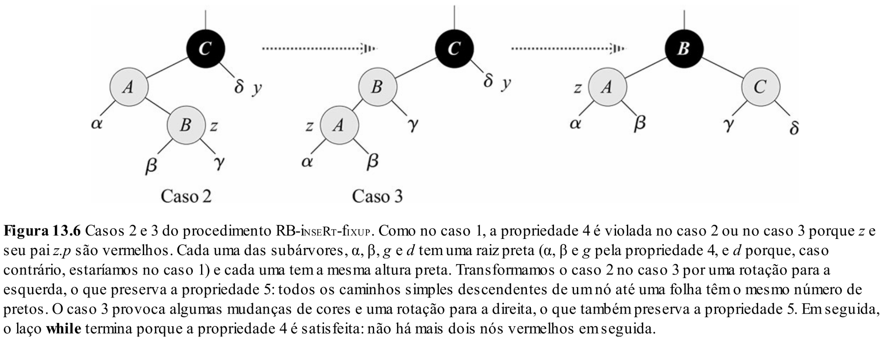

# Aula 22: Árvores RBT - Árvores Rubro-Negras

## 1. Introdução

Árvores **rubro-negras** (RBT) são um outro exemplo de árvore **balanceada**.
E, naturalmente, surge uma pergunta:

> **Por que estudá-las, se já temos as árvores AVL?**

### AVL: Balanceamento Rígido

- Árvores AVL exigem um **balanceamento muito rígido** entre as subárvores esquerda e direita.
- Isso implica que, a cada inserção ou remoção, podemos ter que fazer **várias rotações** para manter o equilíbrio.
- **Lado bom**: Isso torna as **buscas muito eficientes**.
- **Lado ruim**: Mas encarece operações de **inserção** e **remoção**.

### RBT: Balanceamento Flexível

- Árvores rubro-negras adotam uma estratégia de **balanceamento mais relaxado**.
- **Lado bom**: Isso reduz o número de rotações necessárias em inserções e remoções.
- **Lado ruim**: Como consequência, **as buscas podem ser um pouco mais lentas**, já que a árvore pode ficar mais desbalanceada que uma AVL.

### Na prática

- Mesmo com essa diferença, **ambas** garantem operações com **complexidade $O(\log(n))$**.
- A vantagem das RBTs está nas **constantes envolvidas**, que tornam as operações de modificação **mais baratas** na prática.
- Por isso, **estruturas padrão de bibliotecas** usam RBTs:
  - `std::map`, `std::set` em **C++**
  - `TreeMap`, `TreeSet` em **Java**

## 2. Árvores Rubro-Negras

Entendemos que, teoricamente, as árvores rubro-negras (RBTs) são mais permissivas em relação à diferença de altura entre subárvores. Mas afinal:

> **O que é uma árvore rubro-negra e como funciona seu balanceamento na prática?**

Uma árvore rubro-negra é uma **árvore binária de busca** com uma informação adicional em cada nó: sua **cor**, que pode ser **vermelha** ou **preta**.

A ideia é usar essa informação para impor restrições estruturais que mantêm a árvore **aproximadamente balanceada**.

Veremos mais adiante que, graças a essas restrições, nenhuma rota da raiz até uma folha pode ser mais do que **duas vezes maior** do que qualquer outra.  
Assim, a estrutura assegura que as operações básicas continuem com tempo **O(log n)** no pior caso.

Cada nó possui os seguintes atributos:

- `cor`: vermelha ou preta
- `chave`
- `esquerda`
- `direita`
- `pai`

Quando um filho ou pai não existe, seu ponteiro aponta para um **nó sentinela `NIL`**, que representa as folhas externas da árvore.

### 2.1 Propriedades

Uma árvore rubro-negra obedece às seguintes propriedades (restrições estruturais):

1. Todo nó é **vermelho** ou **preto**
2. A **raiz** e os **nós folha (`NIL`)** são sempre **pretos**
3. Se um nó é **vermelho**, então seus filhos **são pretos** (não há dois vermelhos consecutivos)
4. Todos os caminhos de um nó até qualquer folha contêm o **mesmo número de nós pretos**

> Para evitar verificações adicionais e facilitar a implementação, todos os ponteiros nulos são substituídos por **nós `NIL` pretos**.

### 2.2 Exemplo


### 2.3 Nó `NIL`

Por conveniência, usa-se uma **única sentinela `NIL`** para representar todas as folhas externas.
Essa sentinela tem:
- Cor **preta**
- Atributos `pai`, `esquerda`, `direita`, `chave`: com valores arbitrários

### 2.4 Altura Preta

A **altura preta** de um nó `x`, denotada por `bh(x)`, é o número de nós **pretos** em qualquer caminho simples de `x` até uma folha, **sem contar o próprio `x`**.

> Pela propriedade 4, todos os caminhos de um nó até uma folha têm a **mesma altura preta**.  
> A **altura preta da árvore** é a altura preta da **raiz**.

### 2.5 Qual é a altura máxima de uma RBT com `n` nós?

Como em árvores AVL, queremos saber quão eficiente é a RBT em termos de altura.
Como ela é mais flexível, pode ser mais "alta" - mas o quanto mais alta?

Vamos usar a seguinte abordagem:

> **Qual o número _mínimo_ de nós internos necessários para que uma RBT enraizada em `x` tenha altura preta `bh(x)`?**

#### Casos base:

- `bh(x) = 0` → 0 nós (só o NIL)
- `bh(x) = 1` → 1 nó (a raiz)
- `bh(x) = 2` → 3 nós (raiz + dois filhos)

#### Recorrência:

A árvore mais compacta ainda precisa respeitar a propriedade 4, então:

$$N(bh) = 1 + 2 \cdot N(bh - 1)$$

Isso gera:

$$N(bh) = 2^{bh} - 1$$

#### Consequência: Altura x Número de Nós

Como no máximo **metade dos nós em qualquer caminho** podem ser vermelhos, temos:

- $h \le 2 \cdot bh$
- $n \ge 2^{bh} - 1 \Rightarrow 2^{bh} \le n + 1$

Aplicando logaritmo:

$$bh \le \log(n + 1)$$
$$h \le 2 \cdot \log(n + 1)$$

Logo, a altura máxima de uma RBT com `n` nós é $h \le 2 \cdot \log(n + 1)$.

## 3. Inserção

Vimos que, enquanto a árvore rubro-negra respeitar as 4 propriedades, ela permanece aproximadamente balanceada.

A grande questão é:

> **Como garantir que essas propriedades sejam mantidas após cada inserção?**

### 3.1 O Primeiro Dilema: Qual a cor do novo nó?

Sabemos que **todo nó** deve ser **vermelho** ou **preto** (Propriedade 1). Quando inserimos um novo nó, qual cor devemos atribuir?

Vamos analisar as opções:

- Se o nó for **preto**:
  - Irá **quebrar a propriedade 4** (altura preta), já que um novo preto altera os caminhos.
  - **Exceto** se a árvore estiver vazia (único caso onde o preto não quebra a propriedade 4).
  
- Se o nó for **vermelho**:
  - **Preserva a propriedade 4**.
  - Pode **violar a propriedade 3**, se o pai também for vermelho.
  - Se for a raiz, **viola a propriedade 2** (raiz deve ser preta).

✅ **Decisão comum**: inserir **nós vermelhos** por padrão. Se houver violações, reequilibramos depois.

### 3.2 Interpretação Intuitiva

Pense assim:

> 🔴 **Nós vermelhos são instáveis**,  
> ⚫ **Nós pretos são estáveis**

Quando inserimos um nó vermelho, estamos adicionando uma instabilidade local. Se essa instabilidade gerar conflito (como dois vermelhos seguidos), precisamos "estabilizar" a estrutura com rotações e recolorações.

### 3.3 Rebalanceando a Árvore

Regras para rebalanceamento após inserir um **nó vermelho `z`**:

- Se a árvore estiver vazia, `z` vira a **raiz** → colorimos `z` de **preto** (corrige a propriedade 2)
- Se o **pai de `z` for preto**, tudo está bem (todas as propriedades continuam válidas ✅)
- Se o **pai de `z` for vermelho**, temos um conflito com a propriedade 3 ❌

Nessa última situação, existem **3 casos básicos** a tratar — e seus espelhamentos:

| Situação                         | Ação principal         |
|----------------------------------|-------------------------|
| Tio de `z` é vermelho            | Recoloração             |
| Tio de `z` é preto, `z` é à direita | Rotação à esquerda      |
| Tio de `z` é preto, `z` é à esquerda| Rotação à direita       |

**Nota:** São 6 casos no total (3 no lado esquerdo e 3 espelhados no lado direito). A seguir, vamos detalhar o caso geral em que `z` está na subárvore esquerda.

### 3.4 Caso 1: Tio é vermelho



Temos a seguinte configuração:
- O nó `z` foi inserido como vermelho
- O pai de `z` (`p`) também é vermelho
- O tio de `z` (`y`) é **vermelho**

→ Isso **viola a propriedade #3**: um nó vermelho não pode ter filhos vermelhos.

Mas observe:
- A árvore estava balanceada **antes** da inserção de `z`
- O **avô** de `z` (`g`) é preto, pois o pai e o tio são vermelhos e essa era uma árvore válida

**Intuição**:
Neste cenário, temos **dois nós instáveis (vermelhos)** diretamente abaixo de um nó estável (preto).  
A ideia é que o "conflito" de instabilidade pode ser **"elevado" para cima**, redistribuindo as cores.

**Solução**:
- Colorimos `p` e `y` de **preto**
- Colorimos `g` (o avô) de **vermelho**

Isso faz com que:
- `z` agora tenha pai preto → não há mais conflito
- O número de nós pretos **permanece igual** em todos os caminhos
- Porém, `g` agora é vermelho e pode estar sob um pai também vermelho…

→ **Ou seja**, o problema foi **"empurrado para cima"**: talvez ainda tenhamos que corrigir acima, repetindo o processo recursivamente.

### 3.5 Caso 2: Tio é preto e `z` é filho à direita



Agora temos:
- `z` é vermelho
- `p` é vermelho
- O tio (`y`) é **preto** (ou nulo)
- **`z` é filho direito de `p`**, e `p` é filho esquerdo de `g`

**Intuição**:
Neste cenário, o conflito entre `z` e `p` não pode ser resolvido diretamente como no caso anterior, pois o tio está estável e não temos "espaço" para subir a instabilidade.

Mas o caso **não está simétrico**: a instabilidade está "torta", com `z` pendendo para o lado direito.

**Solução**:
- Fazemos uma **rotação à esquerda em `p`**  
  → Isso transforma o caso em **Caso 3** (simétrico e mais fácil de lidar)
- Após a rotação, atualizamos o ponteiro de `z` para apontar para o antigo pai

Agora, `z` está na posição de filho **à esquerda**, e podemos resolver como no próximo caso (3.6).

### 3.6 Caso 3: Tio é preto e `z` é filho à esquerda

Cenário:
- `z` e seu pai `p` são vermelhos
- O tio `y` é preto (ou nulo)
- `z` é filho à esquerda de `p`, e `p` é filho à esquerda de `g`

**Intuição**:
Aqui temos um caso simétrico e mais "direto" de resolver.  
- O tio está estável (preto), ou seja, não vai causar problemas se redistribuirmos instabilidade.
- Temos instabilidade apenas no lado esquerdo (`z` e `p` vermelhos em sequência), o que permite uma correção **local**.

**Solução**:
1. **Rotação à direita** no avô `g`
2. **Troca de cores** entre `p` e `g`:
   - `p` vira **preto** (estável)
   - `g` vira **vermelho** (instável, mas agora está sob um pai preto ou na raiz)

Essa ação resolve localmente o problema:
- `z` agora tem pai preto → propriedade 3 restaurada
- A altura preta não muda → nenhuma violação da propriedade 4
- A instabilidade foi "resolvida" sem subir na árvore

> Pensando em termos de estabilidade: como o lado do tio está firme, conseguimos reorganizar a árvore de forma que a instabilidade desapareça **sem precisar propagá-la para cima**.

### 3.7 Algoritmo (Rascunho)

```cpp
void fixInsert(Node** root, Node* z) {
    while (z->parent != nullptr && z->parent->color == RED) {
        if (z->parent == z->parent->parent->left) { // pai é filho da esquerda
            Node* y = z->parent->parent->right; // tio
            if (y->color == RED) {
                // Caso 1: pai e tio são vermelhos → sobe a instabilidade
                z->parent->color = BLACK;
                y->color = BLACK;
                z->parent->parent->color = RED;
                z = z->parent->parent;
            } else {
                if (z == z->parent->right) {
                    // Caso 2: z é filho à direita → precisa girar para formar o caso 3
                    z = z->parent;
                    rotateLeft(root, z);
                }
                // Caso 3: z é filho à esquerda com tio preto → rotação e recoloração
                z->parent->color = BLACK;
                z->parent->parent->color = RED;
                rotateRight(root, z->parent->parent);
            }
        } else {
            // Casos simétricos: pai é filho à direita
            // ...
        }
    }

    // Garante que a raiz é preta (propriedade #2)
    root->color = BLACK;
}
```