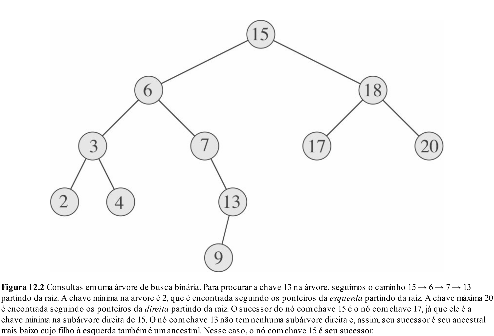
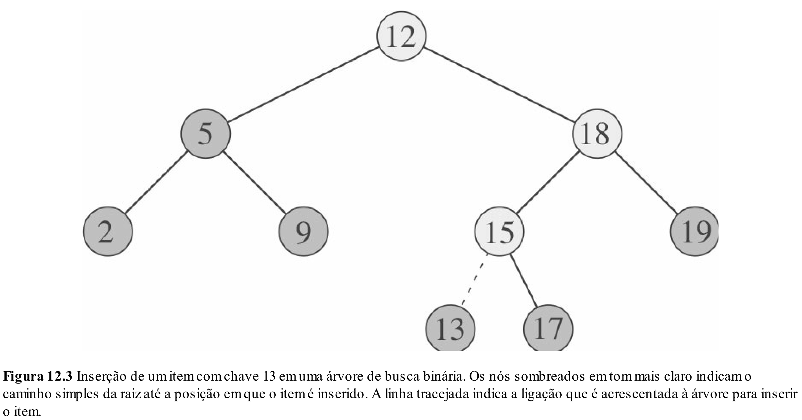
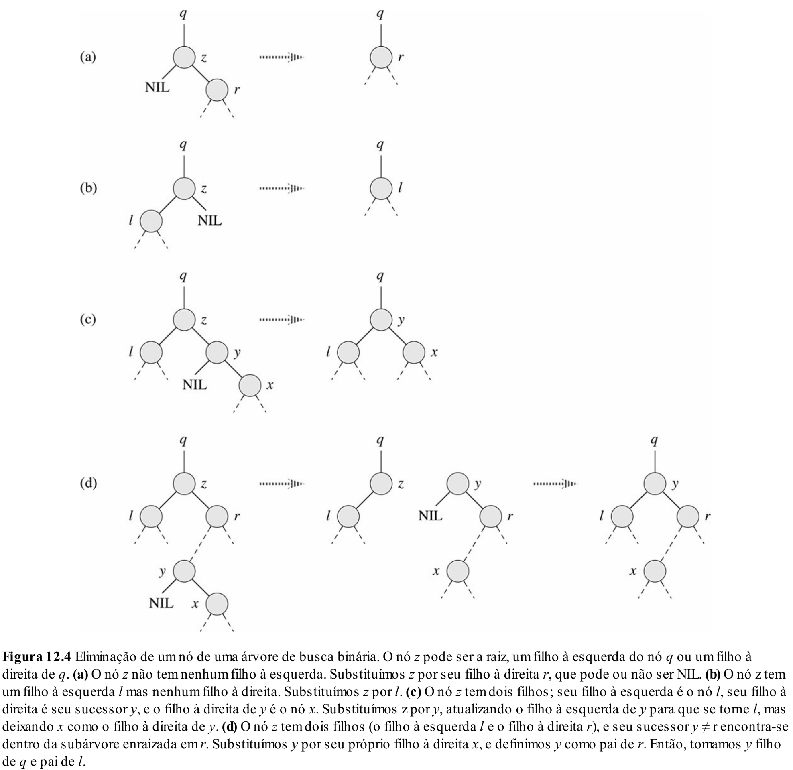

# Aula 19: Árvores Binárias de Busca (BST)

## 1. Motivação

### 1.1. De pilhas, filas e listas para busca eficiente

Até agora, estudamos algumas estruturas de dados fundamentais:

* **Pilha**: boa quando queremos acessar/remover sempre o último elemento inserido.
* **Fila**: boa quando queremos acessar/remover sempre o primeiro elemento inserido.
* **Lista**: boa quando queremos manter uma sequência flexível de elementos, com inserções e remoções por ponteiros.

Essas estruturas resolvem muitos problemas importantes. Porém, existe uma classe de problemas em que a principal pergunta é outra:

> Como guardar elementos de modo que seja rápido verificar se um valor existe, inserir novos valores e remover valores antigos?

Esse tipo de problema aparece em vários TADs e aplicações práticas.

### 1.2. Conjuntos, dicionários e índices

#### Conjunto

Um **conjunto** armazena elementos sem repetição.

Exemplos:

* Verificar se um CPF já está cadastrado.
* Verificar se uma matrícula pertence à turma.
* Verificar se uma palavra aparece em uma coleção.
* Manter o conjunto de usuários ativos em um sistema.

Operações típicas:

* `insert(x)`: inserir o elemento `x`.
* `remove(x)`: remover o elemento `x`.
* `contains(x)`: verificar se `x` pertence ao conjunto.

#### Dicionário / Mapa

Um **dicionário**, ou **mapa**, associa uma chave a um valor.

Exemplos:

* Matrícula → dados do aluno.
* CPF → cadastro da pessoa.
* Código do produto → informações do produto.
* Palavra → número de ocorrências no texto.
* Login → dados do usuário.

Operações típicas:

* `put(key, value)`: inserir ou atualizar uma chave.
* `get(key)`: buscar o valor associado a uma chave.
* `remove(key)`: remover uma chave.

#### Índices

Outro exemplo importante é o conceito de **índice**, que aparece em disciplinas de banco de dados.

Em uma tabela de banco de dados, poderíamos procurar um registro percorrendo todas as linhas. Mas isso seria caro para tabelas grandes.

Por exemplo, imagine uma tabela de alunos:

| matrícula | nome   | curso               |
| --------- | ------ | ------------------- |
| 1021      | Ana    | Ciência de Dados    |
| 1057      | Bruno  | Matemática Aplicada |
| 1093      | Carla  | Ciência de Dados    |
| 1120      | Daniel | Matemática Aplicada |

Se quisermos buscar rapidamente o aluno de matrícula `1093`, não queremos percorrer a tabela inteira sempre.

Um índice é uma estrutura auxiliar que mantém uma organização sobre uma ou mais chaves para acelerar buscas.

A ideia geral é:

> Em vez de procurar diretamente em todos os dados, usamos uma estrutura auxiliar que nos guia rapidamente até o dado desejado.

BSTs simples não são a principal estrutura usada em bancos de dados reais. Bancos de dados normalmente usam estruturas como **B-Trees** e **B+ Trees**, que são mais adequadas para disco e grandes volumes de dados.

Mesmo assim, a motivação é parecida:

> Organizar as chaves para reduzir o número de comparações necessárias durante a busca.

#### Autocomplete

Outro exemplo é o **autocomplete**.

Quando digitamos parte de uma palavra, queremos encontrar rapidamente palavras que começam com aquele prefixo.

Por exemplo:

```text
comp → computação, computador, compilador, complexidade
```

Nesse caso, a estrutura mais clássica costuma ser uma **Trie**, não uma BST simples.

Mesmo assim, esse exemplo reforça uma ideia importante:

> Muitas aplicações precisam de estruturas organizadas para acelerar buscas.

A BST é uma das primeiras estruturas que estudamos com esse objetivo.

### 1.3. A pergunta central

A pergunta central desta aula é:

> Como implementar buscas, inserções e remoções de forma eficiente?

Para responder isso, vamos comparar algumas estruturas que já conhecemos.

## 2. Limitações das estruturas anteriores

### 2.1. Comparação de custos

| Estrutura          |    Busca |        Inserção | Remoção | Comentário                                                            |
| ------------------ | -------: | --------------: | ------: | --------------------------------------------------------------------- |
| Lista não ordenada |     O(n) |            O(1) |    O(n) | Inserir é fácil, mas buscar exige percorrer a lista                   |
| Lista ordenada     |     O(n) |            O(n) |    O(n) | A ordem ajuda conceitualmente, mas ainda precisamos percorrer nó a nó |
| Vetor não ordenado |     O(n) | O(1) |    O(n) | Inserção no fim é barata, mas busca é linear                          |
| Vetor ordenado     | O(log n) |            O(n) |    O(n) | Busca binária é rápida, mas inserir/remover pode exigir deslocamentos |

A melhor busca que vimos até agora aparece no **vetor ordenado**, usando **busca binária**.

A busca binária é eficiente porque, a cada comparação, eliminamos metade dos elementos restantes.

Porém, existe um problema: manter um vetor ordenado é caro.

Se quisermos inserir um novo elemento em um vetor ordenado, talvez seja necessário deslocar muitos elementos para abrir espaço. O mesmo acontece ao remover um elemento.

### 2.2. O conflito

Temos então um conflito:

* Se usamos uma lista ou vetor não ordenado, inserir pode ser fácil, mas buscar é O(n).
* Se usamos um vetor ordenado, buscar é O(log n), mas inserir e remover são O(n).

A pergunta passa a ser:

> Existe uma estrutura que mantenha a ideia da busca binária, mas seja mais flexível para inserções e remoções?

A resposta é: **árvore binária de busca**.

## 3. Definição de BST

### 3.1. Ideia central

Uma **árvore binária de busca**, ou **BST** (*Binary Search Tree*), tenta combinar duas ideias:

1. A eficiência da busca binária.
2. A flexibilidade de uma estrutura baseada em nós e ponteiros.

Em vez de guardar os elementos em posições consecutivas de um vetor, guardamos os elementos em nós de uma árvore.

Cada nó possui:

* uma chave;
* um ponteiro para o filho esquerdo;
* um ponteiro para o filho direito.

A regra fundamental é:

> Para cada nó, todos os valores da subárvore esquerda são menores que o valor do nó, e todos os valores da subárvore direita são maiores que o valor do nó.

Ou seja:

* esquerda: valores menores;
* direita: valores maiores.

Essa regra deve valer para todos os nós da árvore, não apenas para a raiz.

### 3.2. Exemplo

```text
      8
     / \
    3   10
   / \    \
  1   6    14
     / \   /
    4   7 13
```

Analisando a árvore:

* Todos os valores à esquerda de `8` são menores que `8`.
* Todos os valores à direita de `8` são maiores que `8`.
* Todos os valores à esquerda de `3` são menores que `3`.
* Todos os valores à direita de `3` são maiores que `3`.
* O mesmo vale recursivamente para todos os nós.

Essa propriedade é o que permite fazer buscas eficientes.

## 4. Estrutura da ABB em C++

Antes de implementar as operações, vamos definir a estrutura geral da nossa árvore binária de busca.

Como estamos usando programação orientada a objetos, vamos encapsular a árvore em uma classe `BinarySearchTree`.

A classe terá:

* uma `struct Node` interna, representando cada nó da árvore;
* um atributo `root`, apontando para a raiz;
* métodos públicos, como `insert`, `contains` e `remove`;
* métodos privados auxiliares, que recebem ponteiros para nós específicos.

```cpp
class BinarySearchTree {
private:
    struct Node {
        int key;
        Node* left;
        Node* right;
        Node* parent;

        Node(int value) {
            key = value;
            left = nullptr;
            right = nullptr;
            parent = nullptr;
        }
    };

    Node* root;

    Node* search(Node* node, int x);
    Node* minimum(Node* node);
    Node* maximum(Node* node);
    Node* insert(Node* node, int x);
    Node* successor(Node* node);
    void transplant(Node* u, Node* v);
    void remove(Node* z);

public:
    BinarySearchTree() {
        root = nullptr;
    }

    bool contains(int x);
    void insert(int x);
    int minimum();
    int maximum();
    void remove(int x);
};
```

Essa estrutura separa a interface pública da árvore dos detalhes internos da implementação.

Por exemplo, quem usa a classe não precisa manipular diretamente ponteiros para nós. A pessoa apenas chama operações como:

```cpp
BinarySearchTree tree;

tree.insert(8);
tree.insert(3);
tree.insert(10);

if (tree.contains(3)) {
    cout << "Valor encontrado" << endl;
}
```

Nas próximas seções, vamos mostrar apenas a implementação dos métodos relevantes.

## 4. Operações de consulta

### 4.1. Busca em uma BST

A primeira operação importante é a busca.

A imagem abaixo ilustra a busca em uma BST:



Vamos buscar o valor `7` na árvore abaixo:

```text
      8
     / \
    3   10
   / \    \
  1   6    14
     / \   /
    4   7 13
```

Começamos pela raiz:

1. `7 < 8`, então vamos para a esquerda.
2. `7 > 3`, então vamos para a direita.
3. `7 > 6`, então vamos para a direita.
4. Encontramos `7`.

O ponto importante é que não precisamos olhar todos os nós.

A cada comparação, descartamos uma subárvore inteira.

#### Algoritmo de busca

```cpp
Node* BinarySearchTree::search(Node* node, int x) {
    if (node == nullptr || node->key == x) {
        return node;
    }

    if (x < node->key) {
        return search(node->left, x);
    } else {
        return search(node->right, x);
    }
}

bool BinarySearchTree::contains(int x) {
    return search(root, x) != nullptr;
}
```

A busca segue apenas um caminho da raiz até algum nó da árvore.

Por isso, seu custo é:

```text
O(h)
```

onde `h` é a altura da árvore.

Se a árvore estiver balanceada, `h` será aproximadamente `log n`.

Nesse caso, a busca será `O(log n)`.

Se a árvore estiver muito desequilibrada, `h` pode ser `n`.

Nesse caso, a busca será `O(n)`.

### 4.2. Mínimo e máximo

A propriedade da BST também permite encontrar o menor e o maior valor de forma simples.

#### Mínimo

O menor valor da árvore está o mais à esquerda possível.

```text
      8
     / \
    3   10
   / \    \
  1   6    14
     / \   /
    4   7 13
```

Para encontrar o mínimo:

1. Começamos na raiz.
2. Enquanto existir filho à esquerda, seguimos para a esquerda.
3. Quando não houver mais filho à esquerda, encontramos o menor valor.

No exemplo, o mínimo é `1`.

```cpp
Node* BinarySearchTree::minimum(Node* node) {
    Node* current = node;

    while (current->left != nullptr) {
        current = current->left;
    }

    return current;
}

int BinarySearchTree::minimum() {
    Node* minNode = minimum(root);
    return minNode->key;
}
```

#### Máximo

O maior valor da árvore está o mais à direita possível.

A lógica é análoga:

```cpp
Node* BinarySearchTree::maximum(Node* node) {
    Node* current = node;

    while (current->right != nullptr) {
        current = current->right;
    }

    return current;
}

int BinarySearchTree::maximum() {
    Node* maxNode = maximum(root);
    return maxNode->key;
}
```

Essas operações também custam `O(h)`.

## 5. Inserção

### 5.1. Ideia da inserção

A inserção em uma BST é parecida com uma busca.

A diferença é que, em vez de parar quando encontramos o valor, seguimos até encontrar uma posição vazia.

A imagem abaixo ilustra a inserção em uma BST:



Podemos pensar assim:

> Inserir em uma BST é fazer uma busca que falha e colocar o novo nó no ponto onde a busca terminou.

### 5.2. Exemplo: inserir o valor 5

Árvore inicial:

```text
      8
     / \
    3   10
   / \    \
  1   6    14
     / \   /
    4   7 13
```

Queremos inserir `5`.

1. `5 < 8`, vamos para a esquerda.
2. `5 > 3`, vamos para a direita.
3. `5 < 6`, vamos para a esquerda.
4. `5 > 4`, vamos para a direita.
5. A posição está vazia. Inserimos `5` ali.

Resultado:

```text
      8
     / \
    3   10
   / \    \
  1   6    14
     / \   /
    4   7 13
     \
      5
```

### 5.3. Código de inserção

```cpp
Node* BinarySearchTree::insert(Node* node, int x) {
    if (node == nullptr) {
        return new Node(x);
    }

    if (x < node->key) {
        Node* leftChild = insert(node->left, x);
        node->left = leftChild;
        leftChild->parent = node;
    } else if (x > node->key) {
        Node* rightChild = insert(node->right, x);
        node->right = rightChild;
        rightChild->parent = node;
    }

    return node;
}

void BinarySearchTree::insert(int x) {
    root = insert(root, x);
}
```

Observações:

* Esse código não permite chaves duplicadas.
* Se `x == root->key`, a função não insere nada.
* A função retorna a raiz da árvore após a inserção.
* O custo da inserção também é `O(h)`.

## 6. Altura e complexidade

### 6.1. Por que a altura importa?

Até agora, todas as operações principais dependem da altura da árvore:

| Operação | Custo |
| -------- | ----: |
| Busca    |  O(h) |
| Mínimo   |  O(h) |
| Máximo   |  O(h) |
| Inserção |  O(h) |

Isso significa que a BST só será eficiente se a altura for pequena.

### 6.2. Altura mínima e máxima

Considere uma BST com `n` nós.

A menor altura possível ocorre quando a árvore está o mais cheia e balanceada possível.

Se usamos a convenção de que uma árvore com apenas a raiz tem altura `0`, então:

```text
altura mínima ≈ log2(n + 1) - 1
```

Mais precisamente:

```text
h_min = ceil(log2(n + 1)) - 1
```

A maior altura possível ocorre quando a árvore degenera, isto é, quando cada nó tem apenas um filho.

Nesse caso, a árvore se comporta como uma lista encadeada.

```text
h_max = n - 1
```

Assim, para uma BST com `n` nós:

```text
ceil(log2(n + 1)) - 1 <= h <= n - 1
```

De forma simplificada, podemos dizer:

```text
log(n + 1) - 1 <= h <= n - 1
```

Portanto, a altura pode variar muito dependendo do formato da árvore.

### 6.3. Árvore relativamente balanceada

```text
        8
      /   \
     3     10
    / \      \
   1   6      14
      / \     /
     4   7   13
```

Nesse caso, a altura é pequena em relação ao número de nós.

A busca se parece com busca binária.

Se a árvore tiver altura próxima de `log n`, as operações custam `O(log n)`.

### 6.4. Árvore degenerada

Agora imagine inserir os valores em ordem crescente:

```text
1
 \
  2
   \
    3
     \
      4
       \
        5
         \
          6
```

Essa árvore é, na prática, uma lista encadeada.

Nesse caso, a altura é `n - 1`, e as operações passam a custar `O(n)`.

Portanto, o custo real de uma BST não depende diretamente apenas do número de elementos.

Depende da altura.

A ideia central é:

```text
BST: busca, inserção e remoção custam O(h)

Se h ≈ log n: custo O(log n)
Se h ≈ n: custo O(n)
```

Essa limitação é o motivo pelo qual existem árvores balanceadas, como AVL e Red-Black Trees.

## 7. Remoção

### 7.1. Ideia geral da remoção

A remoção é a operação mais delicada em uma BST.

O problema é que, ao remover um nó, precisamos manter a propriedade de ordenação da árvore.

A imagem abaixo ilustra a remoção em uma BST:



Existem três casos principais.

### 7.2. Caso 1: remover uma folha

Se o nó não tem filhos, basta removê-lo.

Exemplo: remover `7`.

Antes:

```text
      8
     / \
    3   10
   / \    \
  1   6    14
     / \   /
    4   7 13
```

Depois:

```text
      8
     / \
    3   10
   / \    \
  1   6    14
     /     /
    4     13
```

Esse é o caso mais simples.

### 7.3. Caso 2: remover um nó com um filho

Se o nó tem apenas um filho, removemos o nó e ligamos seu pai diretamente ao seu filho.

Exemplo: remover `14`.

Antes:

```text
      8
     / \
    3   10
   / \    \
  1   6    14
     / \   /
    4   7 13
```

Depois:

```text
      8
     / \
    3   10
   / \    \
  1   6    13
     / \
    4   7
```

Isso funciona porque todos os elementos da subárvore do filho ainda estão na posição correta em relação aos ancestrais.

### 7.4. Caso 3: remover um nó com dois filhos

Esse é o caso mais importante.

Se o nó tem dois filhos, não podemos simplesmente ligar o pai a um dos filhos, porque isso pode quebrar a propriedade da BST.

Exemplo: remover `3`.

```text
      8
     / \
    3   10
   / \    \
  1   6    14
     / \   /
    4   7 13
```

O nó `3` tem dois filhos: `1` e `6`.

Precisamos escolher um valor que possa substituir `3` sem quebrar a ordem.

Temos duas opções naturais:

* O **sucessor** de `3`: o menor valor maior que `3`.
* O **antecessor** de `3`: o maior valor menor que `3`.

Na prática, usamos normalmente o sucessor.

O sucessor de um nó em uma BST é o menor valor da sua subárvore direita.

No exemplo, a subárvore direita de `3` tem raiz `6`.

O menor valor dessa subárvore é `4`.

Então `4` pode substituir `3`.

Depois, removemos o `4` da posição antiga.

Resultado:

```text
      8
     / \
    4   10
   / \    \
  1   6    14
       \   /
        7 13
```

Por que isso funciona?

Porque o sucessor de `3` é:

* maior que todos os valores da subárvore esquerda de `3`;
* menor que todos os outros valores da subárvore direita de `3`.

Portanto, ele pode ocupar a posição de `3` sem violar a propriedade da BST.

## 8. Sucessor e antecessor

### 8.1. Definição

Agora que vimos a remoção com dois filhos, faz sentido formalizar os conceitos de sucessor e antecessor.

O **sucessor** de um nó é o próximo nó na ordem crescente.

Em outras palavras, é o valor que aparece imediatamente depois dele em um percurso em ordem (*in-order*).

O **antecessor** é o valor que aparece imediatamente antes.

### 8.2. Como encontrar o sucessor

Para encontrar o sucessor de um nó `node`, existem dois casos.

#### Caso 1: `node` tem filho direito

Se `node->right != nullptr`, o sucessor é o menor valor da subárvore direita.

```cpp
if (node->right != nullptr) {
    return minimum(node->right);
}
```

#### Caso 2: `node` não tem filho direito

Se o nó não tem filho direito, precisamos subir na árvore até encontrar o primeiro ancestral para o qual o nó atual esteja na subárvore esquerda.

```cpp
Node* BinarySearchTree::successor(Node* node) {
    if (node->right != nullptr) {
        return minimum(node->right);
    }

    Node* current = node;
    Node* parent = current->parent;

    while (parent != nullptr && current == parent->right) {
        current = parent;
        parent = parent->parent;
    }

    return parent;
}
```

### 8.3. Antecessor

O antecessor é análogo:

* Se existe filho esquerdo, o antecessor é o máximo da subárvore esquerda.
* Caso contrário, subimos até encontrar o primeiro ancestral para o qual o nó atual esteja na subárvore direita.

## 9. Implementação da remoção

### 9.1. Função `transplant`

Para implementar a remoção, podemos usar uma função auxiliar chamada `transplant`.

A ideia de `transplant(u, v)` é substituir o nó `u` pelo nó `v` na árvore.

Ou seja, o pai de `u` passa a apontar para `v`.

```cpp
void BinarySearchTree::transplant(Node* u, Node* v) {
    if (u->parent == nullptr) {
        root = v;
    } else if (u == u->parent->left) {
        u->parent->left = v;
    } else {
        u->parent->right = v;
    }

    if (v != nullptr) {
        v->parent = u->parent;
    }
}
```

### 9.2. Código de remoção

Usando `transplant`, a remoção fica assim:

```cpp
void BinarySearchTree::remove(Node* z) {
    if (z->left == nullptr) {
        transplant(z, z->right);
    } else if (z->right == nullptr) {
        transplant(z, z->left);
    } else {
        Node* y = minimum(z->right);

        if (y->parent != z) {
            transplant(y, y->right);
            y->right = z->right;
            y->right->parent = y;
        }

        transplant(z, y);
        y->left = z->left;
        y->left->parent = y;
    }

    delete z;
}

void BinarySearchTree::remove(int x) {
    Node* z = search(root, x);

    if (z != nullptr) {
        remove(z);
    }
}
```

Observações importantes:

* Esse código presume que a raiz é mantida externamente.
* Se o nó removido for a raiz, é necessário atualizar o ponteiro da raiz.
* Em uma implementação completa em C++, também devemos liberar a memória do nó removido com `delete`.
* A remoção também custa `O(h)`, pois pode envolver buscar o nó e/ou encontrar seu sucessor.

## 10. Complexidade final

Em uma BST, as principais operações custam `O(h)`, onde `h` é a altura da árvore.

| Operação   | Custo |
| ---------- | ----: |
| Busca      |  O(h) |
| Inserção   |  O(h) |
| Remoção    |  O(h) |
| Mínimo     |  O(h) |
| Máximo     |  O(h) |
| Sucessor   |  O(h) |
| Antecessor |  O(h) |

Como vimos:

```text
ceil(log2(n + 1)) - 1 <= h <= n - 1
```

Se a árvore estiver balanceada:

```text
h ≈ log n
```

Então:

```text
busca, inserção e remoção: O(log n)
```

Se a árvore estiver degenerada:

```text
h ≈ n
```

Então:

```text
busca, inserção e remoção: O(n)
```

Portanto, uma BST simples não garante `O(log n)` no pior caso.

Ela só tem esse comportamento quando a altura permanece pequena.
