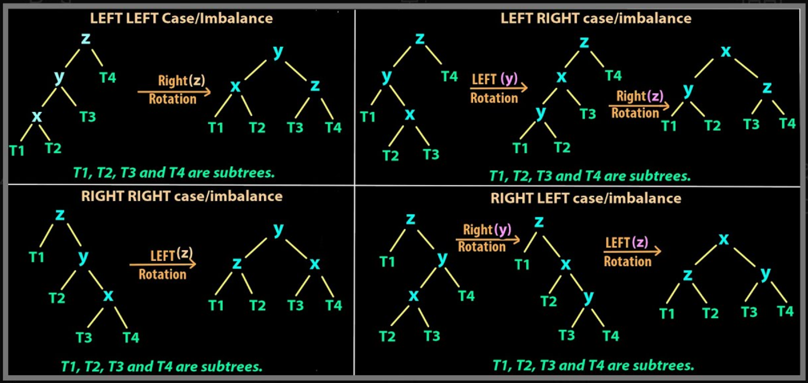

# Aula 21: Árvores AVL - Árvores Binárias de Busca Balanceadas

## 1. Motivação: o problema das ABBs

### 1.1 Relembrando Árvores Binárias de Busca

Na aula anterior, estudamos as **Árvores Binárias de Busca** (**ABBs**).

Uma ABB possui duas propriedades principais:

* cada nó possui, no máximo, dois filhos;
* para cada nó:
    * todos os valores da subárvore esquerda são menores que o valor do nó;
    * todos os valores da subárvore direita são maiores que o valor do nó.

Com isso, vimos que as principais operações têm custo proporcional à altura da árvore:

| Operação | Custo |
|---|---|
| Busca | $O(h)$ |
| Inserção | $O(h)$ |
| Remoção | $O(h)$ |

onde $h$ é a altura da árvore.

Portanto, o desempenho de uma ABB depende diretamente da sua altura.

### 1.2 Custo das operações em função da altura

Se a árvore estiver bem distribuída, sua altura será próxima de $\log n$.

Nesse caso, operações como busca, inserção e remoção terão custo próximo de:

$$
O(\log n)
$$

Por outro lado, se a árvore ficar muito inclinada para um lado, sua altura pode chegar a $n$.

Nesse caso, as operações passam a custar:

$$
O(n)
$$

Ou seja, uma ABB pode ser eficiente, mas isso depende da forma da árvore.

### 1.3 Quando uma ABB degenera

Uma ABB pode degenerar facilmente.

Por exemplo, se inserirmos `1, 2, 3, 4` nessa ordem, teremos:

```text
1
 \
  2
   \
    3
     \
      4
````

Nesse caso, a árvore fica totalmente inclinada para a direita.

Na prática, ela se comporta como uma lista encadeada.

A altura da árvore passa a ser proporcional ao número de nós:

$$
h = O(n)
$$

Portanto, embora a ABB tenha potencial para fazer busca, inserção e remoção em $O(\log n)$, no pior caso essas operações podem custar $O(n)$.

### 1.4 Objetivo das árvores balanceadas

O problema principal da ABB comum é que ela não controla automaticamente sua altura.

A pergunta natural é:

> Como podemos manter a árvore com altura pequena automaticamente?

Uma das respostas para esse problema é a **Árvore AVL**.

A ideia da AVL é manter a árvore balanceada após operações de inserção e remoção.

Com isso, evitamos que a árvore se degenere como uma lista.

Mais à frente, veremos que a propriedade de balanceamento da AVL garante que a altura da árvore seja proporcional a:

$$
\log n
$$

mesmo no pior caso.

## 2. Definição de Árvore AVL

### 2.1 O que é uma AVL

Uma **Árvore AVL** é uma Árvore Binária de Busca que mantém uma propriedade adicional de balanceamento.

Ou seja:

> Toda Árvore AVL é uma ABB, mas nem toda ABB é uma AVL.

A AVL continua obedecendo à propriedade da ABB:

* valores menores ficam à esquerda;
* valores maiores ficam à direita.

A diferença é que a AVL também exige que a árvore permaneça **balanceada**.

Esse balanceamento é mantido automaticamente após operações de inserção e remoção.

### 2.2 Fator de balanceamento

Para saber se uma árvore está balanceada, usamos o **fator de balanceamento**.

Nesta disciplina, vamos usar a seguinte convenção:

$$
BF(n) = altura(esquerda) - altura(direita)
$$

Ou seja:

* se `BF(n) > 0`, o nó está mais pesado à esquerda;
* se `BF(n) < 0`, o nó está mais pesado à direita;
* se `BF(n) = 0`, as duas subárvores têm a mesma altura.

Em uma Árvore AVL, todo nó deve obedecer à seguinte condição:

$$
-1 \leq BF(n) \leq 1
$$

Portanto, os únicos fatores de balanceamento permitidos são:

```text
-1, 0, +1
```

Se algum nó ficar com fator de balanceamento `+2` ou `-2`, a árvore deixou de ser AVL naquele ponto e precisa ser corrigida.

### 2.3 Exemplos de árvores balanceadas e não balanceadas

Considere a árvore abaixo:

```text
     D
    / \
   C   G
  /
 B
```

Para o nó `D`:

* altura da subárvore esquerda: 1;
* altura da subárvore direita: 0.

Logo:

$$
BF(D) = 1 - 0 = 1
$$

Como o fator de balanceamento está entre `-1` e `+1`, o nó `D` está balanceado.

Agora considere a seguinte árvore:

```text
        D
       / \
      C   G
         / \
        F   H
       /
      E
```

Para o nó `D`:

* altura da subárvore esquerda: 0;
* altura da subárvore direita: 2.

Logo:

$$
BF(D) = 0 - 2 = -2
$$

Como `BF(D) = -2`, esse nó está desbalanceado.

A árvore, portanto, não é uma AVL.

## 3. Rotações

### 3.1 Ideia geral de rotação

A AVL mantém o balanceamento usando **rotações**.

Uma rotação é uma reorganização local da árvore.

Ela muda a relação entre alguns nós, mas preserva a propriedade da ABB.

Ou seja, depois da rotação:

* a árvore continua sendo uma ABB;
* os valores continuam em ordem;
* a altura da subárvore desbalanceada é reduzida ou restaurada.

Esse último ponto é essencial.

Sempre que uma rotação é necessária, ela serve para corrigir uma subárvore que ficou alta demais de um lado.

A rotação diminui essa altura local ou a devolve ao valor adequado, mantendo a árvore dentro do limite permitido pela AVL.

### 3.2 Rotação simples à esquerda

Considere a inserção dos valores `A`, `B` e `C`, nessa ordem.

Após inserir `A`:

```text
A
```

Após inserir `B`:

```text
A
 \
  B
```

Após inserir `C`:

```text
A
 \
  B
   \
    C
```

Agora o nó `A` ficou desbalanceado.

Usando a convenção:

$$
BF(n) = altura(esquerda) - altura(direita)
$$

temos:

```text
BF(A) = -2
```

A árvore está pesada demais à direita.

Esse caso é chamado de **RR**, pois a inserção ocorreu na subárvore direita do filho direito.

Para corrigir, fazemos uma **rotação à esquerda** no nó `A`.

Resultado:

```text
  B
 / \
A   C
```

A árvore volta a ficar balanceada.

### 3.3 Implementação da rotação à esquerda

Abaixo está uma possível implementação orientada a objetos.

A rotação recebe a raiz da subárvore desbalanceada e retorna a nova raiz dessa subárvore.

```cpp
#include <algorithm>

class AVLTree {
private:
    struct Node {
        int key;
        int height;
        Node* left;
        Node* right;
        Node* parent;

        Node(int key) {
            this->key = key;
            this->height = 0;
            this->left = nullptr;
            this->right = nullptr;
            this->parent = nullptr;
        }
    };

    Node* root;

    int getHeight(Node* node) {
        if (node == nullptr) {
            return -1;
        }

        return node->height;
    }

    int getBalanceFactor(Node* node) {
        if (node == nullptr) {
            return 0;
        }

        return getHeight(node->left) - getHeight(node->right);
    }

    void recomputeHeight(Node* node) {
        if (node == nullptr) {
            return;
        }

        int leftHeight = getHeight(node->left);
        int rightHeight = getHeight(node->right);

        node->height = 1 + std::max(leftHeight, rightHeight);
    }

    Node* rotateLeft(Node* x) {
        Node* y = x->right;
        Node* beta = y->left;

        y->left = x;
        x->right = beta;

        if (beta != nullptr) {
            beta->parent = x;
        }

        y->parent = x->parent;
        x->parent = y;

        recomputeHeight(x);
        recomputeHeight(y);

        return y;
    }
};
```

Observe que usamos `x`, e não `root`, porque `x` não necessariamente é a raiz da árvore inteira.

Ele é apenas a raiz da subárvore que está sendo rotacionada.

Além disso, a rotação retorna um `Node*`.

Isso é necessário porque, depois de uma rotação, a raiz local da subárvore muda.

### 3.4 Rotação simples à direita

A rotação à direita é simétrica à rotação à esquerda.

Considere:

```text
    C
   /
  B
 /
A
```

O nó `C` está pesado demais à esquerda.

Nesse caso:

```text
BF(C) = +2
```

Esse caso é chamado de **LL**, pois o desbalanceamento ocorreu na subárvore esquerda do filho esquerdo.

Para corrigir, fazemos uma **rotação à direita** em `C`.

Resultado:

```text
  B
 / \
A   C
```

Implementação:

```cpp
Node* rotateRight(Node* y) {
    Node* x = y->left;
    Node* beta = x->right;

    x->right = y;
    y->left = beta;

    if (beta != nullptr) {
        beta->parent = y;
    }

    x->parent = y->parent;
    y->parent = x;

    recomputeHeight(y);
    recomputeHeight(x);

    return x;
}
```

Assim como na rotação à esquerda, a rotação à direita retorna a nova raiz da subárvore.

### 3.5 Casos gerais de rotação

Nos exemplos anteriores, usamos apenas três nós para facilitar a visualização.

Na prática, porém, esses nós podem ter subárvores associadas.

A figura abaixo mostra os quatro casos gerais:



O ponto central é que as rotações preservam a propriedade de ABB.

Por exemplo, no caso LL, antes da rotação temos a seguinte ordem:

```text
T1 < x < T2 < y < T3 < z < T4
```

Depois da rotação à direita em `z`, a ordem continua sendo:

```text
T1 < x < T2 < y < T3 < z < T4
```

Ou seja, a rotação muda a estrutura da árvore, mas não muda a ordem dos elementos.

Por isso, a árvore continua sendo uma ABB.

A rotação apenas reorganiza os nós para diminuir a altura da subárvore que ficou desbalanceada.

### 3.6 Preservação da propriedade de ABB

Uma rotação pode parecer perigosa à primeira vista, porque ela muda quem é pai e quem é filho.

Mas ela não altera a ordem relativa dos elementos.

Isso é o que garante que a propriedade de ABB continua válida.

No caso LL, por exemplo, temos antes:

```text
        z
       / \
      y   T4
     / \
    x   T3
   / \
 T1   T2
```

A ordem dos elementos é:

```text
T1 < x < T2 < y < T3 < z < T4
```

Depois da rotação à direita em `z`, temos:

```text
        y
       / \
      x   z
     / \ / \
   T1 T2 T3 T4
```

A ordem continua sendo:

```text
T1 < x < T2 < y < T3 < z < T4
```

Portanto, a rotação preserva a propriedade de ABB.

Ela apenas muda a forma da árvore para reduzir sua altura local.

## 4. Rebalanceamento após inserção

### 4.1 Inserção como em uma ABB comum

A inserção em uma AVL começa da mesma forma que a inserção em uma ABB comum.

Primeiro, percorremos a árvore comparando a nova chave com as chaves existentes.

* Se a chave for menor que a chave do nó atual, seguimos para a esquerda.
* Se a chave for maior que a chave do nó atual, seguimos para a direita.
* Se a chave já existir, podemos ignorar a inserção.

Depois que o novo nó é inserido, voltamos pelo caminho percorrido atualizando alturas e verificando fatores de balanceamento.

### 4.2 Atualização das alturas

Cada nó armazena sua própria altura.

Após uma inserção, a altura de alguns nós pode mudar.

Por isso, ao voltar da recursão, recalculamos a altura do nó atual:

```cpp
void recomputeHeight(Node* node) {
    if (node == nullptr) {
        return;
    }

    int leftHeight = getHeight(node->left);
    int rightHeight = getHeight(node->right);

    node->height = 1 + std::max(leftHeight, rightHeight);
}
```

Depois de atualizar a altura, calculamos o fator de balanceamento:

```cpp
int getBalanceFactor(Node* node) {
    if (node == nullptr) {
        return 0;
    }

    return getHeight(node->left) - getHeight(node->right);
}
```

Se o fator estiver entre `-1` e `+1`, o nó continua balanceado.

Se o fator for `+2` ou `-2`, será necessário aplicar uma rotação.

### 4.3 Identificação dos casos LL, RR, LR e RL

Depois de uma inserção ou remoção, um nó pode ficar desbalanceado de quatro formas diferentes.

Esses casos são conhecidos como:

* LL;
* RR;
* LR;
* RL.

O nome do caso indica o caminho em que o desbalanceamento ocorreu.

Por exemplo:

* LL: o problema está no lado esquerdo do filho esquerdo;
* RR: o problema está no lado direito do filho direito;
* LR: o problema está no lado direito do filho esquerdo;
* RL: o problema está no lado esquerdo do filho direito.

A tabela abaixo resume os casos:

| Caso | Situação                                      | Correção                                                    |
| ---- | --------------------------------------------- | ----------------------------------------------------------- |
| LL   | desbalanceamento à esquerda do filho esquerdo | rotação à direita                                           |
| RR   | desbalanceamento à direita do filho direito   | rotação à esquerda                                          |
| LR   | desbalanceamento à direita do filho esquerdo  | rotação à esquerda no filho, depois rotação à direita no nó |
| RL   | desbalanceamento à esquerda do filho direito  | rotação à direita no filho, depois rotação à esquerda no nó |

Um erro comum é confundir o nome do caso com a direção da rotação.

No caso LL, a rotação é à direita.

No caso RR, a rotação é à esquerda.

### 4.4 Como decidir qual rotação aplicar

Ao subir de volta depois de uma inserção ou remoção, atualizamos a altura dos nós e calculamos o fator de balanceamento.

Como usamos:

$$
BF(n) = altura(esquerda) - altura(direita)
$$

temos:

* `BF(n) = +2`: o nó está pesado demais à esquerda;
* `BF(n) = -2`: o nó está pesado demais à direita.

A decisão pode ser feita olhando o fator de balanceamento do filho mais pesado.

| Fator do nó | Fator do filho pesado | Caso | Rotação                                               |
| ----------- | --------------------- | ---- | ----------------------------------------------------- |
| `+2`        | `>= 0`                | LL   | rotação à direita                                     |
| `+2`        | `< 0`                 | LR   | rotação à esquerda no filho, depois rotação à direita |
| `-2`        | `<= 0`                | RR   | rotação à esquerda                                    |
| `-2`        | `> 0`                 | RL   | rotação à direita no filho, depois rotação à esquerda |

Em inserções, normalmente o fator do filho será `+1` ou `-1`.

Em remoções, também pode aparecer o caso em que o fator do filho é `0`.

### 4.5 Implementação do rebalanceamento

Podemos criar um método auxiliar chamado `rebalance`.

Esse método recebe um nó, atualiza sua altura, calcula seu fator de balanceamento e aplica a rotação necessária.

```cpp
Node* rebalance(Node* node) {
    recomputeHeight(node);

    int bf = getBalanceFactor(node);

    // Caso pesado à esquerda
    if (bf > 1) {
        int leftBF = getBalanceFactor(node->left);

        // Caso LR
        if (leftBF < 0) {
            node->left = rotateLeft(node->left);

            if (node->left != nullptr) {
                node->left->parent = node;
            }
        }

        // Caso LL
        return rotateRight(node);
    }

    // Caso pesado à direita
    if (bf < -1) {
        int rightBF = getBalanceFactor(node->right);

        // Caso RL
        if (rightBF > 0) {
            node->right = rotateRight(node->right);

            if (node->right != nullptr) {
                node->right->parent = node;
            }
        }

        // Caso RR
        return rotateLeft(node);
    }

    return node;
}
```

Esse método retorna a nova raiz da subárvore.

Isso é importante porque, após uma rotação, a raiz local da subárvore pode mudar.

### 4.6 Implementação da inserção

A inserção em uma AVL segue a mesma ideia da inserção em uma ABB.

Primeiro, inserimos o novo valor respeitando a propriedade da ABB.

Depois, ao voltar da recursão, atualizamos as alturas e rebalanceamos a árvore.

A ideia geral é:

```text
insert(x):
    inserir x como em uma ABB comum
    ao voltar:
        atualizar altura
        calcular fator de balanceamento
        se necessário, aplicar rotação
```

Implementação:

```cpp
Node* insert(Node* node, int key) {
    if (node == nullptr) {
        return new Node(key);
    }

    if (key < node->key) {
        Node* leftChild = insert(node->left, key);
        node->left = leftChild;
        leftChild->parent = node;
    } else if (key > node->key) {
        Node* rightChild = insert(node->right, key);
        node->right = rightChild;
        rightChild->parent = node;
    } else {
        return node;
    }

    return rebalance(node);
}

void insert(int key) {
    root = insert(root, key);

    if (root != nullptr) {
        root->parent = nullptr;
    }
}
```

Nessa implementação, valores repetidos são ignorados.

Também poderíamos tratar valores repetidos de outras formas, dependendo da aplicação.

### 4.7 Por que apenas uma rotação resolve na inserção?

Na inserção, o novo nó é adicionado em uma folha.

Isso pode aumentar a altura de alguma subárvore em 1.

Ao subir de volta para a raiz, podemos encontrar um primeiro nó desbalanceado.

Quando aplicamos a rotação correta nesse primeiro nó desbalanceado, a altura da subárvore volta ao que era antes da inserção.

Por isso, na inserção:

* basta corrigir o primeiro nó desbalanceado encontrado;
* uma rotação simples ou dupla é suficiente;
* o desbalanceamento não continua se propagando para os ancestrais.

Em outras palavras:

> Na inserção, quando uma rotação é necessária, ela restaura a altura local da subárvore para o valor adequado.

## 5. Por que a AVL garante altura logarítmica?

### 5.1 Voltando ao problema original

No início da aula, vimos que o problema da ABB comum é que sua altura pode chegar a (O(n)).

Isso faz com que busca, inserção e remoção também possam custar (O(n)).

A AVL tenta resolver esse problema impondo uma regra local:

$$
-1 \leq BF(n) \leq 1
$$

para todo nó da árvore.

Agora a pergunta é:

> Essa regra local realmente garante que a altura da árvore será proporcional a (\log n)?

A resposta é sim.

### 5.2 Altura máxima e número mínimo de nós

Queremos entender qual é a maior altura possível de uma AVL com `n` nós.

Responder isso diretamente é difícil, porque existem muitas formas diferentes de montar uma AVL com `n` nós.

Por isso, analisamos o problema inverso:

> Qual é o número mínimo de nós necessário para construir uma AVL de altura `h`?

Essa pergunta é útil porque a AVL mais alta possível, para uma certa quantidade de nós, é justamente aquela que usa o menor número possível de nós para atingir uma certa altura.

Em outras palavras:

* se uma AVL de altura `h` precisa de muitos nós;
* então, com poucos nós, não é possível construir uma AVL muito alta.

### 5.3 Recorrência para o número mínimo de nós

Para uma AVL ter altura `h` usando o menor número possível de nós:

* uma subárvore deve ter altura `h - 1`;
* a outra deve ter altura `h - 2`.

Isso acontece porque a diferença de altura entre as subárvores pode ser, no máximo, 1.

Assim, o número mínimo de nós em uma AVL de altura `h` pode ser definido por:

$$
N(h) = 1 + N(h-1) + N(h-2)
$$

O `1` representa a raiz.

Considerando a convenção de altura adotada na disciplina, temos:

$$
N(-1) = 0
$$

$$
N(0) = 1
$$

Ou seja:

* uma árvore vazia possui 0 nós;
* uma árvore de altura 0 possui 1 nó.

### 5.4 Conclusão sobre a altura

A recorrência

$$
N(h) = 1 + N(h-1) + N(h-2)
$$

cresce de forma parecida com a sequência de Fibonacci.

Portanto, o número mínimo de nós cresce exponencialmente em relação à altura.

Consequentemente, a altura cresce de forma logarítmica em relação ao número de nós.

Em termos assintóticos:

$$
h = O(\log n)
$$

Isso significa que a AVL não permite que a árvore fique alta demais em relação ao número de nós.

Portanto, as principais operações continuam com custo:

$$
O(\log n)
$$

mesmo no pior caso.

## 6. Remoção em Árvores AVL

### 6.1 Remoção como em uma ABB comum

A remoção em uma AVL começa como a remoção em uma ABB comum.

Primeiro, removemos o nó respeitando os casos tradicionais:

1. nó sem filhos;
2. nó com um filho;
3. nó com dois filhos.

No caso de dois filhos, podemos substituir o valor do nó pelo seu sucessor ou predecessor e remover esse sucessor/predecessor da posição original.

Depois da remoção, subimos de volta atualizando as alturas e rebalanceando os nós.

### 6.2 Diferença entre inserção e remoção

A diferença fundamental entre inserção e remoção está no comportamento da altura.

Na inserção, a altura de uma subárvore pode aumentar.

Quando aplicamos uma rotação no primeiro nó desbalanceado, a altura da subárvore normalmente volta ao que era antes da inserção.

Por isso, o problema não continua se propagando.

```text
Inserção → primeiro nó desbalanceado → rotação → fim do rebalanceamento
```

Na remoção, a altura de uma subárvore pode diminuir.

Quando isso acontece, mesmo depois de uma rotação, a altura da subárvore pode continuar menor do que era antes.

Nesse caso, o pai também pode ficar desbalanceado.

```text
Remoção → rebalanceia um nó → altura pode diminuir → pai pode desbalancear → continua subindo
```

### 6.3 Por que a remoção pode exigir várias rotações

Na remoção, é possível que o rebalanceamento de um nó diminua a altura da subárvore.

Se a altura da subárvore diminui, o ancestral dessa subárvore pode passar a ter uma diferença de alturas maior do que 1.

Com isso, outro nó pode precisar de rebalanceamento.

Esse processo pode continuar até a raiz.

Portanto, na remoção:

* pode ser necessário rebalancear mais de um nó;
* o processo pode continuar até a raiz;
* podem ocorrer várias rotações ao longo do caminho.

Em resumo:

* inserção exige, no máximo, uma rotação simples ou dupla;
* remoção pode exigir várias rotações sucessivas.

### 6.4 Exemplo de remoção exigindo mais de uma rotação

Considere a seguinte Árvore AVL:

```text
          8
        /   \
       5     10
      / \    / \
     2   6  9   12
    / \   \     /
   1   4   7   11
      /
     3
````

Essa árvore está balanceada.

Agora vamos remover o nó `8`.

Como o nó `8` possui dois filhos, podemos aplicar a mesma ideia usada na remoção em ABB:

* substituir o valor `8` pelo seu sucessor;
* neste caso, o sucessor de `8` é `9`;
* depois, removemos o nó `9` da sua posição original.

Após essa remoção, a árvore fica:

```text
          9
        /   \
       5     10
      / \      \
     2   6      12
    / \   \     /
   1   4   7   11
      /
     3
```

Agora analisamos os fatores de balanceamento ao voltar pelo caminho da remoção.

O nó `10` ficou desbalanceado:

```text
      10
        \
         12
        /
       11
```

Usando a convenção:

$$
BF(n) = altura(esquerda) - altura(direita)
$$

temos:

```text
BF(10) = -2
```

O nó `10` está pesado demais à direita.

Além disso, seu filho direito `12` está pesado à esquerda:

```text
BF(12) = +1
```

Portanto, temos um caso **RL**.

A correção é uma rotação dupla:

1. rotação à direita em `12`;
2. rotação à esquerda em `10`.

Depois dessa rotação dupla, a subárvore direita fica:

```text
       11
      /  \
    10    12
```

Substituindo na árvore, temos:

```text
          9
        /   \
       5     11
      / \    / \
     2   6  10 12
    / \   \
   1   4   7
      /
     3
```

Porém, ainda precisamos continuar subindo.

Agora o nó `9` ficou desbalanceado.

A subárvore esquerda de `9` tem altura maior do que a subárvore direita:

```text
BF(9) = +2
```

Como o filho esquerdo `5` está pesado à esquerda ou balanceado, temos um caso **LL**.

Portanto, aplicamos uma rotação simples à direita em `9`.

O resultado final é:

```text
          5
        /   \
       2     9
      / \   / \
     1   4 6   11
        /   \  / \
       3     7 10 12
```

Agora a árvore voltou a estar balanceada.

Esse exemplo mostra a diferença importante entre inserção e remoção:

* na inserção, após corrigir o primeiro nó desbalanceado, o rebalanceamento termina;
* na remoção, mesmo após corrigir um nó, a altura da subárvore pode diminuir;
* por isso, outro ancestral pode ficar desbalanceado;
* nesse caso, uma única remoção causou rebalanceamentos em dois níveis diferentes da árvore.

Neste exemplo, a remoção de `8` exigiu:

1. uma rotação dupla no nó `10`, caso **RL**;
2. uma rotação simples à direita no nó `9`, caso **LL**.
