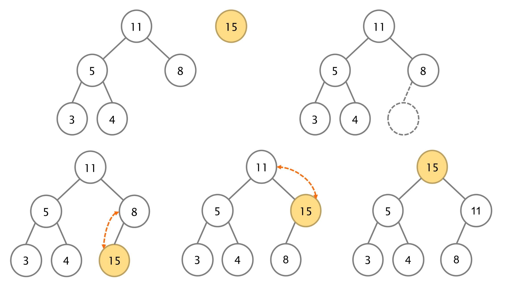
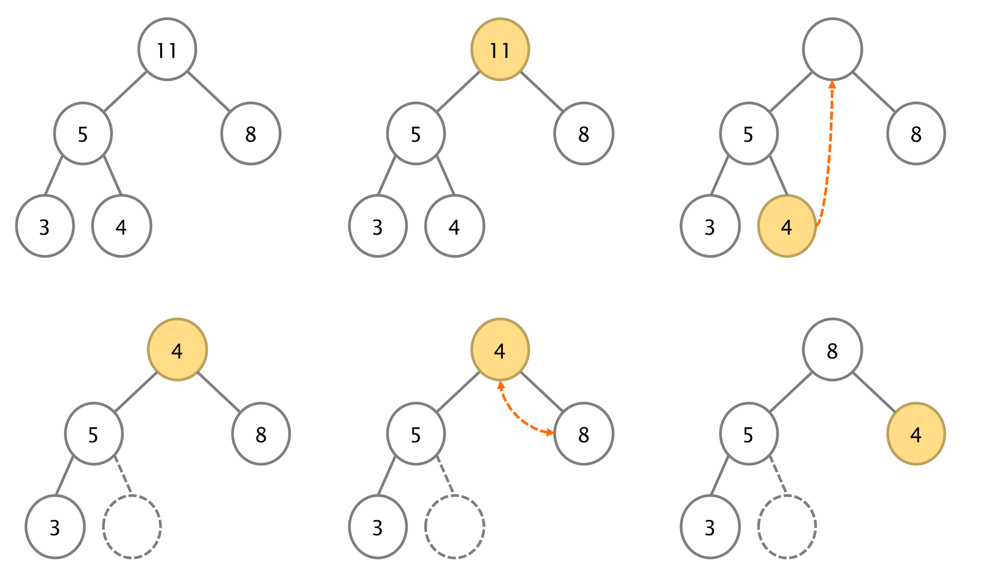
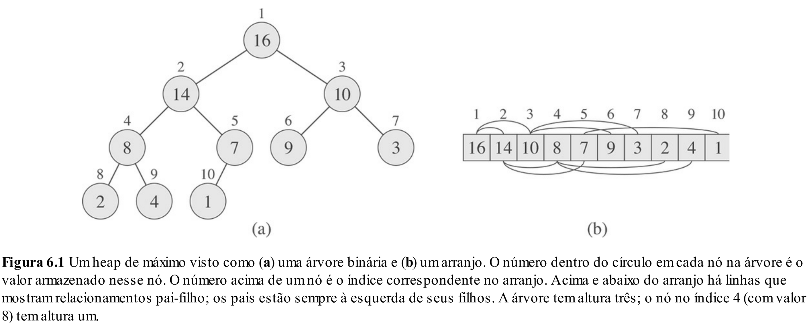
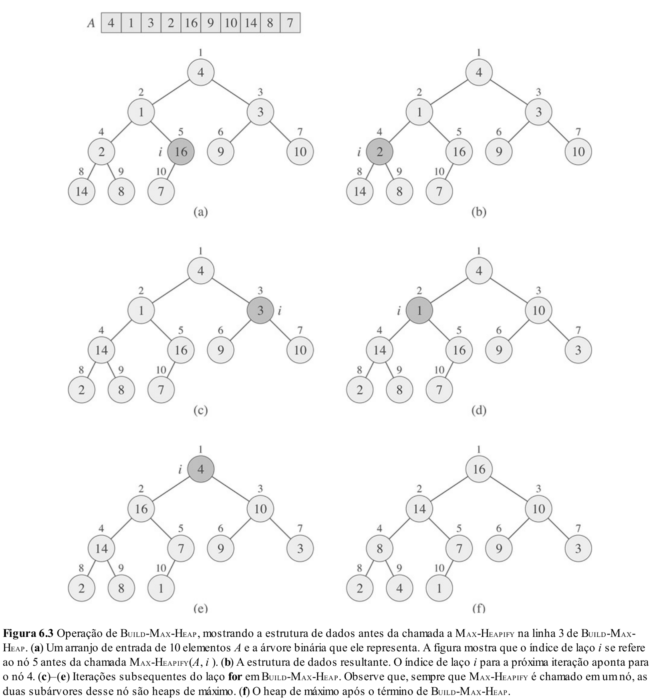

# Aulas 23: Heaps

## 1. Introdução

Bom, continuando nossa saga por estruturas de dados eficientes, nas últimas semanas nos concentramos nas árvores **AVL**, onde vimos que elas conseguem executar operações importantes de forma eficiente:

* **Inserção** → $O(\log n)$
* **Remoção** → $O(\log n)$
* **Busca** → $O(\log n)$

E a pergunta que podemos tirar disso é: **acabou?** Finalmente encontramos as estruturas de dados mais eficientes possíveis?

A resposta é: **não, nossa saga continua.**

Como vimos ao longo do período, não existe uma estrutura de dados que seja sempre a melhor para todos os problemas. O que existe são estruturas mais adequadas para certos tipos de operação.

Por exemplo:

* Pilhas são ótimas quando queremos remover sempre o último elemento inserido.
* Filas são ótimas quando queremos remover sempre o primeiro elemento inserido.
* Árvores binárias de busca balanceadas são boas quando queremos inserir, remover e buscar elementos de forma eficiente.

Mas e se o nosso problema for mais específico?

Suponha que estamos majoritariamente interessados em acessar rapidamente o **maior** ou o **menor** elemento de um conjunto.

Por exemplo:

* Qual é a tarefa mais urgente a ser executada?
* Qual paciente deve ser atendido primeiro?
* Qual evento deve acontecer primeiro em uma simulação?
* Qual elemento tem a maior prioridade neste momento?

Para esse tipo de problema, existe uma estrutura mais adequada do que uma árvore AVL: a **heap**.

Nesta aula, vamos estudar uma versão específica dessa estrutura: a **heap binária**.

## 2. Motivação: por que não usar as estruturas que já conhecemos?

Suponha que desejamos manter um conjunto de elementos e consultar frequentemente o maior valor.

Como poderíamos fazer isso usando estruturas já conhecidas?

### 2.1 Array ou lista desordenada

Se armazenarmos os elementos em uma lista desordenada:

* Inserção: $O(1)$
* Buscar o maior elemento: $O(n)$
* Remover o maior elemento: $O(n)$

A inserção é barata, mas encontrar o maior elemento exige percorrer toda a estrutura.

### 2.2 Array ou lista ordenada

Se mantivermos os elementos sempre ordenados:

* Inserção: $O(n)$
* Acessar o maior elemento: $O(1)$
* Remover o maior elemento: $O(1)$ ou $O(n)$, dependendo da representação

O acesso ao maior elemento fica barato, mas cada inserção pode exigir deslocamentos ou uma busca pela posição correta.

### 2.3 Árvore binária de busca balanceada

Se usarmos uma árvore AVL:

* Inserção: $O(\log n)$
* Remoção: $O(\log n)$
* Busca: $O(\log n)$
* Encontrar o maior elemento: $O(\log n)$

Para encontrar o maior elemento em uma ABB, basta caminhar sempre para a direita até o final.

Em uma árvore balanceada, esse caminho tem tamanho $O(\log n)$.

> Observação: algumas implementações poderiam guardar um ponteiro direto para o maior elemento, tornando o acesso $O(1)$. Mesmo assim, a heap é uma estrutura naturalmente desenhada para esse tipo de operação.

### 2.4 Heap

A heap é uma estrutura pensada exatamente para esse cenário:

* Acessar o maior ou menor elemento rapidamente.
* Inserir elementos de forma eficiente.
* Remover o maior ou menor elemento de forma eficiente.

No caso de uma **max-heap**:

* Acessar o maior elemento: $O(1)$
* Inserir: $O(\log n)$
* Remover o maior elemento: $O(\log n)$

Ou seja, a heap não é uma árvore de busca melhorada.

Ela é uma estrutura especializada para trabalhar com prioridade.

## 3. Heap Binária

### 3.1 O que é uma heap binária?

Uma **heap binária** é uma estrutura semelhante a uma árvore binária, mas com duas propriedades importantes:

1. **Propriedade de forma**
2. **Propriedade de ordem**

A propriedade de forma diz que a heap é uma árvore binária **completa**.

Isso significa que:

* Todos os níveis estão completamente preenchidos, exceto possivelmente o último.
* No último nível, os nós são preenchidos da esquerda para a direita, sem buracos.

Essa propriedade é muito importante porque garante que a altura da heap seja $O(\log n)$.

A propriedade de ordem define a relação entre cada nó e seus filhos.

Existem dois tipos principais de heap:

* **Max-heap**
* **Min-heap**

Em uma **max-heap**:

```text
pai >= filhos
```

Ou seja, cada pai deve ser maior ou igual aos seus filhos.

Em uma **min-heap**:

```text
pai <= filhos
```

Ou seja, cada pai deve ser menor ou igual aos seus filhos.

Nesta aula, vamos focar principalmente em **max-heaps**.

### 3.2 Exemplo de max-heap

```text
          99
        /    \
      37      50
     /   \   /  \
   31    15 2    25
  /  \   /
 1   27 10
```

Essa é uma max-heap porque todo pai é maior ou igual aos seus filhos.

Por exemplo:

* 99 é maior que 37 e 50.
* 37 é maior que 31 e 15.
* 50 é maior que 2 e 25.
* 31 é maior que 1 e 27.
* 15 é maior que 10.

### 3.3 Exemplo de min-heap

```text
          1
        /    \
       2      10
     /   \   /  \
   27    25 15    50
  /  \   /
 37  31 99
```

Essa é uma min-heap porque todo pai é menor ou igual aos seus filhos.

Em uma min-heap, o menor elemento sempre está na raiz.

### 3.4 Heap não é árvore binária de busca

É importante não confundir heap com árvore binária de busca.

Em uma **árvore binária de busca**, temos uma relação global:

```text
subárvore esquerda < nó < subárvore direita
```

Em uma **heap**, temos apenas uma relação local:

```text
pai >= filhos
```

Isso significa que uma heap não mantém os elementos totalmente ordenados.

Por exemplo, em uma max-heap, sabemos que a raiz é o maior elemento. Mas não sabemos, em geral, onde está um elemento específico.

Por isso:

* Acessar o maior elemento: $O(1)$
* Inserir novo elemento: $O(\log n)$
* Remover o maior elemento: $O(\log n)$
* Buscar um valor arbitrário: $O(n)$

Essa última linha é importante.

Se o objetivo principal for buscar qualquer elemento rapidamente, uma ABB balanceada pode ser mais adequada.

Se o objetivo principal for acessar ou remover o maior ou menor elemento, heap é uma ótima opção.

### 3.5 Aplicações

Heaps binárias são muito úteis em situações que envolvem acesso rápido ao maior ou menor valor:

* Filas de prioridade;
* Heapsort;
* Sistemas de agendamento;
* Sistema de Ordens de Compra e Venda;
* Algoritmos de grafos, como Dijkstra e Prim.

Neste momento, o mais importante é entender a aplicação em **filas de prioridade**.

Os demais exemplos servem para mostrar que heaps aparecem em vários contextos importantes da computação.

## 4. Operações (Conceitualmente)

Antes de pensar em código, vamos entender as operações usando a heap como uma árvore.

A implementação com array será discutida depois.

Por enquanto, o mais importante é entender **o que precisa acontecer** para manter as duas propriedades da heap:

1. A propriedade de forma.
2. A propriedade de ordem.

### 4.1 Acesso ao máximo ou mínimo

Em uma max-heap, o maior elemento sempre está na raiz.

Em uma min-heap, o menor elemento sempre está na raiz.

Portanto, conceitualmente, acessar o maior ou menor elemento é imediato.

Não precisamos procurar pela árvore inteira.

No caso da max-heap:

```text
          99
        /    \
      37      50
     /   \   /  \
   31    15 2    25
```

O maior elemento é 99, pois ele está na raiz.

Custo:

```text
O(1)
```

### 4.2 Inserção

Para inserir um elemento em uma heap, precisamos preservar primeiro a propriedade de forma.

Lembre-se: a heap deve ser uma árvore quase completa.

Portanto, o novo elemento deve ser inserido na próxima posição livre da árvore, isto é, no próximo espaço disponível do último nível, da esquerda para a direita.

Depois disso, pode ser que a propriedade de ordem seja violada.

Por exemplo, em uma max-heap, se inserirmos um valor maior que seu pai, teremos um problema.

A solução é fazer esse elemento **subir** na árvore.

Esse processo é chamado de **heapify up**.

A ideia é:

1. Inserimos o novo elemento na próxima posição livre.
2. Comparamos o novo elemento com seu pai.
3. Se o filho for maior que o pai, trocamos os dois.
4. Repetimos esse processo até que:

   * o pai seja maior ou igual ao filho; ou
   * o elemento chegue à raiz.



Intuitivamente, o novo elemento sobe até encontrar uma posição em que a propriedade de heap volte a ser respeitada.

Como a heap tem altura $O(\log n)$, no pior caso o elemento pode subir da última posição até a raiz.

Logo, o custo da inserção é:

```text
O(log n)
```

### 4.3 Remoção do máximo / mínimo

A remoção principal em uma heap é a remoção da raiz.

Em uma max-heap, isso significa remover o maior elemento.

Em uma min-heap, isso significa remover o menor elemento.

Vamos pensar em uma max-heap.

Se simplesmente removermos a raiz, deixaremos um buraco no topo da árvore.

Isso quebraria a propriedade de forma.

Para evitar isso, fazemos o seguinte:

1. Guardamos o valor da raiz, que é o maior elemento.
2. Pegamos o último elemento da heap e colocamos na raiz.
3. Removemos a antiga posição final da árvore.
4. Agora a propriedade de forma está correta, mas a propriedade de ordem pode estar errada.
5. Fazemos o elemento da raiz **descer** até encontrar sua posição correta.

Esse processo é chamado de **heapify down**.

A ideia é:

1. Comparamos o elemento atual com seus filhos.
2. Em uma max-heap, escolhemos o maior dos filhos.
3. Se o maior filho for maior que o elemento atual, trocamos.
4. Repetimos até que:

   * o elemento atual seja maior ou igual aos filhos; ou
   * o elemento chegue a uma folha.



Intuitivamente, como colocamos um elemento possivelmente pequeno na raiz, precisamos empurrá-lo para baixo até que a hierarquia da heap seja restaurada.

Como a heap tem altura $O(\log n)$, no pior caso o elemento pode descer da raiz até uma folha.

Logo, o custo da remoção é:

```text
O(log n)
```

## 5. Implementação usando arrays

Agora que entendemos conceitualmente o que acontece na inserção e na remoção, podemos discutir a implementação.

Até agora, desenhamos a heap como uma árvore.

No entanto, na prática, heaps binárias normalmente são implementadas usando **arrays**.

Isso é possível porque a heap tem formato de árvore quase completa.

Como não existem buracos entre os nós, conseguimos armazenar os elementos em ordem de nível, da esquerda para a direita.



Considere a heap:

```text
          90
        /    \
      70      80
     /  \    / \
   20   60  50  40
```

Sua representação em array é:

```cpp
[90, 70, 80, 20, 60, 50, 40]
```

### 5.1 Índices dos filhos e do pai

Se um nó está na posição `i` do array, então:

```cpp
leftChild(i)  = 2 * i + 1
rightChild(i) = 2 * i + 2
parent(i)     = (i - 1) / 2
```

Por exemplo, no array:

```cpp
[90, 70, 80, 20, 60, 50, 40]
```

Temos:

```text
índice:  0   1   2   3   4   5   6
valor:  90  70  80  20  60  50  40
```

Para o elemento no índice 1, valor 70:

```cpp
leftChild(1)  = 2 * 1 + 1 = 3
rightChild(1) = 2 * 1 + 2 = 4
```

Logo, os filhos de 70 são:

```cpp
arr[3] = 20
arr[4] = 60
```

Para o elemento no índice 4, valor 60:

```cpp
parent(4) = (4 - 1) / 2 = 1
```

Logo, o pai de 60 é:

```cpp
arr[1] = 70
```

### 5.2 Classe Heap

Como neste semestre estamos trabalhando com orientação a objetos, vamos representar a heap como uma classe.

A ideia é encapsular os dados internos da heap e expor apenas as operações importantes.

```cpp
class Heap {
private:
    int* data;
    int size;
    int capacity;

    int parent(int i);
    int leftChild(int i);
    int rightChild(int i);

    void swap(int i, int j);
    void heapifyUp(int index);
    void heapifyDown(int index);

public:
    Heap(int capacity);
    ~Heap();

    bool isEmpty();
    bool isFull();

    int getMax();
    void insert(int value);
    int removeMax();
};
```

Observe que `heapifyUp` e `heapifyDown` são métodos privados.

Isso faz sentido porque eles são detalhes internos da implementação.

Quem usa a heap não precisa chamar `heapifyUp` diretamente.

Quem usa a heap deve chamar operações de mais alto nível, como:

* `insert`
* `removeMax`
* `getMax`

### 5.3 Construtor e destrutor

```cpp
Heap::Heap(int capacity) {
    this->capacity = capacity;
    this->size = 0;
    this->data = new int[capacity];
}

Heap::~Heap() {
    delete[] this->data;
}
```

O construtor cria o array interno da heap.

O destrutor libera a memória alocada.

### 5.4 Métodos auxiliares

```cpp
int Heap::parent(int i) {
    return (i - 1) / 2;
}

int Heap::leftChild(int i) {
    return 2 * i + 1;
}

int Heap::rightChild(int i) {
    return 2 * i + 2;
}

void Heap::swap(int i, int j) {
    int tmp = this->data[i];
    this->data[i] = this->data[j];
    this->data[j] = tmp;
}
```

Esses métodos representam diretamente as fórmulas da representação em array.

### 5.5 Verificando estado da heap

```cpp
bool Heap::isEmpty() {
    return this->size == 0;
}

bool Heap::isFull() {
    return this->size == this->capacity;
}
```

Esses métodos ajudam a tratar casos especiais, como tentar remover de uma heap vazia ou inserir em uma heap cheia.

### 5.6 Acessando o maior elemento

```cpp
int Heap::getMax() {
    if (this->isEmpty()) {
        return -1;
    }

    return this->data[0];
}
```

Aqui usamos `-1` como valor sentinela apenas para simplificar o exemplo.

Em uma implementação mais robusta, poderíamos usar outras estratégias, como lançar exceção ou retornar um `bool` indicando sucesso ou falha.

### 5.7 Inserção usando array

Conceitualmente, a inserção fazia duas coisas:

1. Inseria o novo elemento na próxima posição livre da árvore.
2. Fazia o elemento subir enquanto necessário.

Na implementação com array, a próxima posição livre da árvore corresponde ao índice `size`.

Portanto:

```cpp
void Heap::insert(int value) {
    if (this->isFull()) {
        return;
    }

    this->data[this->size] = value;
    this->heapifyUp(this->size);
    this->size++;
}
```

Implementação do `heapifyUp`:

```cpp
void Heap::heapifyUp(int current) {
    while (current > 0) {
        int p = this->parent(current);

        if (this->data[p] < this->data[current]) {
            this->swap(p, current);
            current = p;
        } else {
            break;
        }
    }
}
```

A lógica é exatamente a mesma da explicação conceitual.

A diferença é que, em vez de usar ponteiros para pai e filhos, usamos fórmulas sobre os índices do array.

### 5.8 Remoção usando array

Conceitualmente, a remoção fazia o seguinte:

1. Guardava o valor da raiz.
2. Movia o último elemento para a raiz.
3. Removia a última posição.
4. Fazia o elemento da raiz descer enquanto necessário.

Na implementação com array, a raiz é `data[0]` e o último elemento é `data[size - 1]`.

```cpp
int Heap::removeMax() {
    if (this->isEmpty()) {
        return -1;
    }

    int maxValue = this->data[0];

    this->data[0] = this->data[this->size - 1];
    this->size--;

    this->heapifyDown(0);

    return maxValue;
}
```

Implementação do `heapifyDown`:

```cpp
void Heap::heapifyDown(int current) {
    while (true) {
        int largest = current;
        int left = this->leftChild(current);
        int right = this->rightChild(current);

        if (left < this->size && this->data[left] > this->data[largest]) {
            largest = left;
        }

        if (right < this->size && this->data[right] > this->data[largest]) {
            largest = right;
        }

        if (largest == current) {
            break;
        }

        this->swap(current, largest);
        current = largest;
    }
}
```

Novamente, a lógica é a mesma da explicação conceitual.

Só que agora a relação entre pai e filhos aparece por meio dos índices do array.

## 6. Construindo heaps

Até agora, vimos como inserir elementos um por um em uma heap.

Mas suponha que já temos um array completo com vários elementos:

```cpp
[4, 10, 3, 5, 1]
```

E queremos transformar esse array em uma max-heap.

Como fazer isso?

Existem duas estratégias principais:

1. Construção ingênua, inserindo um elemento por vez.
2. Construção eficiente, usando a estratégia bottom-up.

### 6.1 Estratégia ingênua: inserir um por vez

A primeira ideia é simples.

Começamos com uma heap vazia.

Depois, percorremos o array original e inserimos cada elemento usando `insert`.

Por exemplo:

```cpp
[4, 10, 3, 5, 1]
```

Inserimos:

```text
4
10
3
5
1
```

Cada inserção coloca o elemento no final da heap e depois chama `heapifyUp` para restaurar a propriedade de max-heap.

Sabemos que cada inserção custa:

```text
O(log n)
```

Como fazemos `n` inserções, o custo total é:

```text
O(n log n)
```

Essa estratégia funciona.

Mas não é a melhor possível.

### 6.2 Estratégia eficiente: bottom-up

A estratégia mais eficiente é chamada de **bottom-up**.

A ideia central é a seguinte:

> As folhas da árvore já são heaps válidas.

Por quê?

Porque uma folha não tem filhos.

Logo, ela não viola a propriedade:

```text
pai >= filhos
```

Então, em vez de inserir elementos um por um, podemos fazer o seguinte:

1. Interpretar o array original como uma árvore binária quase completa.
2. Ignorar as folhas, pois elas já estão corretas.
3. Começar pelo último nó interno.
4. Aplicar `heapifyDown` de baixo para cima até chegar à raiz.



### 6.3 Último nó interno

Em um array com `n` elementos, os filhos de um nó `i` são:

```cpp
leftChild(i)  = 2 * i + 1
rightChild(i) = 2 * i + 2
```

Um nó é interno se ele possui pelo menos um filho.

O último nó interno está no índice:

```cpp
n / 2 - 1
```

Portanto, para construir a heap, percorremos:

```cpp
for (int i = n / 2 - 1; i >= 0; i--) {
    heapifyDown(i);
}
```

### 6.4 Exemplo de buildHeap

Considere o array:

```cpp
[4, 10, 3, 5, 1]
```

Como árvore:

```text
        4
      /   \
    10     3
   /  \
  5    1
```

Esse array ainda não representa uma max-heap, porque 4 é menor que 10.

Temos `n = 5`.

O último nó interno está em:

```cpp
n / 2 - 1 = 5 / 2 - 1 = 1
```

Portanto, vamos aplicar `heapifyDown` nos índices:

```text
1, 0
```

Primeiro, fazemos `heapifyDown` no índice 1.

O valor no índice 1 é 10.

Seus filhos são:

* 5
* 1

Como 10 já é maior que seus filhos, nada muda.

Array:

```cpp
[4, 10, 3, 5, 1]
```

Agora, fazemos `heapifyDown` no índice 0.

O valor no índice 0 é 4.

Seus filhos são:

* 10
* 3

O maior filho é 10.

Como 10 é maior que 4, trocamos:

```cpp
[10, 4, 3, 5, 1]
```

Agora 4 está no índice 1.

Seus filhos são:

* 5
* 1

O maior filho é 5.

Como 5 é maior que 4, trocamos:

```cpp
[10, 5, 3, 4, 1]
```

Agora a heap está válida.

### 6.5 Implementação de buildMaxHeap na classe

Podemos adicionar um método privado ou público para construir a heap a partir do array interno.

Se a heap já possui seus elementos no array `data`, o método poderia ser:

```cpp
void Heap::buildMaxHeap() {
    for (int i = this->size / 2 - 1; i >= 0; i--) {
        this->heapifyDown(i);
    }
}
```

Para fins didáticos, também poderíamos criar um construtor que recebe um array e já constrói a heap:

```cpp
Heap::Heap(int* values, int n) {
    this->capacity = n;
    this->size = n;
    this->data = new int[n];

    for (int i = 0; i < n; i++) {
        this->data[i] = values[i];
    }

    this->buildMaxHeap();
}
```

Dessa forma, podemos criar uma heap a partir de um array qualquer:

```cpp
int values[] = {4, 10, 3, 5, 1};
Heap heap(values, 5);
```

### 6.6 Custo da construção bottom-up

À primeira vista, poderíamos pensar:

* Existem vários nós internos.
* Para cada um deles, chamamos `heapifyDown`.
* Cada `heapifyDown` custa $O(\log n)$.

Então talvez o custo fosse:

```text
O(n log n)
```

Mas essa análise é pessimista.

Na prática, a construção bottom-up custa:

```text
O(n)
```

A intuição é a seguinte:

* Nós próximos da raiz podem descer muitos níveis, mas são poucos.
* Nós próximos das folhas só podem descer poucos níveis, mas são muitos.
* A maior parte dos nós está perto das folhas.

Ou seja:

```text
muitos nós  -> pouco trabalho
poucos nós -> muito trabalho
```

Essa é a razão pela qual o build bottom-up é mais eficiente do que inserir um elemento por vez.

| Estratégia         | Ideia                                   |         Custo |
| ------------------ | --------------------------------------- | ------------: |
| Inserir um por vez | Chama `insert` para cada elemento       | $O(n \log n)$ |
| Bottom-up          | Chama `heapifyDown` de baixo para cima |        $O(n)$ |

## 7. HeapSort e fila de prioridade

### 7.1 HeapSort

Agora que sabemos construir uma heap a partir de um array, podemos usar essa ideia para ordenar elementos.

Esse algoritmo é chamado de **HeapSort**.

A ideia do HeapSort é simples:

1. Transformar o array em uma max-heap.
2. Remover repetidamente o maior elemento.
3. Colocar cada maior elemento no final do array ordenado.

Uma primeira versão conceitual seria:

```cpp
void heapSort(int* arr, int n) {
    Heap heap(arr, n);

    for (int i = n - 1; i >= 0; i--) {
        arr[i] = heap.removeMax();
    }
}
```

Esse código é fácil de entender:

* Construímos uma heap com todos os elementos.
* Removemos o maior elemento várias vezes.
* Cada maior elemento é colocado da direita para a esquerda no array.

Como removemos sempre o maior elemento, o array fica ordenado em ordem crescente.

### 7.2 HeapSort in-place

Apesar da versão anterior ser útil para entender a ideia, o HeapSort também pode ser implementado **in-place**.

Ou seja, ele pode ordenar usando o próprio array original, sem precisar alocar outro array de tamanho `n`.

A ideia é:

1. Transformar o próprio array em uma max-heap.
2. Trocar a raiz com o último elemento da heap.
3. Reduzir o tamanho considerado da heap.
4. Aplicar `heapifyDown` na raiz.
5. Repetir até a heap ter tamanho 1.

Visualmente, o array passa a ter duas regiões:

```text
[ região da heap | região ordenada ]
```

A região da heap fica no começo.

A região ordenada cresce do final para o começo.

Como essa versão mexe diretamente no tamanho lógico da heap dentro do próprio array, sua implementação costuma ser um pouco menos intuitiva do que a versão conceitual.

Por isso, para entender o algoritmo, primeiro é melhor pensar na versão com heap auxiliar.

O custo do HeapSort é:

```text
O(n log n)
```

Isso acontece porque:

* Construir a heap custa $O(n)$.
* Fazemos `n` remoções conceituais.
* Cada uma pode custar $O(\log n)$.

Logo:

$$
O(n + n \log n) = O(n \log n)
$$

Em termos de memória, a versão in-place usa apenas memória extra constante:

```text
O(1)
```

Essa é uma vantagem em relação ao Merge Sort, que geralmente usa memória auxiliar $O(n)$.

### 7.3 Fila de prioridade

Uma das principais aplicações de heaps é implementar **filas de prioridade**.

Durante a A1, falamos brevemente sobre filas de prioridade.

Agora conseguimos entender melhor como elas podem ser implementadas de forma eficiente.

Uma fila de prioridade é uma estrutura que armazena elementos associados a uma prioridade.

A remoção não segue necessariamente a ordem de chegada.

Em vez disso, removemos sempre o elemento de maior prioridade.

Por exemplo:

* Em um hospital, pacientes mais graves podem ser atendidos antes.
* Em um sistema operacional, processos mais importantes podem ser executados primeiro.
* Em um jogo, eventos mais urgentes podem ser processados antes.
* Em um simulador, o próximo evento pode ser aquele com menor tempo associado.

Se a maior prioridade deve sair primeiro, podemos usar uma max-heap.

Se o menor valor deve sair primeiro, como no caso de menor tempo ou menor distância, podemos usar uma min-heap.

Uma fila de prioridade geralmente oferece operações como:

| Operação | Significado                         | Custo com heap |
| -------- | ----------------------------------- | -------------: |
| `push`   | Inserir elemento com prioridade     |    $O(\log n)$ |
| `top`    | Consultar elemento mais prioritário |         $O(1)$ |
| `pop`    | Remover elemento mais prioritário   |    $O(\log n)$ |

Essas operações correspondem diretamente às operações que vimos na heap.

### 7.4 Prioridades mutáveis e changeKey

Em muitas aplicações, a prioridade de um elemento pode mudar depois que ele já está na fila.

Por exemplo:

* Um processo pode ficar mais urgente.
* Uma tarefa pode perder prioridade.
* A distância estimada até um vértice pode diminuir em um algoritmo de caminhos mínimos.

Para isso, podemos definir uma operação chamada `changeKey`.

Ela altera a prioridade de um elemento já presente na heap.

Suponha que sabemos a posição `i` do elemento cuja prioridade será alterada.

Podemos fazer:

```cpp
void Heap::changeKey(int i, int newKey) {
    int oldKey = this->data[i];
    this->data[i] = newKey;

    if (newKey > oldKey) {
        this->heapifyUp(i);
    } else {
        this->heapifyDown(i);
    }
}
```

Se a nova prioridade aumentou, talvez o elemento precise subir.

Se a nova prioridade diminuiu, talvez ele precise descer.

O custo dessa operação é:

```text
O(log n)
```

Mas existe um detalhe importante.

Esse custo assume que já sabemos a posição `i` do elemento.

A heap não é boa para buscar um elemento arbitrário.

Se quisermos encontrar um elemento pelo nome, id ou outro identificador, talvez seja necessário percorrer o array inteiro.

Isso custaria:

```text
O(n)
```

Então, para fazer `changeKey` de forma realmente eficiente, precisamos de alguma estrutura auxiliar.

Uma solução comum é manter um mapeamento:

```text
id do elemento -> posição no array da heap
```

Por exemplo:

```json
{
    "Evento A": 0,
    "Evento B": 1,
    "Evento C": 2,
    "Evento D": 3
}
```

Assim, se quisermos alterar a prioridade do “Evento C”, conseguimos descobrir rapidamente em qual posição ele está.

Esse mapeamento pode ser implementado com estruturas como:

* Árvores balanceadas.
* Tabelas hash.
