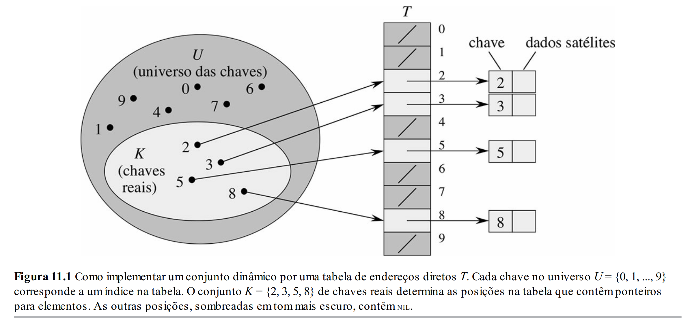
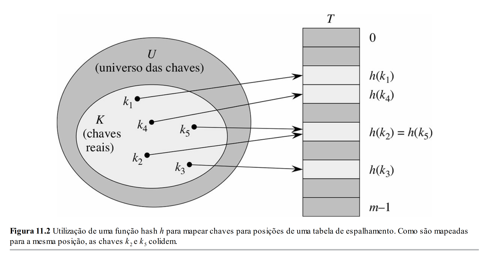

# Aula 25: Tabelas Hash

## 1. Introdução

Nas últimas aulas, estudamos estruturas de dados eficientes para diferentes padrões de acesso.

Árvores AVL são boas quando queremos manter os elementos ordenados e ainda assim realizar várias operações de forma eficiente, pois essas operações são proporcionais à altura da árvore:
```text
Busca:    O(log n)
Inserção: O(log n)
Remoção:  O(log n)
````

Já heaps são boas quando queremos acessar rapidamente o maior ou menor elemento:
```text
Acessar maior, em uma max-heap: O(1)
Acessar menor, em uma min-heap: O(1)
Inserir:                        O(log n)
Remover maior/menor:            O(log n)
```

Dessa vez, vamos estudar uma nova estrutura especializada em busca por chave e verificação de pertencimento. Isto é, uma estrutura de dados que se propõe a responder rapidamente perguntas como:
```text
Esse CPF já foi cadastrado?
Esse usuário existe?
Essa matrícula pertence a algum aluno?
Essa palavra aparece no texto?
Quantas vezes essa palavra apareceu?
Esse produto está no banco de dados?
```

Essas perguntas aparecem em aplicações como:
```text
login de usuários
bancos de dados
caches
contagem de frequência de palavras
verificação de duplicatas
índices invertidos
sistemas de busca
```

É nesse contexto que apresentaremos uma das estruturas de dados mais importantes e conhecidas: a **tabela hash**, também chamada de **Tabela de espelhamento** e **Tabela de dispersão**.

Como frequentemente ouvimos, a grande promessa das tabelas hash é permitir operações como busca, inserção e remoção em tempo médio esperado próximo de `O(1)`, ou seja, tempo constante.

E a aula de hoje se propõe justamente a elucidar como isso acontece internamente.

## 2. Dicionários

Antes de falar propriamente das tabelas hash, precisamos primeiro entender o tipo de TAD que queremos implementar.

Um **dicionário** é um tipo abstrato de dados que armazena pares `(chave, valor)`, em que a chave é usada para encontrar o valor associado.

Em geral, assumimos que as chaves são únicas: uma mesma chave não deve apontar para dois valores diferentes ao mesmo tempo.

Por exemplo:
```text
202412345 -> dados do aluno com essa matrícula
"jose.silva@gmail.com" -> dados do usuário com esse email
"estrutura" -> frequência da palavra "estrutura"
```

As principais operações são:
```text
insert(key, value)
search(key)
remove(key)
```

Para simplificar, poderíamos imaginar inicialmente um dicionário com chaves e valores inteiros:
```cpp
class Dictionary {
public:
    void insert(int key, int value);
    bool contains(int key);
    int get(int key);
    void remove(int key);
};
```

Em um primeiro momento, vamos pensar principalmente em chaves inteiras. Depois, veremos como a mesma ideia pode ser estendida para outros tipos de chave comuns, como strings ou tuplas.

## 3. Motivação: as estruturas que vimos até agora

Antes de criar uma nova estrutura, vale perguntar: por que não usar as estruturas que já conhecemos?

Suponha que queremos armazenar vários alunos e buscar rapidamente por matrícula.

Poderíamos usar um array desordenado, um array ordenado ou uma árvore AVL.

Uma comparação simplificada seria:

| Estrutura         | Busca por chave |      Inserção |       Remoção | Mantém ordem? |
| ----------------- | --------------: | ------------: | ------------: | ------------- |
| Array desordenado |            O(n) |          O(1) |          O(n) | Não           |
| Array ordenado    |        O(log n) |          O(n) |          O(n) | Sim           |
| AVL               |        O(log n) |      O(log n) |      O(log n) | Sim           |
| Hash Table        |   O(1) esperado | O(1) esperado | O(1) esperado | Não           |

Por enquanto, a linha da Hash Table representa a promessa que vamos tentar entender ao longo da aula.

Dentre essas estruturas:
* O array desordenado é simples, mas a busca é cara;
* O array ordenado permite busca binária, mas inserir e remover pode exigir deslocar vários elementos;
* A AVL é muito boa quando queremos manter os elementos ordenados e ainda assim inserir, remover e buscar de forma eficiente.

Mas será que `O(log n)` é o melhor que conseguimos fazer para busca por chave?

Como veremos, se abrirmos mão da ordem e aceitarmos uma análise de caso médio/esperado, conseguimos chegar a operações próximas de `O(1)`.

Isso significa que hash tables são excelentes para busca por pertencimento e acesso por chave.

Por exemplo:
```text
Esse elemento existe?
Qual valor está associado a essa chave?
Essa palavra já apareceu?
Esse CPF já está cadastrado?
```

Mas são ruins para operações que dependem de ordem, como:
```text
encontrar o menor elemento
encontrar o maior elemento
imprimir em ordem crescente
buscar elementos em um intervalo
encontrar o sucessor ou predecessor de uma chave
```

Logo, se o problema depende de ordem, uma árvore balanceada pode ser mais adequada.

Já se o problema é buscar rapidamente por chave, uma tabela hash pode ser uma ótima escolha.

## 4. Uma primeira tentativa: Tabelas de endereçamento direto

Antes de falar das tabelas hash, vamos começar com uma estrutura mais simples: a **Tabela de endereçamento direto**.

A ideia é simples: se cada chave já é um inteiro pequeno, podemos usar a própria chave como índice de um array.

### 4.1 Ideia

Suponha que temos um universo $U = \{0, 1, 2, \dots, u - 1\}$ de chaves possíveis e que as chaves realmente armazenadas em um certo momento formam um subconjunto $K \subseteq U$.

A ideia da Tabela de endereçamento direto é criar um array `T` com uma posição para cada chave possível do universo `U`.

Ou seja, se uma chave `k` pertence ao conjunto de chaves reais `K`, armazenamos o elemento associado a `k` diretamente na posição:

```cpp
T[k]
````

A figura a seguir ilustra essa abordagem.



Como podemos observar:
* Existe um universo de chaves possíveis `U`;
* Existe um conjunto `K` de chaves realmente utilizadas;
* Para cada chave `k ∈ K`, armazenamos o elemento associado diretamente na posição `T[k]`;
* Para cada chave `k ∈ U`, mas `k ∉ K`, a posição `T[k]` fica vazia.

Em outras palavras:

```text
T[k] contém o elemento com chave k, se ele existir.
T[k] contém NULL, caso contrário.
```

Como nessa estrutura a chave é simplesmente o índice do array, as operações são muito eficientes:

```text
Inserção: O(1)
Busca:    O(1)
Remoção:  O(1)
```

Se a chave pode ser usada diretamente como índice, o problema está praticamente resolvido.

### 4.2 Exemplos

Um exemplo simples em que essa abordagem funciona bem é a contagem de frequência de caracteres em um texto.

Caracteres podem ser representados por números. Por exemplo, usando ASCII:

```text
'A' -> 65
'B' -> 66
'a' -> 97
'b' -> 98
```

Logo, podemos usar um array com 256 posições:

```cpp
int freq[256];
```

Cada caractere pode ser usado como índice:

```cpp
char c = 'A';
freq[(int)c]++;
```

Esse é um caso em que a ideia de acesso direto funciona bem, porque o domínio é pequeno e conhecido.

Outro exemplo seria trabalhar com valores previamente mapeados para inteiros, como enums ou categorias fixas.

Por exemplo, suponha que temos uma lista de alunos e queremos saber em quais cidades há pelo menos um aluno.

O Brasil possui 5570 municípios. Se conseguirmos mapear cada cidade para um inteiro único entre `0` e `5569`, podemos criar:

```cpp
bool cities[5570];
```

Depois, para cada aluno, poderíamos fazer algo como:

```cpp
int index = mapping(city);
cities[index] = true;
```

Nesse caso, `mapping(city)` transforma o nome da cidade em um índice válido do array.

Observe que esse exemplo já sugere uma ideia importante: às vezes a chave original não é um inteiro, mas conseguimos criar uma função que a transforma em um inteiro adequado.

Essa ideia será importante quando falarmos de tabelas hash.

### 4.3 Limitações

A Tabela de endereçamento direto é excelente quando o universo de chaves é pequeno e bem definido.

Mas ela tem duas limitações importantes:
* Nem toda chave é naturalmente um inteiro pequeno;
* Não faz sentido criar um array de tamanho `|U|` quando `|K| << |U|`.

#### Nem toda chave é um inteiro pequeno

Em muitos problemas, as chaves podem ser strings, objetos ou valores compostos.

Exemplos:

```text
"maria"
"joao@gmail.com"
"ABC-1234"
"estrutura"
"123.456.789-11"
```

Não é imediatamente óbvio em qual posição do array deveríamos colocar a string `"estrutura"`.

Portanto, o primeiro problema é:

```text
Como transformar uma chave qualquer em um inteiro?
```

#### O universo de chaves pode ser enorme

Mesmo quando a chave é um inteiro, o universo pode ser grande demais.

Exemplos:

```text
CPF:       12345678901
Matrícula: 202412345
Telefone:  21999998888
```

Não faz sentido criar um array com bilhões de posições apenas para armazenar alguns milhares de elementos.

Por exemplo, se temos apenas 5000 alunos, mas as matrículas são números como:

```text
202400001
202400002
202400003
...
```

não queremos criar um array com mais de 200 milhões de posições só para guardar esses alunos.

Nesse caso, o universo `U` é muito maior que o conjunto de chaves realmente usadas `K`.
Matematicamente, temos $|K| \ll |U|$

A Tabela de endereçamento direto tem a velocidade que queremos, mas pode desperdiçar memória demais.

### 4.4 O que precisamos solucionar

A Tabela de endereçamento direto nos ensina a ideia ideal:
> Se eu conseguir transformar a chave em uma posição do array, a busca pode ser `O(1)`.

Mas, para usar essa ideia em problemas reais, precisamos resolver dois problemas:
```text
1. Como transformar uma chave qualquer em um inteiro?
2. Como transformar esse inteiro em um índice pequeno do array?
```

Essas duas perguntas nos levam naturalmente à ideia de tabela hash.

## 5. A ideia da Hash Table

Uma tabela hash pode ser vista como uma tentativa de aproximar a eficiência da Tabela de endereçamento direto usando muito menos memória.

Na Tabela de endereçamento direto, fazíamos `T[key]`. Ou seja, usávamos a própria chave como índice.

Na tabela hash, faremos algo parecido, mas com uma etapa intermediária `T[h(key)]`.

A função `h` é chamada de **função hash**.

Ela recebe uma chave `k` pertencente ao universo de chaves `U` e devolve um índice válido da tabela.

Dessa forma, se a tabela possui `m` posições, queremos:
$$
h: U \rightarrow {0, 1, 2, \dots, m - 1}
$$

Ou seja, para qualquer chave `k ∈ U`, a função hash deve produzir um índice entre `0` e `m - 1`.

A tabela em si continua sendo um array:

```text
T[0], T[1], T[2], ..., T[m - 1]
```

Cada posição desse array é chamada de **bucket**.

Assim, cada chave `k` será armazenada na posição determinada por `T[h(k)]`.

A figura a seguir ilustra essa ideia.



Observe a diferença em relação à Tabela de endereçamento direto.

Na Tabela de endereçamento direto, a tabela precisava ter uma posição para cada chave possível do universo `U`.

Na tabela hash, a tabela tem apenas `m` posições, normalmente muito menos do que `|U|`.

Em geral, queremos escolher `m` proporcional ao número de elementos que esperamos armazenar:
$$
m = O(n)
$$
onde:
* `n` é o número de elementos armazenados;
* `m` é o número de buckets da tabela.

A ideia geral é:
```text
chave -> função hash -> bucket
```

Por exemplo:
```text
"ana" -> h("ana") -> 2
```

Então armazenamos o elemento associado à chave `"ana"` no bucket 2.

### 5.1 Colisões aparecem naturalmente

Como normalmente temos $|U| \gg m$ não podemos esperar que cada chave possível receba um bucket diferente.

Portanto, podem existir duas chaves diferentes `k₁` e `k₂` tais que $k_1 \neq k_2$ mas $h(k_1) = h(k_2)$.

Quando isso acontece, dizemos que houve uma **colisão**.

A própria figura anterior mostra essa situação: duas chaves diferentes podem ser mapeadas para a mesma posição da tabela.

Essa é uma consequência natural do princípio das gavetas.

Se temos mais chaves possíveis do que posições na tabela, algumas chaves inevitavelmente compartilharão a mesma posição.

Por enquanto, basta guardar a ideia:

```text
Hash tables não eliminam colisões.
Hash tables precisam lidar com colisões.
```

Mais adiante, estudaremos estratégias para tratar colisões, começando por **encadeamento separado**.

### 5.2 Separando a ideia em duas etapas

Outra ponto importante é que até agora escrevemos a função hash como se ela resolvesse tudo:

```cpp
T[h(key)]
```

Essa função `h` parece fazer duas coisas ao mesmo tempo:
1. transformar a chave em um número;
2. transformar esse número em um índice entre `0 e m - 1`.

Na prática, muitas bibliotecas realmente escondem esses detalhes dentro de uma única função.

Mas, para entender a estrutura, é útil separar o processo em duas etapas conceituais:

```text
chave -> prehashing -> inteiro -> hashing -> bucket
```

Por exemplo:

```text
"ana"
-> prehash("ana")
-> 96752
-> hash(96752)
-> 2
```

A primeira etapa é o **prehashing**.

Ela transforma uma chave qualquer em um inteiro.

Exemplos:

```text
"ana" -> 96752
"estrutura" -> 138927492374
(10, 20) -> 10000050
```

A segunda etapa é o **hashing** propriamente dito.

Ela transforma esse inteiro em um índice válido da tabela.

Se a tabela tem `m` buckets, o resultado precisa estar entre `0 e m - 1`

Portanto:
```text
prehashing: chave -> inteiro
hashing:    inteiro -> bucket
```

## 6. Prehashing

O papel do prehashing é transformar uma chave em um inteiro.

Idealmente, gostaríamos que chaves diferentes gerassem inteiros diferentes.

Na prática, isso depende do tipo de chave e da função usada.

Para alguns tipos, essa transformação é natural. Para outros, precisamos construir uma função específica.

### 6.1 Inteiros

Se a chave já é um inteiro, o prehashing pode ser a própria chave.

Por exemplo:
```text
prehash(12345) = 12345
```
Nesse caso, não precisamos fazer quase nada.

Ainda assim, esse número pode ser grande demais para ser usado diretamente como índice.

Por isso, depois do prehashing ainda precisaremos aplicar uma função hash para reduzir esse inteiro a um bucket válido.

### 6.2 Strings

Strings são mais interessantes.

Uma string é uma sequência de caracteres.

Por exemplo:
```text
"abc"
```

Como cada caractere possui uma representação numérica, uma primeira ideia seria somar os valores dos caracteres.

```cpp
int prehash(string s) {
    int total = 0;
    for (int i = 0; i < s.length(); i++) {
        total += (int)s[i];
    }
    return total;
}
```

Essa ideia é simples, mas ruim.

O problema é que ela ignora a ordem dos caracteres.

Por exemplo:
```text
"abc"
"cba"
"bac"
```

Todas essas strings teriam a mesma soma.

Mas elas são strings diferentes e deveriam, idealmente, gerar valores diferentes.

Uma ideia melhor é levar a posição dos caracteres em consideração.

Podemos tratar a string como se fosse um número escrito em uma certa base.

Por exemplo:

```cpp
unsigned long prehash(std::string s) {
    unsigned long h = 0;
    unsigned long base = 31;
    for (int i = 0; i < s.length(); i++) {
        h = h * base + s[i];
    }
    return h;
}
```

A intuição é parecida com a representação de números decimais.

No número `123`, o valor não é apenas:
```text
1 + 2 + 3
```

A posição de cada dígito importa:
```text
1 * 10² + 2 * 10¹ + 3 * 10⁰
```

Para strings, fazemos algo parecido:
```text
'a' * base² + 'b' * base¹ + 'c' * base⁰
```

O código anterior calcula isso incrementalmente:
```text
h = h * base + caractere
```

Essa ideia é uma versão simplificada de uma técnica conhecida como **hashing polinomial**.

Nesta aula, não precisamos nos aprofundar nos detalhes matemáticos.

O ponto importante é:

```text
Para strings, uma boa função de prehashing deve considerar os caracteres e suas posições.
```

### 6.3 Outros tipos de chave

Assim como acontece para inteiros e strings, outros tipos de chave também precisam de mapeamentos próprios para inteiros.

A ideia aqui não é detalhar como esses mapeamentos são feitos em cada caso, mas apenas deixar claro que esse processo não é mágica: para cada tipo de chave, precisamos pensar em uma forma de representá-la numericamente.

Para tuplas, classes customizadas e outros objetos compostos, podemos usar estratégias que combinem os valores internos da chave.

Por exemplo, se a chave é uma tupla:

```text
(x, y)
````

normalmente queremos que a ordem dos componentes seja levada em consideração. Ou seja, em geral, não queremos que:

```text
prehash(x, y) = prehash(y, x)
```

Da mesma forma, se a chave é um objeto, precisamos decidir quais atributos identificam esse objeto.

Por exemplo:

```text
Aluno   -> matrícula
Pessoa  -> CPF
Produto -> product_id
Usuário -> email ou id
```

Depois disso, podemos combinar os prehashings desses atributos para produzir um único inteiro.

O objetivo é sempre tentar fazer com que chaves diferentes gerem inteiros diferentes sempre que possível. Quando isso não for viável, ao menos queremos evitar que chaves diferentes gerem o mesmo inteiro com facilidade ou que os inteiros produzidos tenham padrões ruins demais.

Os detalhes dessas funções podem ficar bastante sofisticados. Para esta disciplina, o mais importante é entender a ideia geral:

```text
prehashing transforma uma chave qualquer em um inteiro;
a forma de fazer isso depende do tipo da chave.
```

## 7. Hashing

Depois do prehashing, temos um inteiro.

Mas esse inteiro ainda pode ser enorme.

Por exemplo:

```text
prehash("estrutura") = 138927492374
````

Se a tabela possui apenas `m = 10` buckets, precisamos transformar esse número em uma posição entre 0 e 9.

Essa etapa é o **hashing** no sentido de compressão:

```text
inteiro -> bucket
```

Se a tabela tem tamanho `m`, queremos uma função `h` tal que:

```text
0 <= h(x) < m
```

Ou seja, a função hash recebe um inteiro e devolve um índice válido da tabela.

### 7.1 Propriedades de interesse

Uma boa função hash deve ter algumas propriedades:

```text
1. Determinismo
2. Baixo custo computacional
3. Boa distribuição
4. Baixa sensibilidade a padrões ruins da entrada
```

A primeira propriedade é o **determinismo**.

A mesma chave deve sempre gerar o mesmo bucket.

```text
Se h(x) = 3 agora, h(x) deve continuar sendo 3 depois.
```

Sem determinismo, não conseguiríamos buscar um elemento depois de inseri-lo.

A segunda propriedade é o **baixo custo computacional**.

Calcular a função hash precisa ser rápido. Não faria sentido usar uma função hash extremamente cara, pois isso destruiria a vantagem da tabela hash.

A terceira propriedade é a **boa distribuição**.

Queremos espalhar os elementos entre os buckets.

Se temos 100 elementos e 10 buckets, gostaríamos de algo próximo de:

```text
bucket 0: 10 elementos
bucket 1: 9 elementos
bucket 2: 11 elementos
bucket 3: 10 elementos
...
```

Não queremos algo assim:

```text
bucket 0: 90 elementos
bucket 1: 1 elemento
bucket 2: 1 elemento
bucket 3: 1 elemento
...
```

A quarta propriedade é a **baixa sensibilidade a padrões ruins da entrada**.

Na prática, os dados frequentemente possuem padrões.

Exemplos:

```text
matrículas sequenciais
IDs e valores múltiplos de 2, 5, 10
CPFs com partes estruturadas
telefones com prefixos semelhantes
datas codificadas como números
```

Uma boa função hash deve tentar evitar que chaves parecidas ou padronizadas caiam todas nos mesmos buckets.

### 7.2 Division Method

Uma primeira tentativa de função hash é o **método da divisão**.

A ideia é simples:

```text
h(x) = x % m
```

onde:

```text
x = inteiro gerado pelo prehashing
m = número de buckets
```

Exemplo com `m = 10`:

```text
12 % 10 = 2
25 % 10 = 5
31 % 10 = 1
44 % 10 = 4
58 % 10 = 8
```

A tabela ficaria:

```text
índice:  0   1   2   3   4   5   6   7   8   9
valor:   -  31  12   -  44  25   -   -  58   -
```

Nesse exemplo, a distribuição ficou razoável.

Mas o método da divisão pode se comportar mal se os dados tiverem padrões.

Por exemplo, ainda com `m = 10`:

```text
20 % 10 = 0
30 % 10 = 0
40 % 10 = 0
50 % 10 = 0
60 % 10 = 0
```

Todos caíram no bucket 0.

Visualmente:

```text
índice:  0                  1   2   3   4   5   6   7   8   9
valor:   20,30,40,50,60     -   -   -   -   -   -   -   -   -
```

O problema não é que o método da divisão seja sempre ruim.

Ele é simples, rápido e muitas vezes funciona bem.

O problema é que, dependendo da escolha de `m` e do padrão das entradas, ele pode concentrar muitos elementos em poucos buckets.

Por isso, a escolha do tamanho da tabela importa.

Uma estratégia comum é escolher `m` como um número primo que não esteja muito próximo de potências de 2, 10 ou outros valores relacionados aos padrões esperados das entradas.

A intuição é que um valor de `m` mal escolhido pode preservar padrões dos dados.

Por exemplo, se `m = 10`, o resultado de `x % m` depende diretamente do último dígito decimal de `x`.

Assim, valores como:

```text
20, 30, 40, 50, 60
```

caem todos no mesmo bucket.

Ao escolher um `m` menos alinhado com esses padrões, tentamos quebrar esse tipo de regularidade.

Outra possibilidade é garantir que a etapa de prehashing já produza inteiros bem distribuídos. Nesse caso, mesmo uma operação simples como `% m` pode funcionar bem, porque os padrões da entrada original já foram parcialmente misturados na etapa anterior.

Portanto, o método da divisão funciona melhor quando pelo menos uma destas coisas acontece:

```text
1. escolhemos bem o tamanho m da tabela;
2. o prehashing já produz inteiros bem distribuídos.
```

### 7.3 Multiplication Method

Outra estratégia é o **método da multiplicação**.

A ideia é misturar melhor os bits da chave antes de escolher o bucket.

Uma formulação comum é:

```text
h_a(x) = ((a * x) mod 2^W) >> (W - M)
```

onde:

```text
W = número de bits da palavra, normalmente 32 ou 64
m = 2^M = número de buckets
a = número ímpar escolhido entre 1 e 2^W - 1
```

Vamos entender a ideia sem entrar em prova.

A parte:

```text
(a * x) mod 2^W
```

multiplica a chave por uma constante `a` e mantém apenas os `W` bits do resultado.

A parte:

```text
>> (W - M)
```

pega os `M` bits mais significativos.

Como temos `M` bits, o resultado está entre:

```text
0 e 2^M - 1
```

Ou seja, entre:

```text
0 e m - 1
```

A intuição é:

```text
multiplicar por a embaralha os bits de x;
depois usamos alguns bits do resultado para escolher o bucket.
```

Vamos usar um exemplo pequeno apenas para visualizar.

Suponha:

```text
W = 8
M = 3
m = 2^3 = 8 buckets
a = 37
```

Então:

```text
h(x) = ((37 * x) mod 256) >> 5
```

Agora considere `x = 20`:

```text
37 * 20 = 740
740 mod 256 = 228
228 em binário = 11100100
3 bits mais significativos = 111
h(20) = 7
```

Agora considere `x = 30`:

```text
37 * 30 = 1110
1110 mod 256 = 86
86 em binário = 01010110
3 bits mais significativos = 010
h(30) = 2
```

Agora considere `x = 40`:

```text
37 * 40 = 1480
1480 mod 256 = 200
200 em binário = 11001000
3 bits mais significativos = 110
h(40) = 6
```

Perceba que, no método da divisão com `m = 10`, valores como 20, 30 e 40 caíam no mesmo bucket.

Aqui, com o método multiplicativo, eles foram espalhados:

```text
20 -> 7
30 -> 2
40 -> 6
```

Além disso, se verificarmos `x = 19`:

```text
37 * 19 = 703
703 mod 256 = 191
191 em binário = 10111111
3 bits mais significativos = 101
h(19) = 5
```

Também notamos que números próximos podem cair em buckets distintos.

Esse exemplo é pequeno e artificial, mas mostra a intuição.

O método da multiplicação tenta reduzir o impacto de padrões simples da entrada.

Observe que `a` é um parâmetro da função.

Para cada escolha de `a`, temos uma função hash diferente:

```text
h_1, h_3, h_5, ..., h_a, ...
```

Assim, escolher `a` aleatoriamente significa escolher uma função dentro de uma família de funções hash que seguem o mesmo padrão geral.

Em algumas formulações, escolhendo `a` aleatoriamente de maneira adequada, é possível provar garantias probabilísticas.

Por exemplo, para duas chaves diferentes `x` e `y`, pode-se obter uma garantia do tipo:

```text
Pr[h_a(x) = h_a(y)] <= 2/m
```

Não vamos provar esse resultado.

O objetivo aqui é apenas entender que existem famílias de funções hash com propriedades teóricas melhores do que uma escolha completamente arbitrária.

### 7.4 Outras famílias de funções hash

Existem várias outras famílias de funções hash.

Algumas são estudadas em cursos mais avançados de algoritmos e análise probabilística, como **universal hashing**.

A ideia geral é semelhante ao que comentamos no método da multiplicação: em vez de apostar em uma única função fixa, escolhemos uma função dentro de uma família de funções hash.

Com uma família bem projetada, podemos obter garantias sobre a probabilidade de colisões.

Na prática, linguagens e bibliotecas costumam usar funções hash testadas empiricamente e ajustadas para diferentes tipos de dados.

Nesta disciplina, o mais importante não é decorar várias funções hash.

O mais importante é entender:

```text
1. uma função hash deve ser determinística;
2. deve ser rápida;
3. deve espalhar bem os elementos;
4. deve lidar razoavelmente bem com padrões da entrada.
```
