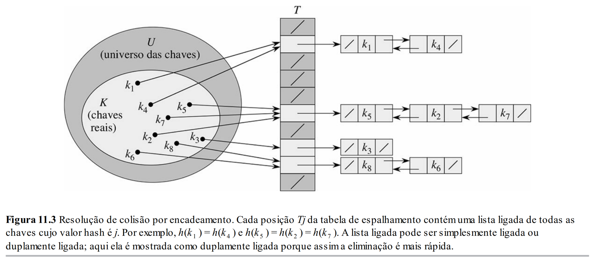

# Aula 26: Tabelas Hash II - Colisões e Endereçamento Aberto

## 1. Colisões

Na aula anterior, vimos que uma boa função hash deve tentar espalhar bem as chaves pelos buckets.

Mas, mesmo com uma boa função hash, colisões podem acontecer.

Uma **colisão** ocorre quando duas chaves diferentes caem no mesmo bucket.

Formalmente:

```text
x != y
h(x) = h(y)
```

Por exemplo, usando `h(x) = x % 10`:

```text
12 % 10 = 2
22 % 10 = 2
32 % 10 = 2
```

As três chaves são diferentes, mas todas caem no bucket 2.

Isso não significa necessariamente que a função hash está errada.

Colisões são inevitáveis quando mapeamos um universo grande de chaves para um número pequeno de buckets.

Essa é a intuição do princípio das gavetas.

Se temos mais objetos do que gavetas, alguma gaveta terá mais de um objeto.

Por exemplo, se temos 1000 possíveis chaves e apenas 10 buckets, é impossível colocar todas as possíveis chaves em buckets diferentes.

Então uma função hash boa não é uma função que elimina colisões.

Isso geralmente é impossível.

Uma função hash boa tenta espalhar os elementos para que as colisões sejam raras e não se concentrem demais.

A frase principal é:

```text
Hash tables não eliminam colisões.
Hash tables tentam tornar colisões raras e baratas.
```

Como colisões podem acontecer, toda tabela hash precisa de uma estratégia para lidar com elas.

Duas famílias importantes são:

* **Encadeamento separado** (*separate chaining*);
* **Endereçamento aberto** (*open addressing*).

## 2. Encadeamento separado

### 2.1 Funcionamento

A ideia por trás do **encadeamento separado** é simples.

Cada bucket da tabela guarda uma lista de elementos cujas chaves foram mapeadas para aquele bucket.

Assim, se várias chaves caírem no mesmo bucket, armazenamos todas elas naquela lista.

Em vez de cada posição do array guardar um único elemento, cada posição guarda o início de uma lista.

Visualmente:

```text
índice 0: -
índice 1: 31
índice 2: 12 -> 22 -> 32
índice 3: -
índice 4: 44
índice 5: 25
```

Se a função hash for `h(x) = x % 10`, então:

* `12 -> 2`
* `22 -> 2`
* `32 -> 2`

Todos caem no bucket 2.

Com encadeamento separado, isso não destrói a tabela.

O bucket 2 guarda uma lista:

```text
12 -> 22 -> 32
```

A tabela hash usa o array para chegar rapidamente ao bucket certo.

Depois, usa a lista para procurar dentro daquele bucket.

A figura a seguir ilustra uma tabela hash com encadeamento separado:



### 2.2 Exemplo

Considere uma tabela com `m = 10` buckets e função hash:

```text
h(x) = x % 10
```

Vamos inserir:

```text
12, 25, 31, 22, 44, 32
```

Calculando os buckets:

| Chave | Bucket |
| ----: | -----: |
|    12 |      2 |
|    25 |      5 |
|    31 |      1 |
|    22 |      2 |
|    44 |      4 |
|    32 |      2 |

A tabela fica:

```text
0: -
1: 31
2: 12 -> 22 -> 32
3: -
4: 44
5: 25
6: -
7: -
8: -
9: -
```

Para buscar `22`:

1. Calculamos `h(22) = 2`;
2. Vamos ao bucket 2;
3. Percorremos a lista `12 -> 22 -> 32`;
4. Encontramos `22`.

Não precisamos procurar na tabela inteira.

Procuramos apenas no bucket indicado pela função hash.

Para inserir `42`:

```text
h(42) = 42 % 10 = 2
```

Antes:

```text
2: 12 -> 22 -> 32
```

Se inserirmos no início da lista:

```text
2: 42 -> 12 -> 22 -> 32
```

Inserir no início costuma ser simples, porque basta ajustar ponteiros.

Para remover `22`:

Antes:

```text
2: 42 -> 12 -> 22 -> 32
```

Depois:

```text
2: 42 -> 12 -> 32
```

A remoção se parece com a remoção em lista encadeada.

Precisamos encontrar o elemento e ajustar os ponteiros.

### 2.3 Custo

Vamos analisar o custo das operações com encadeamento separado.

Suponha:

* `n` = número de elementos armazenados;
* `m` = número de buckets.

Definimos o **fator de carga** como:

$$
\alpha = \frac{n}{m}
$$

O fator de carga representa o número médio de elementos por bucket.

Por exemplo, se `n = 100` e `m = 10`, então:

$$
\alpha = \frac{100}{10} = 10
$$

Isso significa que, em média, há 10 elementos por bucket.

No entanto, isso não quer dizer que todo bucket terá exatamente 10 elementos.

Podemos ter buckets vazios e buckets com muitos elementos.

A pergunta importante é:

> O que acontece se a função hash espalhar bem as chaves?

Para fazer uma primeira análise, usamos uma hipótese idealizada chamada **hipótese simplificada de hashing uniforme**.

A ideia é assumir que cada chave tem a mesma probabilidade de cair em qualquer bucket.

Ou seja, para uma tabela com `m` buckets:

$$
Pr[h(k) = j] = \frac{1}{m}
$$

para qualquer bucket `j`.

Além disso, assumimos que o comportamento de uma chave não ajuda a prever o comportamento das outras.

Isto é, saber que uma chave caiu em certo bucket não deveria nos dar muita informação sobre onde outra chave cairá.

Essa hipótese pode falhar quando as entradas possuem padrões e a função hash não consegue quebrar esses padrões.

Por exemplo, com:

```text
h(x) = x % 10
```

se várias chaves são múltiplas de 10:

```text
20, 30, 40, 50, 60
```

todas cairão no bucket 0.

Nesse caso, saber que uma chave caiu no bucket 0 nos dá uma pista forte de que as outras também podem cair no mesmo bucket.

Essa hipótese é uma idealização.

Na prática, funções hash reais tentam se aproximar desse comportamento, mas não garantem perfeição.

Sob essa hipótese, o tamanho esperado de cada lista é:

$$
\alpha = \frac{n}{m}
$$

Intuitivamente:

```text
n elementos espalhados uniformemente em m buckets
=> aproximadamente n/m elementos por bucket
```

Agora podemos analisar a busca.

Para buscar uma chave:

1. Calculamos o hash: `O(1)`;
2. Acessamos o bucket: `O(1)`;
3. Percorremos a lista daquele bucket: `O(α)`, em média.

Logo:

```text
Busca esperada: O(1 + α)
```

Para remover, o raciocínio é parecido:

```text
Remoção esperada: O(1 + α)
```

Para inserir, existem dois casos.

Se permitimos chaves repetidas e inserimos direto no início da lista:

```text
Inserção: O(1)
```

Mas, se não queremos permitir duplicatas, precisamos primeiro verificar se a chave já existe.

Nesse caso:

```text
Inserção esperada: O(1 + α)
```

Se mantivermos `α` pequeno, então as operações ficam próximas de `O(1)`.

Por exemplo, se escolhermos `m` proporcional a `n`, isto é:

$$
m = O(n)
$$

então:

$$
\alpha = \frac{n}{m} = O(1)
$$

Logo, sob a hipótese de boa distribuição:

| Operação                                         | Custo esperado |
| ------------------------------------------------ | -------------: |
| Busca                                            |         `O(1)` |
| Remoção                                          |         `O(1)` |
| Inserção, se for necessário verificar duplicatas |         `O(1)` |
| Inserção direta no início da lista               |         `O(1)` |

Mas existe pior caso.

Se todos os elementos caírem no mesmo bucket:

```text
0: 10 -> 20 -> 30 -> 40 -> 50 -> ...
1: -
2: -
3: -
...
```

a tabela hash vira praticamente uma lista encadeada.

Nesse caso:

| Operação                                      | Pior caso |
| --------------------------------------------- | --------: |
| Busca                                         |    `O(n)` |
| Remoção                                       |    `O(n)` |
| Inserção, se for necessário evitar duplicatas |    `O(n)` |

Essa é uma diferença importante entre tabelas hash e árvores AVL.

Uma AVL garante `O(log n)` no pior caso.

Uma tabela hash busca oferecer `O(1)` em média ou em valor esperado, desde que duas condições sejam razoavelmente satisfeitas:

1. A função hash distribui bem as chaves;
2. O fator de carga `α` é mantido pequeno.

A primeira condição depende da qualidade da função hash.

A segunda condição depende de controlar o tamanho da tabela.

Isso nos leva ao próximo tópico.

## 3. Redimensionamento e rehashing

Até agora, analisamos a tabela hash supondo que o fator de carga `α` se mantém pequeno.

Mas isso não acontece automaticamente.

Se continuarmos inserindo elementos em uma tabela de tamanho fixo, o valor de `n` aumenta, enquanto `m` permanece igual.

Como:

$$
\alpha = \frac{n}{m}
$$

então, se `m` é fixo e `n` cresce, `α` também cresce.

Por exemplo:

| Situação           | `n` | `m` | `α = n/m` |
| ------------------ | --: | --: | --------: |
| Tabela pouco cheia |   5 |  10 |       0.5 |
| Tabela mais cheia  |  50 |  10 |         5 |

Com encadeamento separado, isso significa que as listas tendem a ficar maiores.

Listas maiores tornam busca e remoção mais caras.

A solução usual é aumentar o tamanho da tabela quando o fator de carga passa de certo limite.

Esse processo é chamado de **redimensionamento**.

A ideia é:

1. Criar uma nova tabela maior;
2. Percorrer os elementos da tabela antiga;
3. Recalcular a posição de cada elemento na tabela nova;
4. Inserir os elementos na nova tabela;
5. Descartar a tabela antiga.

Esse processo de recalcular as posições é chamado de **rehashing**.

É importante notar que não basta copiar os elementos para os mesmos índices.

Se mudamos `m`, a função hash pode mudar de resultado.

Por exemplo, se `h(x) = x % m`:

| Valor | Com `m = 10` | Com `m = 20` |
| ----: | -----------: | -----------: |
|    42 |            2 |            2 |
|    37 |            7 |           17 |

Em alguns casos, o índice permanece igual.

Em outros, muda.

Por isso, ao redimensionar a tabela, precisamos recalcular o hash dos elementos.

Esse processo pode parecer caro, e de fato uma operação de rehashing pode custar `O(n)`.

Mas ela não acontece a cada inserção.

Ela acontece apenas ocasionalmente, quando a tabela cresce demais.

Por isso, em uma análise amortizada, o custo médio por inserção continua sendo eficiente.

A ideia é parecida com o crescimento de arrays dinâmicos, como `vector`.

Em um `vector`, algumas inserções podem ser caras quando precisamos realocar o array, mas como isso não acontece sempre, o custo amortizado de inserção continua sendo baixo.

Em tabelas hash, o redimensionamento cumpre um papel parecido:

```text
manter o fator de carga controlado
```

Sem resizing, a tabela hash pode degradar com o tempo.

Com resizing, conseguimos manter as operações próximas de `O(1)` esperado.

## 4. Endereçamento aberto

Até agora, vimos uma forma de tratar colisões: encadeamento separado.

Nessa estratégia, cada bucket possui uma lista de elementos.

Agora veremos outra família de estratégias: **endereçamento aberto**.

A ideia é diferente.

No encadeamento separado, se um elemento colide, ele é armazenado em uma lista associada ao bucket.

No endereçamento aberto, todos os elementos ficam dentro do próprio array.

Ou seja, não usamos listas externas.

Quando uma colisão acontece, procuramos outra posição livre dentro da própria tabela.

A diferença pode ser resumida assim:

| Estratégia            | O que acontece na colisão?                         |
| --------------------- | -------------------------------------------------- |
| Encadeamento separado | Guarda o elemento em uma lista associada ao bucket |
| Endereçamento aberto  | Procura outro bucket livre dentro do array         |

No endereçamento aberto, cada posição da tabela pode estar em um dos seguintes estados:

* vazia;
* ocupada;
* removida.

A ideia de “removida” será importante quando falarmos de remoção.

Uma consequência importante é que, no endereçamento aberto, o número de elementos armazenados não pode ultrapassar o número de buckets.

Ou seja:

$$
n \leq m
$$

Portanto, o fator de carga satisfaz:

$$
\alpha = \frac{n}{m} \leq 1
$$

Na prática, não queremos chegar perto demais de `α = 1`.

Se a tabela fica muito cheia, fica difícil encontrar posições livres.

Por isso, tabelas com endereçamento aberto normalmente fazem resizing antes de ficarem completamente cheias.

Agora precisamos responder:

> Se o bucket original está ocupado, como escolhemos o próximo bucket a tentar?

Essa sequência de tentativas é chamada de **sondagem**.

### 4.1 Sondagem linear

A forma mais simples de endereçamento aberto é a **sondagem linear**.

A ideia é:

* Se a posição `h(k)` está ocupada, tente a próxima;
* Se a próxima também está ocupada, tente a próxima;
* Continue até encontrar uma posição livre.

Formalmente, podemos escrever:

$$
h(k, i) = (h(k) + i) \mod m
$$

onde:

* `k` é a chave;
* `i` é o número da tentativa;
* `m` é o tamanho da tabela.

Na primeira tentativa, `i = 0`:

$$
h(k, 0) = h(k)
$$

Na segunda tentativa, `i = 1`:

$$
h(k, 1) = (h(k) + 1) \mod m
$$

Na terceira tentativa, `i = 2`:

$$
h(k, 2) = (h(k) + 2) \mod m
$$

E assim por diante.

#### Exemplo de inserção

Considere uma tabela com `m = 10` e função hash:

```text
h(k) = k % 10
```

Vamos inserir:

```text
12, 22, 32
```

Para `12`:

```text
h(12) = 2
```

A posição 2 está vazia.

Inserimos `12` no índice 2.

```text
0: -
1: -
2: 12
3: -
4: -
5: -
6: -
7: -
8: -
9: -
```

Para `22`:

```text
h(22) = 2
```

A posição 2 já está ocupada.

Com sondagem linear, tentamos a próxima posição: índice 3.

A posição 3 está vazia.

Inserimos `22` no índice 3.

```text
0: -
1: -
2: 12
3: 22
4: -
5: -
6: -
7: -
8: -
9: -
```

Para `32`:

```text
h(32) = 2
```

A posição 2 está ocupada.

Tentamos 3.

Também está ocupada.

Tentamos 4.

Está vazia.

Inserimos `32` no índice 4.

```text
0: -
1: -
2: 12
3: 22
4: 32
5: -
6: -
7: -
8: -
9: -
```

Observe que os três elementos possuem o mesmo hash inicial, mas foram armazenados em posições diferentes da tabela.

#### Busca

A busca segue a mesma sequência de tentativas usada na inserção.

Para buscar `32`, começamos calculando:

```text
h(32) = 2
```

Depois percorremos a sequência:

| Índice visitado | Conteúdo | Resultado   |
| --------------: | -------: | ----------- |
|               2 |       12 | Não é 32    |
|               3 |       22 | Não é 32    |
|               4 |       32 | Encontramos |

Portanto, no endereçamento aberto, buscar não significa olhar apenas a posição `h(k)`.

Precisamos seguir a sequência de sondagem até:

* encontrar a chave; ou
* encontrar uma posição vazia.

Se encontramos uma posição vazia, sabemos que a chave não está na tabela.

Por quê?

Porque, se ela tivesse sido inserida, teria sido colocada em alguma posição antes daquela posição vazia na sequência de sondagem.

#### Remoção e tombstones

A remoção em endereçamento aberto exige cuidado.

Suponha a tabela:

```text
0: -
1: -
2: 12
3: 22
4: 32
5: -
6: -
7: -
8: -
9: -
```

Agora queremos remover `22`.

Se simplesmente apagarmos a posição 3 e marcarmos como vazia:

```text
0: -
1: -
2: 12
3: -
4: 32
5: -
6: -
7: -
8: -
9: -
```

teremos um problema.

Agora, se buscarmos `32`, começamos em `h(32) = 2`.

Olhamos o índice 2:

```text
2: 12
```

Não é 32.

Tentamos o índice 3:

```text
3: vazio
```

Ao encontrar uma posição vazia, a busca concluiria que `32` não está na tabela.

Mas `32` está no índice 4.

Ou seja, apagar uma posição simplesmente pode quebrar a busca.

A solução comum é usar um marcador especial chamado **tombstone**, ou marcador de removido.

Em vez de marcar a posição como vazia, marcamos como removida:

```text
0: -
1: -
2: 12
3: REMOVIDO
4: 32
5: -
6: -
7: -
8: -
9: -
```

Durante a busca, uma posição marcada como `REMOVIDO` não encerra a busca.

Ela indica:

```text
continue procurando
```

Durante a inserção, uma posição `REMOVIDO` pode ser reutilizada.

Assim, os estados possíveis de uma posição são:

| Estado     | Significado na busca   |
| ---------- | ---------------------- |
| `VAZIO`    | A busca pode parar     |
| `OCUPADO`  | Comparamos a chave     |
| `REMOVIDO` | Continuamos procurando |

Essa é uma das razões pelas quais endereçamento aberto é mais delicado de implementar do que encadeamento separado.

#### Clustering

A sondagem linear é simples, mas tem um problema importante: **clustering**.

Clustering significa formação de blocos longos de posições ocupadas.

Por exemplo:

```text
0: -
1: -
2: 12
3: 22
4: 32
5: 42
6: 52
7: -
8: -
9: -
```

Temos um bloco ocupado de 2 até 6.

Agora, qualquer chave cujo hash inicial caia em 2, 3, 4, 5 ou 6 precisará percorrer esse bloco até encontrar uma posição livre.

Além disso, quando inserimos um novo elemento logo após o bloco, o bloco cresce.

Isso tende a piorar com o tempo.

Esse fenômeno é chamado de **clustering primário**.

A sondagem linear é simples e tem boa localidade de memória, porque acessa posições próximas no array.

Mas pode sofrer com clustering quando a tabela começa a ficar cheia.

Por isso, na prática, é importante manter o fator de carga controlado.

### 4.2 Duplo hashing

Uma forma de reduzir o problema do clustering é usar uma estratégia em que o passo da sondagem depende da chave.

Essa ideia leva ao **duplo hashing**.

No duplo hashing, usamos duas funções hash:

* `h1(k)`;
* `h2(k)`.

A sequência de sondagem é:

$$
h(k, i) = (h_1(k) + i \cdot h_2(k)) \mod m
$$

onde:

* `h1(k)` é a posição inicial;
* `h2(k)` é o tamanho do passo;
* `i` é o número da tentativa.

Na primeira tentativa:

$$
h(k, 0) = h_1(k)
$$

Na segunda tentativa:

$$
h(k, 1) = (h_1(k) + h_2(k)) \mod m
$$

Na terceira tentativa:

$$
h(k, 2) = (h_1(k) + 2h_2(k)) \mod m
$$

E assim por diante.

A vantagem é que chaves diferentes podem ter passos diferentes.

Isso evita que todas as chaves que colidem sigam exatamente a mesma sequência linear.

#### Exemplo

Suponha:

```text
m = 10
h1(k) = k % 10
h2(k) = 3
```

Para uma chave com `h1(k) = 0`, a sequência de sondagem seria:

```text
0, 3, 6, 9, 2, 5, 8, 1, 4, 7
```

Essa sequência visita todas as posições antes de repetir.

Agora suponha que o passo fosse:

```text
h2(k) = 2
```

Começando em 0, a sequência seria:

```text
0, 2, 4, 6, 8, 0, 2, 4, 6, 8, ...
```

Nesse caso, só visitamos os buckets pares.

Mesmo que existam posições livres nos buckets ímpares, nunca chegaremos nelas.

Esse exemplo mostra por que precisamos tomar cuidado com a escolha de `h2(k)`.

#### Por que `h2(k)` precisa ser coprimo com `m`?

Para que a sequência de sondagem consiga visitar todos os buckets da tabela, o passo `h2(k)` precisa ser coprimo com `m`.

Ou seja:

$$
gcd(h_2(k), m) = 1
$$

A intuição é a seguinte.

Se o passo e o tamanho da tabela possuem um divisor comum maior que 1, a sequência fica presa em apenas uma parte da tabela.

Exemplo ruim:

```text
m = 10
h2(k) = 2
gcd(10, 2) = 2
```

Começando em 0:

```text
0, 2, 4, 6, 8, 0, 2, 4, 6, 8, ...
```

Só visitamos metade da tabela.

Exemplo bom:

```text
m = 10
h2(k) = 3
gcd(10, 3) = 1
```

Começando em 0:

```text
0, 3, 6, 9, 2, 5, 8, 1, 4, 7
```

Visitamos todos os buckets antes de repetir.

Essa é a ideia central.

Não precisamos provar formalmente esse resultado nesta disciplina.

O que precisamos guardar é:

```text
No duplo hashing, o passo h2(k) deve ser coprimo com m.
Caso contrário, a sondagem pode visitar apenas parte da tabela.
```

Uma escolha comum é usar `m` primo e garantir que:

```text
1 <= h2(k) < m
```

Nesse caso, qualquer valor de `h2(k)` nesse intervalo será coprimo com `m`.

Outra possibilidade é usar `m` como potência de 2 e garantir que `h2(k)` seja ímpar.

Como qualquer número ímpar é coprimo com uma potência de 2, isso também garante que a sequência possa visitar toda a tabela.

#### Comparação com sondagem linear

Na sondagem linear:

$$
h(k, i) = (h(k) + i) \mod m
$$

Todas as chaves que colidem seguem a mesma sequência de posições.

No duplo hashing:

$$
h(k, i) = (h_1(k) + i \cdot h_2(k)) \mod m
$$

A sequência depende também de `h2(k)`.

Isso tende a reduzir a formação de blocos longos de posições ocupadas.

Por outro lado, o duplo hashing é um pouco mais caro, porque precisamos calcular duas funções hash.

Também é mais fácil errar a implementação, especialmente na escolha de `h2(k)`.

### 4.3 Comparação das estratégias de colisão

Agora podemos comparar as estratégias vistas.

| Estratégia            | Ideia                                              | Vantagens                                                                | Desvantagens                                                        |
| --------------------- | -------------------------------------------------- | ------------------------------------------------------------------------ | ------------------------------------------------------------------- |
| Encadeamento separado | Cada bucket guarda uma lista                       | Simples de entender; remoção simples; permite fator de carga maior que 1 | Usa memória extra para ponteiros/listas; pior localidade de memória |
| Sondagem linear       | Em caso de colisão, tenta a próxima posição        | Simples; boa localidade de memória; não usa listas                       | Sofre com clustering; remoção exige tombstones                      |
| Duplo hashing         | Usa uma segunda função hash como passo da sondagem | Reduz clustering; sequências variam por chave                            | Mais complexo; exige cuidado com coprimalidade                      |

Não existe uma estratégia universalmente melhor.

A escolha depende de fatores como:

* simplicidade;
* uso de memória;
* localidade de cache;
* custo da função hash;
* padrão das entradas;
* facilidade de remoção.

Para fins didáticos, o encadeamento separado costuma ser o mais fácil de entender.

Para implementações práticas, endereçamento aberto pode ser muito atraente por usar melhor o array e evitar alocações extras.

## 5. Uma observação sobre a prática

Até agora, estudamos uma separação conceitual:

```text
chave -> prehashing -> inteiro -> hashing -> bucket
```

Essa separação é muito útil para entender a estrutura.

Na prática, linguagens e bibliotecas podem esconder parte desses detalhes.

Por exemplo, em Python, um objeto pode implementar um método chamado:

```cpp
__hash__()
```

Conceitualmente, podemos pensar nesse método como a etapa de prehashing:

```text
objeto -> __hash__() -> inteiro
```

Depois, a tabela hash interna usa esse inteiro para encontrar uma posição dentro da estrutura.

Do ponto de vista didático, podemos imaginar que essa etapa final se parece com:

```text
inteiro -> índice da tabela
```

Em implementações reais, essa redução para índice pode usar detalhes específicos, como máscaras de bits, tamanhos de tabela especiais e estratégias próprias de sondagem.

O importante para nós é a ideia:

1. O objeto precisa produzir um inteiro hash;
2. A tabela usa esse inteiro para procurar uma posição;
3. Colisões ainda precisam ser tratadas.

Outro ponto prático é que linguagens reais não costumam usar exatamente as funções didáticas que vimos, como apenas:

```text
h(x) = x % m
```

ou uma versão simples do método da multiplicação.

Em vez disso, elas usam funções de hash testadas em muitos cenários, levando em conta:

* distribuição dos valores;
* velocidade;
* uso de memória;
* padrões comuns de entrada;
* segurança contra entradas maliciosas.

Exemplos conhecidos de funções de hash práticas incluem:

* FNV;
* MurmurHash;
* xxHash;
* SipHash.

A “cara” de uma função simples como FNV-1a é algo assim:

```text
hash = valor_inicial

para cada byte b da chave:
    hash = hash XOR b
    hash = hash * primo
```

A função percorre os bytes da chave e vai misturando cada byte no valor acumulado.

Isso lembra a ideia do hashing polinomial para strings, mas usa operações muito baratas na máquina, como:

* XOR;
* multiplicações por constantes;
* deslocamentos de bits;
* rotações.

O objetivo continua sendo o mesmo:

```text
transformar a chave em um inteiro bem distribuído
```

Ou seja, as funções que vimos na aula são modelos didáticos para entender o problema.

Na prática, as bibliotecas usam versões mais sofisticadas, otimizadas e testadas empiricamente.
