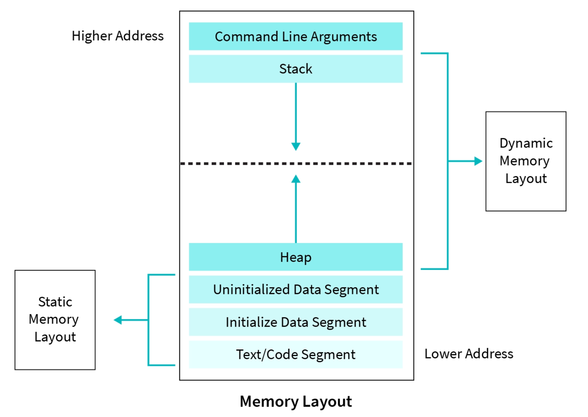

# Aula 5: Alocação Dinâmica

## 1. Alocação Dinâmica

Imagine que queremos criar uma função que multiplica todos os elementos de um vetor por uma constante.

Uma possível implementação seria algo assim:

```cpp
float* multiplyVector(float* vec, int size, int factor) {
    float resultVec[size];

    for(int i = 0; i < size; i++) {
        resultVec[i] = factor * vec[i];
    }

    return resultVec;
}
```

### 1.1 O problema: tempo de vida das variáveis

Em C++, variáveis declaradas dentro de uma função são armazenadas na **stack** (pilha de memória).

Exemplo:

```cpp
void foo() {
    int x = 10;
}
```

Quando a função termina, a memória usada por `x` é automaticamente liberada.

Isso também acontece com o vetor `resultVec`.

Ou seja:

1. `resultVec` é criado dentro da função
2. quando a função termina, sua memória é liberada
3. o ponteiro retornado passa a apontar para memória inválida

Esse tipo de erro é conhecido como **Dangling pointer** (ponteiro pendente)

### 1.2 Por que usar alocação dinâmica?

Em algumas situações precisamos que os dados **continuem existindo mesmo após o fim da função**.

Por exemplo:

* retornar um vetor criado dentro de uma função
* criar estruturas de dados que crescem dinamicamente
* alocar memória cujo tamanho só sabemos em tempo de execução

Para isso utilizamos **alocação dinâmica**, que coloca os dados na **heap** em vez da stack.

### 1.3 Organização da memória de um programa

De forma simplificada, a memória de um programa C++ pode ser dividida em:

* **Code segment**
  Contém o código do programa

* **Data segment**
  Variáveis globais e estáticas

* **Stack**
  Variáveis locais e chamadas de função

* **Heap**
  Memória alocada dinamicamente



Características importantes:

Você pode melhorar essa tabela deixando **mais comparativa e mais precisa tecnicamente**, sem entrar em detalhes demais para a aula. Algo assim fica didaticamente mais forte:

### Características importantes

| Característica          | Stack                                                      | Heap                                                            |
| ----------------------- | ---------------------------------------------------------- | --------------------------------------------------------------- |
| Gerenciamento           | Automático (feito pelo compilador)                         | Manual (programador controla)                                   |
| Tamanho disponível      | Limitado (tipicamente alguns MB, ~8MB em muitos sistemas)  | Muito maior, limitado apenas pela memória disponível do sistema |
| Tempo de vida           | Variáveis existem apenas dentro do escopo da função        | Persistem até que a memória seja liberada explicitamente        |
| Conhecimento do tamanho | Normalmente precisa ser conhecido em tempo de compilação   | Pode ser definido em tempo de execução                          |
| Desempenho              | Mais rápido (alocação simples e otimizações do compilador) | Mais lento (gerenciamento mais complexo da memória)             |

### 1.4 Usando `new` e `delete`

Para alocar memória dinamicamente em C++ usamos o operador `new`.

Exemplo:

```cpp
int* p = new int(5);

cout << *p << endl; // 5

delete p;
```

O que acontece aqui:

1. `new int(5)` aloca memória na heap
2. inicializa o valor com `5`
3. retorna o endereço da memória alocada
4. `delete` libera essa memória

### 1.5 Alocação dinâmica de arrays

Também podemos alocar arrays dinamicamente.

```cpp
int* v = new int[10];

for(int i = 0; i < 10; i++) {
    v[i] = i * 2;
}

delete[] v;
```

Observe que usamos:

```
delete[]
```

para liberar arrays.

### 1.6 Corrigindo o exemplo inicial

Agora podemos corrigir a função inicial usando alocação dinâmica:

```cpp
float* multiplyVector(float* vec, int size, int factor) {

    float* resultVec = new float[size];

    for(int i = 0; i < size; i++) {
        resultVec[i] = factor * vec[i];
    }

    return resultVec;
}
```

Agora o vetor é criado na **heap**, e continuará existindo mesmo após o término da função.

Entretanto, isso cria uma nova responsabilidade:

> Quem chamar a função precisa liberar a memória.

Exemplo de uso:

```cpp
float* result = multiplyVector(vec, size, 2);

// usar vetor...

delete[] result;
```

### 1.7 Erros comuns com alocação dinâmica

#### Vazamento de memória

Quando esquecemos de liberar memória alocada:

```cpp
int* p = new int(10);
// faltou delete
```

Se isso acontecer repetidamente, o programa pode consumir cada vez mais memória.

#### Acesso a `nullptr`

```cpp
int* p = nullptr;
cout << *p;
```

Isso causa **erro de segmentação**.

#### Uso após `delete`

```cpp
int* p = new int(5);

delete p;

cout << *p;
```

Aqui `p` ainda guarda um endereço, mas a memória já foi liberada.

Isso gera **comportamento indefinido**.

## 2. Structs

Até agora trabalhamos apenas com **tipos primitivos**, como:

```cpp
int
float
double
```

Por exemplo, podemos criar um vetor dinâmico de inteiros:

```cpp
int* v = new int[n];
```

No entanto, muitas vezes precisamos armazenar **informações mais complexas**.

Imagine que queremos representar um **aluno**, que possui:

* um identificador (`id`)
* uma nota (`grade`)

Uma primeira tentativa poderia ser usar dois arrays separados:

```cpp
int ids[100];
float grades[100];
```

Nesse caso, o aluno na posição `i` seria representado por:

```
ids[i]
grades[i]
```

Esse tipo de solução pode funcionar, mas possui alguns problemas:

* os dados ficam **espalhados em estruturas diferentes**
* é fácil cometer erros de sincronização
* adicionar novos campos torna o código mais difícil de manter

Para resolver esse problema, usamos **structs**, que permitem agrupar dados relacionados.

### 2.1 Definição de uma struct

Uma `struct` permite criar um **novo tipo de dado composto**, agrupando várias variáveis.

Exemplo:

```cpp
struct Student {
    int id;
    float grade;
};
```

Agora `Student` é um novo tipo que possui dois campos:

* `id`
* `grade`

### 2.2 Criando variáveis do tipo struct

Podemos criar variáveis desse tipo da mesma forma que fazemos com outros tipos.

```cpp
Student s;
```

E acessar seus campos com o operador `.`

```cpp
s.id = 1;
s.grade = 8.5;
```

Exemplo completo:

```cpp
Student s;

s.id = 1;
s.grade = 9.0;

cout << s.id << endl;
cout << s.grade << endl;
```

### 2.3 Arrays de structs

Assim como outros tipos, podemos criar **arrays de structs**.

```cpp
Student turma[100];
```

Cada posição do array contém um objeto `Student`.

Exemplo:

```cpp
turma[0].id = 1;
turma[0].grade = 8.5;

turma[1].id = 2;
turma[1].grade = 7.0;
```

Visualmente:

```
turma

[ Student | Student | Student | ... ]

Student
 ├ id
 └ grade
```

### 2.4 Structs e alocação dinâmica

Também podemos combinar **structs** com **alocação dinâmica**.

Por exemplo:

```cpp
int n;
cin >> n;

Student* turma = new Student[n];
```

Agora temos um **array dinâmico de estudantes**.

Podemos acessar normalmente:

```cpp
turma[0].id = 1;
turma[0].grade = 9.0;
```

E ao final devemos liberar a memória:

```cpp
delete[] turma;
```

### 2.5 Ponteiros para structs

Quando trabalhamos com ponteiros para structs, usamos o operador `->`.

Exemplo:

```cpp
Student* s = new Student;

s->id = 10;
s->grade = 7.5;
```

Isso é equivalente a:

```cpp
(*s).id = 10;
```

Mas o operador `->` é mais conveniente.

## 3. Lista Dinâmica

Até agora aprendemos a:

* criar **arrays**
* usar **alocação dinâmica**
* definir **structs**

No entanto, existe um problema importante: **arrays possuem tamanho fixo**.

Por exemplo:

```cpp
int* v = new int[4];
```

Esse array possui espaço para **apenas 4 elementos**.

Se quisermos adicionar um quinto elemento, não haverá espaço disponível.

### 3.1 O Problema

Considere o seguinte array:

```
capacity = 4
size = 4

[10 | 20 | 30 | 40]
```

Agora queremos adicionar:

```
50
```

Mas o array já está cheio.

Arrays em C++ **não podem aumentar de tamanho após serem criados**.

Então surge a pergunta:

> Como linguagens como Python ou estruturas como `vector` em C++ conseguem crescer dinamicamente?

### 3.2 Ideia da Solução

Quando o array fica cheio:

1. criamos um **novo array maior**
2. copiamos os elementos existentes
3. liberamos o array antigo
4. continuamos usando o novo array

Visualmente:

Antes:

```
[10 | 20 | 30 | 40]
```

Depois da realocação:

```
[10 | 20 | 30 | 40 | _ | _ | _ | _]
```

### 3.3 Estrutura da Lista

Para implementar essa ideia precisamos armazenar:

* o **array de elementos**
* quantos elementos existem
* qual a capacidade atual

Podemos representar isso com uma `struct`.

```cpp
struct IntList {
    int* data;
    int size;
    int capacity;
};
```

Onde:

| Campo      | Significado                         |
| ---------- | ----------------------------------- |
| `data`     | ponteiro para o array               |
| `size`     | quantidade de elementos armazenados |
| `capacity` | tamanho máximo atual                |

### 3.4 Criando a Lista

Como nossa lista será alocada dinamicamente, vamos criar uma função responsável por inicializá-la.

```cpp
IntList* create_list(int capacity) {
    IntList* list = new IntList;
    list->capacity = capacity;
    list->size = 0;
    list->data = new int[list->capacity];
    return list;
}
```

Uso:

```cpp
IntList* list = create_list(4);
```

Após a criação:

```
size = 0
capacity = 4
```

### 3.5 Inserindo Elementos

Agora vamos implementar uma função para adicionar elementos ao final da lista.

```cpp
void push_back(IntList* list, int value) {
```

Primeiro verificamos se o array está cheio:

```cpp
if(list->size == list->capacity) {
```

Se estiver cheio, precisamos aumentar a capacidade.

### 3.6 Aumentando a Capacidade

Criamos um novo array com o dobro do tamanho.

```cpp
int newCapacity = list->capacity * 2;
int* newData = new int[newCapacity];
```

Copiamos os elementos existentes:

```cpp
for(int i = 0; i < list->size; i++) {
    newData[i] = list->data[i];
}
```

Liberamos o array antigo:

```cpp
delete[] list->data;
```

Atualizamos os dados da estrutura:

```cpp
list->data = newData;
list->capacity = newCapacity;
```

### 3.7 Inserindo o Novo Elemento

Depois de garantir que existe espaço disponível:

```cpp
list->data[list->size] = value;
list->size++;
```

### 3.8 Implementação Completa

```cpp
void push_back(IntList* list, int value) {

    if(list->size == list->capacity) {

        int newCapacity = list->capacity * 2;
        int* newData = new int[newCapacity];

        for(int i = 0; i < list->size; i++) {
            newData[i] = list->data[i];
        }

        delete[] list->data;

        list->data = newData;
        list->capacity = newCapacity;
    }

    list->data[list->size] = value;
    list->size++;
}
```

### 3.9 Exemplo de Uso

```cpp
IntList* list = create_list(4);

push_back(list, 10);
push_back(list, 20);
push_back(list, 30);
push_back(list, 40);
push_back(list, 50);
```

Após inserir cinco elementos:

```
size = 5
capacity = 8
```

Observe que a capacidade foi **aumentada automaticamente**.

### 3.10 Liberando a Memória

Como utilizamos alocação dinâmica, precisamos liberar a memória ao final.

```cpp
void destroy_list(IntList* list) {
    delete[] list->data;
    delete list;
}
```

Uso:

```cpp
destroy_list(list);
```

## 4. Exercícios

1. **Criando uma Struct Dinâmica**

   * Crie uma `struct` chamada `Produto` com os atributos `produto_id` (int) e `valor` (double).
   * Aloque dinamicamente um objeto dessa struct.
   * Atribua valores aos campos da struct.
   * Exiba os valores armazenados.
   * Libere corretamente a memória utilizada.

2. **Criando um Array Dinâmico**

   * Implemente uma função que receba um número inteiro `n`.
   * Dentro da função, aloque dinamicamente um array de inteiros com tamanho `n`.
   * Preencha o array com os números de `1` até `n`.
   * Retorne o ponteiro para esse array.
   * No `main`, chame a função, exiba os valores do array e libere corretamente a memória.

3. **Calculando Estatísticas de um Array**

   * Implemente uma função que receba um ponteiro para um array de inteiros e seu tamanho `n`.
   * A função deve calcular e retornar a **média dos elementos** do array.
   * No `main`, aloque dinamicamente um array de tamanho `n`.
   * Peça ao usuário para preencher os valores.
   * Chame a função para calcular a média e exiba o resultado.
   * Libere corretamente a memória utilizada.

4. **Array Dinâmico de Structs**

   * Crie novamente a `struct Produto` com os atributos `produto_id` e `valor`.
   * Leia um número `n` indicando quantos produtos serão cadastrados.
   * Aloque dinamicamente um array de `Produto` com tamanho `n`.
   * Para cada posição do array, leia os dados do produto.
   * Exiba todos os produtos cadastrados.
   * Libere corretamente a memória alocada.
