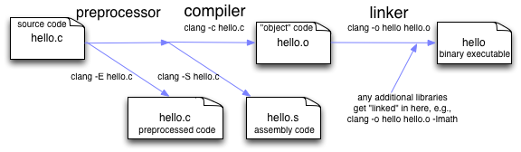

# Aula 6: Modularização e Orientação a Objetos em C++

Na aula passada implementamos uma **lista dinâmica** utilizando alocação de memória, `structs` e funções auxiliares.

À medida que programas crescem, apenas escrever tudo em um único arquivo começa a se tornar problemático. 
Funções, estruturas e classes passam a se misturar e o código fica mais difícil de manter e reutilizar.

Nesta aula veremos duas ideias importantes para organizar melhor programas maiores:

1. **Modularização:** dividir o código em múltiplos arquivos.
2. **Orientação a objetos:** organizar o código em torno de classes e objetos.

## 1. Modularização

À medida que um programa cresce, torna-se cada vez mais difícil manter todo o código em um único arquivo.

Uma prática comum em C/C++ é **dividir o código em múltiplos arquivos**, separando:

* **declarações**
* **implementações**

Essa ideia também aparece em outras linguagens.
Em Python, por exemplo, organizamos projetos em **módulos e pacotes**, importando funções e classes conforme necessário.

Em C/C++, algo semelhante acontece utilizando arquivos `.hpp` (ou `.h`) e `.cpp`.

### 1.1 Motivação para a separação

Diferente de linguagens interpretadas, C e C++ são **linguagens compiladas**.

Isso significa que o programa passa por algumas etapas:

1. cada arquivo é compilado separadamente (transformado em código objeto);
2. os arquivos compilados são depois **ligados (linkados)** para formar o programa final.

Essa abordagem traz algumas vantagens:

* **organização:** o código fica dividido em módulos
* **reutilização:** podemos usar o mesmo módulo em diferentes programas
* **compilação mais eficiente:** apenas arquivos modificados precisam ser recompilados

O desafio é que, durante a compilação de um arquivo `.cpp`, o compilador **não tem acesso direto às implementações presentes em outros arquivos**.

Ou seja, ele precisa saber **quais funções existem e como podem ser chamadas**, mesmo que a implementação esteja em outro módulo.

Por isso, utilizamos arquivos de **cabeçalho (`.h` ou `.hpp`)**, que contêm **as declarações** das funções, classes e estruturas disponíveis naquele módulo, enquanto os arquivos `.cpp` contêm **as implementações** que serão posteriormente transformadas em código objeto e ligadas ao restante do programa.



### 1.2 Protótipos de função

Considere o seguinte código:

```cpp
#include <iostream>

using namespace std;

void exibeSoma(int a, int b) {
    cout << soma(a, b) << endl;
}

int soma(int a, int b) {
    return a + b;
}

int main() {
    exibeSoma(1, 2);
}
```

Esse código gera um **erro de compilação**.

O motivo é que a função `soma` é utilizada antes de ser conhecida pelo compilador.

Quando o compilador encontra a chamada `soma(a, b)`, ele ainda não sabe que essa função existe nem qual é sua assinatura.

Para resolver esse problema, temos duas opções:

* mover a implementação de `soma` para antes de `exibeSoma`;
* ou, preferencialmente, utilizar **protótipos de função**.

Assim como variáveis podem ser **declaradas** e **atribuídas** em momentos diferentes, o mesmo pode acontecer com funções.

A ideia é primeiro **declarar o protótipo da função** (informando sua assinatura: nome, parâmetros e tipo de retorno) e apenas depois fornecer sua **implementação**.

```cpp
#include <iostream>

using namespace std;

int soma(int a, int b);
void exibeSoma(int a, int b);

void exibeSoma(int a, int b) {
    cout << soma(a, b) << endl;
}

int soma(int a, int b) {
    return a + b;
}

int main() {
    exibeSoma(1, 2);
}
```

O protótipo informa ao compilador:
* **nome da função**
* **tipo de retorno**
* **parâmetros**

Dessa forma, o compilador já sabe **como a função pode ser chamada**, mesmo que sua implementação apareça apenas mais adiante no código.

### 1.3 Arquivos `.cpp` e `.hpp`

Como já comentamos, a modularização separa o código em dois tipos de arquivos:

| Arquivo       | Conteúdo       |
| ------------- | -------------- |
| `.hpp` / `.h` | declarações    |
| `.cpp`        | implementações |

A ideia é que o arquivo de cabeçalho (`.hpp` ou `.h`) declare **quais funções, classes ou estruturas existem naquele módulo**, enquanto o arquivo `.cpp` contém **as implementações** dessas declarações.

#### Exemplo

##### `operacoes.hpp`

```cpp
#ifndef OPERACOES_HPP
#define OPERACOES_HPP

int soma(int a, int b);
int subtracao(int a, int b);

#endif
```

##### `operacoes.cpp`

```cpp
#include "operacoes.hpp"

int soma(int a, int b) {
    return a + b;
}

int subtracao(int a, int b) {
    return a - b;
}
```

##### `main.cpp`

```cpp
#include <iostream>
#include "operacoes.hpp"

int main() {

    std::cout << soma(3, 2) << std::endl;
    std::cout << subtracao(5, 1) << std::endl;

}
```

Para compilar esse código basta executar:

```bash
g++ main.cpp operacoes.cpp -o main.exe
```

Nesse caso:

* `main.cpp` e `operacoes.cpp` são compilados
* o compilador depois **liga (linka)** os dois arquivos para formar o executável final.

### 1.4 Diretivas do pré-processador

No arquivo de cabeçalho aparecem as diretivas:

```cpp
#ifndef OPERACOES_HPP
#define OPERACOES_HPP

// declarações

#endif
```

Essas diretivas pertencem ao **pré-processador do C/C++**.

Durante a etapa de pré-processamento, linhas como

```cpp
#include "operacoes.hpp"
```

são substituídas **pelo conteúdo completo do arquivo incluído**.

Isso significa que, se vários arquivos incluírem o mesmo cabeçalho, suas definições podem aparecer várias vezes durante a compilação, gerando erros de redefinição.

As diretivas `#ifndef`, `#define` e `#endif` funcionam como uma **proteção de inclusão**, garantindo que o conteúdo do cabeçalho seja incluído apenas uma vez.

Outro ponto importante é a forma de incluir bibliotecas:

* bibliotecas **locais** são incluídas com

```cpp
#include "operacoes.hpp"
```

* bibliotecas do **sistema ou da biblioteca padrão** são incluídas com

```cpp
#include <iostream>
```

### 1.5 Namespaces

Em programas maiores é comum que diferentes módulos possuam funções com o mesmo nome.

Para evitar conflitos, C++ utiliza **namespaces**, que definem o **espaço de nomes** onde determinadas funções, classes ou variáveis estão definidas.

Exemplo:

```cpp
namespace emap {

int soma(int a, int b) {
    return a + b;
}

}
```

Para utilizar essa função precisamos indicar o namespace:

```cpp
std::cout << emap::soma(3, 2) << std::endl;
```

Isso evita colisões de nomes entre diferentes bibliotecas ou módulos.

Caso desejemos evitar escrever o namespace explicitamente toda vez, podemos utilizar:

```cpp
using namespace emap;
```

Nesse caso, as funções dentro de `emap` passam a poder ser utilizadas diretamente no escopo atual.

## 2. Orientação a Objetos

Até agora trabalhamos principalmente com **structs e funções**, utilizando um paradigma conhecido como **programação procedural**.

No entanto, já vimos anteriormente que existe outra forma bastante comum de organizar programas: a **programação orientada a objetos (OO)**.

Nesse paradigma, programas são estruturados em torno de:

* **classes**
* **objetos**

Onde um **objeto** possui:

* **estado** (atributos)
* **comportamento** (métodos)

Essa abordagem facilita:

* a **organização do código**
* a **reutilização de componentes**
* a **manutenção de programas maiores**

### 2.1 Os quatro pilares da orientação a objetos

A orientação a objetos é frequentemente descrita por quatro ideias principais:

* **abstração**
* **encapsulamento**
* **herança**
* **polimorfismo**

#### Abstração

Abstração significa representar apenas as **características essenciais de uma entidade**, ignorando detalhes desnecessários.

Por exemplo, podemos representar um **Produto** de uma loja com uma classe contendo apenas algumas informações relevantes:

* nome
* preço
* quantidade em estoque

Além disso, podemos definir comportamentos associados, como:

* atualizar preço
* verificar disponibilidade
* calcular valor total de um conjunto de produtos

A ideia é que a classe descreva **o que o objeto representa e o que ele pode fazer**, sem que o usuário da classe precise saber **como isso foi implementado internamente**.

#### Encapsulamento

Encapsulamento significa **controlar o acesso ao estado interno do objeto**.

Em vez de permitir que qualquer parte do programa altere diretamente os atributos de uma classe, normalmente utilizamos **métodos** para manipular esses dados.

Por exemplo, em uma classe `Produto`, talvez não seja desejável permitir que qualquer parte do programa altere diretamente o preço:

```cpp
produto.preco = -100;
```

Em vez disso, podemos fornecer um método que controla essa alteração:

```cpp
produto.setPreco(100);
```

Isso permite garantir que certas **regras do sistema sejam respeitadas**, como impedir preços negativos.

#### Herança

Herança permite criar **novas classes a partir de classes existentes**, reaproveitando atributos e comportamentos.

Por exemplo, podemos ter uma classe base `Produto`, e criar classes mais específicas a partir dela:

* `ProdutoFisico`
* `ProdutoDigital`

Essas classes podem herdar características da classe base, como:

* nome
* preço

e adicionar novos comportamentos ou atributos específicos.

Isso evita repetição de código e facilita a organização de sistemas maiores.

#### Polimorfismo

Polimorfismo significa que **diferentes objetos podem responder à mesma operação de maneiras diferentes**.

Por exemplo, diferentes tipos de produtos podem calcular o preço final de formas distintas.

Um produto físico pode incluir **frete**, enquanto um produto digital não precisa disso.

Ambos podem possuir um método chamado `calcularPrecoFinal()`, mas cada classe pode implementar esse método de forma diferente.

Assim, o programa pode tratar todos esses objetos de forma uniforme, chamando o mesmo método, mesmo que o comportamento interno seja diferente.

## 2.2 Representação em C++

Em C++, classes são muito semelhantes a `structs`.

Ambas podem conter:

* atributos
* métodos

A principal diferença é o modificador de acesso padrão:

| Tipo     | Acesso padrão |
| -------- | ------------- |
| `struct` | public        |
| `class`  | private       |

Ou seja, se nenhum modificador for especificado:

* membros de `struct` são públicos
* membros de `class` são privados

### Construtores e destrutores

Construtores e destrutores são **métodos especiais**.

#### Construtor

O construtor é executado automaticamente quando o objeto é criado.

Ele normalmente é utilizado para **inicializar os atributos da classe**.

```cpp
class Produto {

private:
    std::string nome;
    double preco;

public:

    Produto(std::string nome, double preco) {
        this->nome = nome;
        this->preco = preco;
    }

};
```

Nesse exemplo, sempre que um objeto `Produto` for criado, os atributos `nome` e `preco` serão inicializados.

#### Destrutor

O destrutor é executado automaticamente quando o objeto é destruído.

Ele costuma ser utilizado para **liberar recursos**, como memória alocada dinamicamente, arquivos ou conexões.

```cpp
~Produto() {
    // liberar recursos se necessário
}
```

### Métodos, `this` e operadores

Métodos são funções associadas a uma classe.

Dentro de um método existe um ponteiro implícito chamado **`this`**, que aponta para o objeto atual.

Para facilitar o entendimento, podemos considerar que `this` é semelhante ao `self` do Python.
A diferença é que, em Python, o `self` aparece explicitamente como primeiro parâmetro do método, enquanto em C++ o `this` é fornecido implicitamente pelo compilador.

Exemplo:

```cpp
void setPreco(double preco) {
    this->preco = preco;
}
```

### Operadores de acesso

Existem dois operadores principais para acessar membros de objetos.

| Operador | Uso                                        |
| -------- | ------------------------------------------ |
| `.`      | acessar membros de um objeto               |
| `->`     | acessar membros de um ponteiro para objeto |

Exemplo com objeto:

```cpp
Produto p("Notebook", 3000);
p.setPreco(2800);
```

Exemplo com ponteiro:

```cpp
Produto* p = new Produto("Notebook", 3000);
p->setPreco(2800);
```

## 2.3 Encapsulamento

C++, diferente de Python, possui **modificadores de acesso estritos**, que são verificados em tempo de compilação.

Esses modificadores determinam **quem pode acessar os atributos e métodos da classe**.

| Modificador | Acesso                  |
| ----------- | ----------------------- |
| `private`   | apenas a própria classe |
| `protected` | classe e subclasses     |
| `public`    | qualquer código         |

Exemplo:

```cpp
class Produto {

private:
    double preco;

public:

    void setPreco(double p) {
        preco = p;
    }

    double getPreco() const {
        return preco;
    }

};
```

Nesse exemplo, o atributo `preco` não pode ser acessado diretamente fora da classe.

Por exemplo, a seguinte operação geraria erro de compilação:

```cpp
produto.preco = 100;
```

A única forma de acessar ou modificar esse valor é através dos métodos definidos na interface pública da classe.

## 2.4 Herança

Herança permite criar **uma classe derivada a partir de uma classe base**, reutilizando atributos e métodos.

Sintaxe:

```cpp
class ClasseFilha : public ClasseBase
```

Exemplo simples:

```cpp
class Animal {

public:

    void dormir() {
        std::cout << "Dormindo..." << std::endl;
    }

};
```

```cpp
class Cachorro : public Animal {

public:

    void latir() {
        std::cout << "Au au!" << std::endl;
    }

};
```

Nesse caso:

* `Cachorro` **herda** o método `dormir()` da classe `Animal`
* e adiciona um novo comportamento específico (`latir()`)

## 2.5 Polimorfismo

Polimorfismo permite que **classes derivadas implementem comportamentos diferentes para a mesma operação**.

Isso é feito através de **métodos virtuais**.

```cpp
class Forma {

public:

    virtual double area() const = 0;

};
```

Nesse exemplo:

* `virtual` indica que o método pode ser **sobrescrito em classes derivadas**
* `= 0` indica que o método é **virtual puro**

Quando uma classe possui pelo menos um método virtual puro, ela se torna uma **classe abstrata**.
Isso significa que ela **não pode ser instanciada diretamente**.

### Implementação em classe derivada

```cpp
class Retangulo : public Forma {

private:
    double largura;
    double altura;

public:

    Retangulo(double l, double a) {
        largura = l;
        altura = a;
    }

    double area() const override {
        return largura * altura;
    }

};
```

Aqui, o método `area()` da classe base está sendo **sobrescrito**.

### Sobrescrita de métodos

Quando uma classe derivada implementa um método virtual da classe base, dizemos que ocorreu **sobrescrita** (*override*).

```cpp
double area() const override
```

O uso de `override` não é obrigatório, mas ajuda o compilador a verificar se realmente estamos sobrescrevendo um método da classe base.

### Exemplo de uso

```cpp
int main() {
    Forma* f = new Retangulo(2, 3);
    std::cout << f->area() << std::endl;
    delete f;

    return 0;
}
```

Aqui `f` é um ponteiro do tipo `Forma`, mas o método executado é o da classe `Retangulo`.

Esse comportamento é conhecido como **ligação dinâmica (dynamic dispatch)** e é o que permite o polimorfismo em C++.

### Observação sobre tipagem

Diferente de Python, C++ é uma **linguagem estaticamente tipada**.

Isso significa que o compilador precisa conhecer os tipos envolvidos em tempo de compilação.

Em Python é comum o uso de **duck typing**, onde objetos diferentes podem ser utilizados de forma intercambiável se possuírem métodos com a mesma assinatura.

Em C++, esse tipo de flexibilidade normalmente é obtido através de:

* **herança**
* **interfaces abstratas**
* **polimorfismo com métodos virtuais**.
 
## 3 Exercícios

**1. Classe simples**
Crie uma classe chamada `Notificacao` contendo dois atributos privados: `mensagem` e `destinatario`. A classe deve possuir um construtor que inicializa esses atributos e um método `exibir()` que imprime a mensagem e o destinatário da notificação.

**2. Encapsulamento**
Modifique a classe `Notificacao` para que os atributos não possam ser acessados diretamente. Para isso, implemente os métodos `getMensagem()` e `getDestinatario()` que retornem os respectivos valores.

**3. Herança**
Crie duas classes derivadas de `Notificacao`: `Email` e `SMS`. Cada uma deve possuir um método `enviar()` que imprime na tela uma mensagem indicando que a notificação foi enviada (por exemplo: “Email enviado para ...” ou “SMS enviado para ...”).

**4. Polimorfismo**
Transforme a classe `Notificacao` em uma **classe abstrata**, declarando um método virtual puro `enviar()`. Em seguida, implemente esse método nas classes `Email` e `SMS`, de modo que cada tipo de notificação execute sua própria forma de envio.

**5. Modularização**
Separe o código desenvolvido nos exercícios anteriores em múltiplos arquivos (`.hpp` e `.cpp`), criando um pequeno módulo para as classes de notificação e um `main.cpp` responsável apenas por testar as funcionalidades implementadas.
