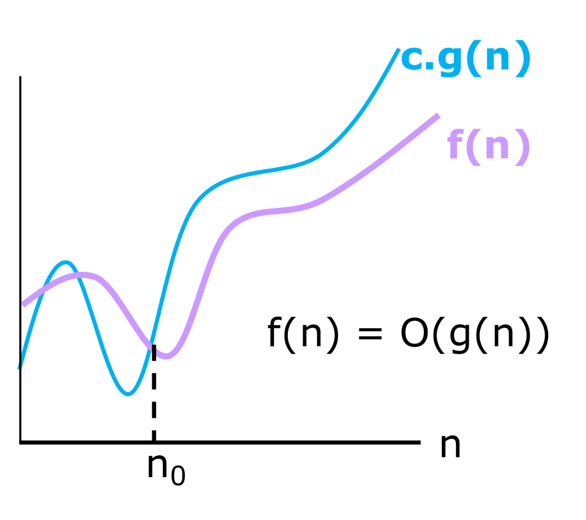
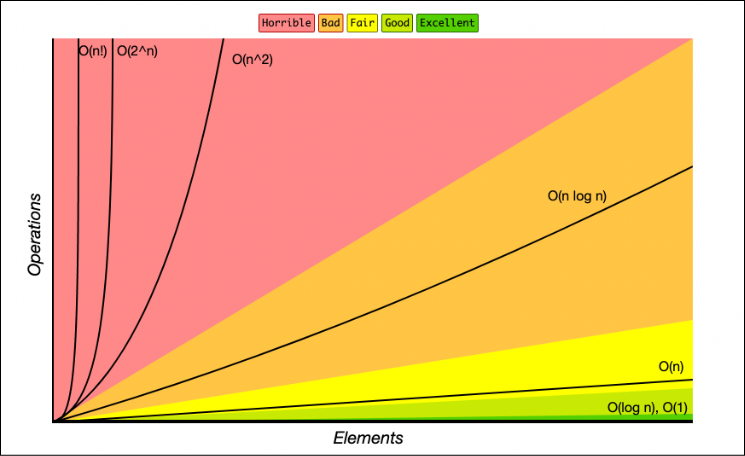

# Aula 7: Complexidade de Algoritmos

Até agora, em disciplinas anteriores, nosso foco principal tem sido entender como uma linguagem de programação funciona e como desenvolver algoritmos corretos para resolver problemas específicos.
No entanto, além da corretude e da legibilidade do código, há outro fator essencial a ser considerado: **a eficiência do algoritmo**.

## 1. Introdução

Em termos práticos, a complexidade de um algoritmo é uma forma de estimarmos quanta **memória** e quanto **tempo** ele demanda para executar uma tarefa.

Projetar algoritmos eficientes é fundamental, pois um código funcional, mas ineficiente, pode ser inviável na prática, especialmente quando lidamos com grandes volumes de dados.

### Exemplo

Considere dois algoritmos para resolver o mesmo problema de busca em uma lista:

1. **Busca Sequencial**: Percorre a lista elemento por elemento até encontrar o valor desejado.
2. **Busca Binária**: Assume que a lista está ordenada e reduz a busca pela metade a cada iteração.

A busca linear pode ser viável para listas pequenas, mas, conforme o tamanho da lista cresce, a busca binária se torna muito mais eficiente.
Essa eficiência pode ser a diferença entre um código que roda em segundos e outro que leva minutos ou até horas para processar a mesma quantidade de dados.

Por isso, ao desenvolver um algoritmo, é sempre importante refletir sobre alternativas mais eficientes. No caso acima, manter a lista ordenada desde o início pode permitir buscas significativamente mais rápidas.

## 2. Complexidade de Algoritmos

De maneira formal, a **complexidade de um algoritmo** descreve a relação entre o tamanho do problema e o consumo de recursos computacionais necessários para resolvê-lo.

### 2.1 Tipos de Complexidade

Os dois principais tipos de complexidade são:
* **Complexidade Espacial**: Mede a quantidade de memória necessária para resolver o problema.
* **Complexidade Temporal**: Mede a quantidade de tempo (ou número de operações) que o algoritmo executa para processar a entrada.

### 2.2 Medida de Complexidade

O **tamanho do problema** geralmente é representado por um parâmetro **N**, que indica a quantidade de elementos a serem processados.
Como veremos adiante, a complexidade de um algoritmo é expressa por funções matemáticas que dependem de **N**.

> **Observação:** Em alguns casos, mais de um parâmetro pode influenciar a complexidade, como ocorre com grafos ou matrizes.

### 2.3 Complexidade de Espaço
A complexidade espacial mede a quantidade de memória necessária para armazenar dados durante a execução do algoritmo.

#### Exemplo
Considere o seguinte código que calcula a média dos valores em um array:

```c
float media(float arr[], int n) {
    float total = 0;
    for(int i = 0; i < n; i++) {
        total += arr[i];
    }
    return total / n;
}
```

Além dos parâmetros de entrada, o algoritmo usa apenas duas variáveis auxiliares (`total` e `i`).
Como essa quantidade de memória extra não cresce com `n`, sua complexidade espacial é constante, representado por `O(1)`.

### 2.4 Complexidade de Tempo

A complexidade temporal mede o número de operações realizadas pelo algoritmo em função de `N`.

#### Exemplo
Consideremos novamente a função que calcula a média de um array:

```c
float media(float arr[], int n) {
    float total = 0;
    for(int i = 0; i < n; i++) {
        total += arr[i];
    }
    return total / n;
}
```

O número de iterações do loop cresce linearmente com `N`.
Ou seja, se o tamanho da lista dobrar, o número de operações também dobrará.
Esse comportamento caracteriza um algoritmo de complexidade temporal `linear`, representado por `O(N)`.

## 3. Fundamentos

Embora a complexidade espacial seja importante, na grande maioria dos problemas a memória utilizada acaba sendo `constante` ou `linear` em relação ao tamanho da entrada.
Dessa forma, a complexidade de tempo tem maior impacto na eficiência de um algoritmo e, por esse motivo, será o foco principal desta aula.

### 3.1 Análise de Desempenho

Existem diferentes maneiras de avaliar o desempenho de um algoritmo. Em geral, podemos considerar três perspectivas principais:

* **Tempo de CPU**: o tempo que o processador leva para executar o algoritmo.
* **Tempo total de execução**: o tempo total percebido pelo usuário, incluindo interrupções do sistema operacional e outras tarefas em execução.
* **Contagem de operações**: o número de operações que o algoritmo executa para processar a entrada.

Embora seja possível medir o tempo de execução diretamente em segundos utilizando ferramentas do sistema ou bibliotecas de programação, essa abordagem possui algumas limitações importantes.

O tempo observado pode variar devido a diversos fatores, como:

* velocidade do processador;
* otimizações do compilador;
* carga do sistema operacional;
* outras aplicações em execução.

Por esse motivo, ao estudar algoritmos, preferimos utilizar uma abordagem **independente de hardware**: analisar **quantas operações o algoritmo executa em função do tamanho da entrada**.

Dessa forma, em vez de perguntar:

> "Quantos segundos esse algoritmo leva para rodar?"

Nesse contexto, a pergunta mais importante passa a ser:

> "Como o número de operações cresce quando o tamanho da entrada aumenta?"

Essa abordagem nos permite comparar algoritmos de forma mais geral e prever seu comportamento mesmo para entradas muito grandes.

### 3.2 Como calcular o custo computacional

O cálculo da complexidade de tempo de um algoritmo envolve contar o número de operações relevantes que o algoritmo realiza.
Algumas considerações importantes:
* **Operações**: Nesta disciplina, assumiremos que leituras, escritas, operações aritméticas e atribuições possuem custo constante, isto é, custo 1.
* **Loops**: Para cada iteração de um loop, somamos o custo da operação dentro do loop.
* **Condicionais**: Quando um algoritmo contém condições (como **if**), as duas possibilidades são consideradas, e o foco é na execução da opção de maior custo.


#### Exemplo 1

Consideremos o código para calcular a média de um vetor.

```c
float media(float arr[], int n) {  // Custo | Vezes
    float total = 0;               // 1     | 1
    for(int i = 0; i < n; i++) {   // 1     | n
        total += arr[i];           // 1     | n
    }
    return total / n;              // 1     | 1
}
```

Agora, vamos analisar sua complexidade:

* A operação `float total = 0;` é executada apenas uma vez, portanto tem custo `1`.
* O laço `for(int i = 0; i < n; i++)` executa `n` iterações. Em cada iteração ocorrem três operações de custo constante:
    * verificação da condição `i < n`,
    * atualização do contador `i++`,
    * execução da instrução `total += arr[i];`.\
    Como cada uma dessas operações tem custo `1`, o custo total do laço é proporcional a `n`.
* A instrução `return total / n;` também é executada uma única vez e possui custo `1`.

Portanto, a complexidade total do algoritmo pode ser expressa por:

<!-- $$
T(n) = 1 + \sum_{i=1}^{n} 3 + 1 = 3n + 2
$$ -->
$$
T(n) = 3n + 2
$$

Assim, no limite assintótico, dizemos que o algoritmo possui complexidade linear **(O(n))**.

#### Exemplo 2

Consideremos o código de inserção em uma lista dinâmica, visto na aula passada.

```cpp
void resize(int new_capacity) {               // Custo | Vezes
    int* new_data = new int[new_capacity];    // 1     | 1
    
    for(int i = 0; i < this->size; i++) {     // 1     | n
        new_data[i] = this->data[i];          // 1     | n
    }

    delete[] this->data;                      // 1     | 1
    this->capacity = new_capacity;            // 1     | 1
    this->data = new_data;                    // 1     | 1
}

void append(int value) {                      // Custo | Vezes
    if(this->size == this->capacity) {        // 1     | 1
        this->resize(2 * this->capacity);     // n     | 0 ou 1 
    }

    this->data[this->size] = value;           // 1     | 1
    this->size++;                             // 1     | 1
}
```

Agora, vamos analisar sua complexidade.

* O método `append` começa verificando a condição:
    ```cpp
    this->size == this->capacity
    ```
    Essa verificação possui custo `1`.

* Na maioria das inserções, essa condição é falsa. Nesse caso, apenas duas operações são executadas:
    ```cpp
    this->data[this->size] = value;
    this->size++;
    ```
    Cada uma com custo `1`.

* No entanto, quando o vetor está cheio, a função `resize` é chamada.
* Dentro de `resize`, ocorre um loop que copia todos os elementos da lista:
    ```cpp
    for(int i = 0; i < this->size; i++)
    ```

    Esse loop executa `size` vezes, realizando cópias com custo constante. Portanto, essa operação possui custo `n`.

Assim, cada chamada de `append` pode ter custo:
* Constante (`O(1)`) na maioria dos casos
* Linear (`O(n)`) quando ocorre redimensionamento.

Portanto, no **pior caso**, a complexidade de uma única operação `append` é:

$$
T(n) = O(n)
$$


### 3.3 Análise Assintótica

Os cálculos anteriores analisam soluções para problemas como calcular a média de um conjunto de números ou redimensionar o tamanho de um array.
No entanto, diferentes programadores podem criar soluções distintas para esses mesmos problemas.

Isso pode levar a diferentes custos computacionais, como:
  - Algoritmo 1: $T_1(N) = 10N + 5000$
  - Algoritmo 2: $T_2(N) = 2N^2 + 10$
  - Algoritmo 3: $T_3(N) = N^2 + 5N + 2$

    Para o caso de computar a média, por exemplo.

Para valores pequenos de **N**, o **Algoritmo 1** pode ser mais lento devido à constante **5000**.
Porém, à medida que **N** cresce, os **algoritmos 2 e 3** se tornam significativamente mais lentos devido ao termo **$N^2$**.

A análise assintótica nos ajuda a simplificar essa análise computacional, focando nas operações de maior ordem que dominam o comportamento do algoritmo para entradas grandes ($N \rightarrow \infty$).
Nesse tipo de análise, termos de menor ordem e constantes multiplicativas têm menor impacto no crescimento para valores grandes de `n` e, por isso, podem ser desconsiderados na análise assintótica.

Ou seja, levando em consideração essa nova abordagem, notariamos que:
- Algoritmo 1 cresce com um fator **$N$**;
- Algoritmo 2 cresce com um fator **$N^2$**;
- Algoritmo 3 cresce com um fator **$N^2$**.

Sendo assim, o **Algoritmo 1** é melhor que os demais algoritmos visto que o seu crescimento é linear enquanto os demais é quadrático.

### 3.4 Perspectivas

Pense no algoritmo de busca sequencial abaixo:
```c
int buscaSequencial(int arr[], int n, int x) {
    for(int i = 0; i < n; i++) {
        if(arr[i] == x) {
            return i; // Melhor caso: O(1)
        }
    }
    return -1; // Pior caso: O(n)
}
```

Podemos fazer 3 tipos de analise sob esse algoritmo:
- **Melhor Caso**:
    * O tempo de execução mais rápido possível para uma entrada de tamanho N.
    * No caso acima, o valor `x` ser o primeiro elemento da lista.
- **Pior Caso**:
    * O tempo de execução mais lento possível para uma entrada de tamanho N.
    * No caso acima, o valor `x` ser o ultimo elemento da lista.
- **Caso Médio**:
    * O tempo esperado considerando todas as entradas possíveis de tamanho N.
    * No caso acima, esse valor varia de acordo com a distribuição dos dados.

### 3.5 Análise de Pior Caso (Notação `O`)

A notação **Big-O** é utilizada para descrever **como o tempo de execução de um algoritmo cresce em função do tamanho da entrada**.

Dizemos que um algoritmo possui complexidade **$O(g(n))$** quando seu tempo de execução cresce **proporcionalmente a $g(n)$** para entradas suficientemente grandes.

Em outras palavras, a notação `O` descreve um **limite superior assintótico** para o tempo de execução de um algoritmo.

Formalmente, sejam $f$ e $g$ duas funções de domínio $X$.
Dizemos que:

$$
f(n) = O(g(n))
$$

se existir uma constante $c \in \mathbb{R}^+$ e um valor $n_0 \in X$ tal que

$$
\forall n \ge n_0,\quad |f(n)| \le c|g(n)|
$$

#### Exemplo

No **Exemplo 1**, obtivemos a função de custo:

$$
f(n) = 3n + 2
$$

Ao analisar o crescimento dessa função, dizemos que:

$$
f(n) = O(n)
$$

Isso significa que o crescimento de $f(n)$ é **limitado superiormente por uma função linear**.

Por exemplo, podemos observar que:

$$
3n + 2 \le 4n \quad \text{para todo } n \ge 2
$$

Nesse caso:

* $g(n) = n$
* $c = 4$
* $n_0 = 2$

Ou seja, para valores suficientemente grandes de $n$, a função $3n + 2$ cresce no máximo proporcionalmente a $n$.

Ilustrando:



A notação `O` nos fornece, portanto, um **limite superior assintótico** para o crescimento do custo de um algoritmo.

#### Exemplos

* **$3n + 2 = O(n)$**, pois $3n + 2 \le 4n$ para todo $n \ge 2$;
* **$10n^2 + 5n - 4 = O(n^2)$**, pois $10n^2 + 5n - 4 \le 11n^2$ para todo $n \ge 5$.

De forma geral, para um polinômio:

$$
f(n) = a_m n^m + a_{m-1} n^{m-1} + ... + a_0
$$

o termo de maior grau domina o crescimento da função, portanto:

$$
f(n) = O(n^m)
$$


## 4. Complexidades clássicas

Embora tenhamos falado do algoritmo `T(n)` de forma genérica, os custos dos algoritmos tendem a recair sobre um pequeno conjunto de valores.
Abaixo, exploramos algumas das complexidades mais comuns, com exemplos e descrições detalhadas.

### 4.1 Comparando diferentes complexidades

A tabela a seguir mostra diferentes complexidades de algoritmos e exemplos típicos para cada tipo de complexidade:


| **Notação**       | **Tipo**          | **Descrição**                                                                                       | **Exemplos de Algoritmos**                                                     |
|-------------------|------------------------|-----------------------------------------------------------------------------------------------------|------------------------------------------------------------------------------------------------------|
| **$O(1)$**        | **Constante**          | O tempo de execução não depende do tamanho da entrada.                                              | - Acesso a um elemento em um vetor ou lista: `arr[i]`.                                                         |
| **$O(log(n))$**   | **Logarítmica**        | O tempo de execução cresce de forma logarítmica em relação ao tamanho da entrada.                   | - Busca binária em um vetor ordenado.                                                                         |
| **$O(n)$**        | **Linear**             | O tempo de execução cresce linearmente com o tamanho da entrada.                                    | - Busca sequencial em um vetor.                                                                               |
| **$O(n log(n))$** | **Linear-Logarítmica** | O tempo de execução cresce mais rápido que O(n), mas menos que O(n^2).                              | - Algoritmos de ordenação eficientes como Merge Sort, Quick Sort.                                       |
| **$O(n^2)$**      | **Quadrática**         | O tempo de execução cresce quadraticamente com o tamanho da entrada.                                | - Ordenação por bolha (Bubble Sort).                                                                    |
| **$O(2^n)$**      | **Exponencial**        | O tempo de execução cresce muito rapidamente com o aumento do tamanho da entrada.                   | - Algoritmo de força bruta para resolver o problema da mochila.                                         |
| **$O(n!)$**       | **Fatorial**           | O tempo de execução cresce ainda mais rapidamente que O(2^n), com uma taxa de crescimento fatorial. | - Algoritmo de força bruta para resolver o problema do caixeiro viajante (Travelling Salesman Problem). |

Cada uma dessas complexidades representa diferentes formas de como o tempo de execução de um algoritmo se comporta conforme o tamanho da entrada cresce. 
Algumas complexidades, como $O(1)$ e $O(log(n))$, indicam algoritmos muito eficientes em termos de tempo, enquanto outras, como $O(n!)$ e $O(2^n)$, indicam algoritmos que podem se tornar rapidamente inviáveis para entradas grandes.

### 4.2 Comportamento das Complexidades ao Longo do Tamanho `n`

É importante entender como as diferentes complexidades se comportam à medida que o tamanho da entrada $n$ aumenta.
A seguir, temos um gráfico que compara o comportamento de algumas das complexidades mais comuns, mostrando como o tempo de execução aumenta à medida que $n$ cresce.



Onde,

$$O(1) \lt O(log(n)) \lt O(n) \lt O(n log(n)) \lt O(n^2) \lt O(n^3) \lt O(c^n) \lt O(n!)$$

Como podemos observar, complexidades como $O(1)$ e $O(log(n))$ aumentam muito lentamente com o tamanho da entrada, tornando-os altamente eficientes.
Já algoritmos com complexidades como $O(n^2)$, $O(2^n)$ e $O(n!)$ têm um crescimento muito mais rápido, o que torna esses algoritmos menos práticos para entradas grandes.

### 4.3 Exemplos de Algoritmos

Abaixo, mostramos alguns exemplos de algoritmos em C para diferentes complexidades de tempo: constante, logarítmica, linear, quadrática e exponencial.

#### Complexidade $O(1)$ - Acesso a um Item em um Vetor

O acesso direto a um elemento de um vetor ocorre em tempo constante O(1):

```c
int acessarElemento(int arr[], int index) {
    return arr[index];
}
```

#### Complexidade $O(log(n))$ - Busca Binária

A busca binária reduz pela metade o espaço de busca a cada iteração, resultando em uma complexidade logarítmica O(log(n)):

```c
int buscaBinariaRecursiva(int arr[], int esquerda, int direita, int x) {
    if (esquerda > direita) {
        return -1;  // Elemento não encontrado
    }

    int meio = (esquerda + direita) / 2;

    if (arr[meio] == x) {
        return meio;  // Elemento encontrado
    }

    if (arr[meio] < x) {
        return buscaBinariaRecursiva(arr, meio + 1, direita, x);
    } else {
        return buscaBinariaRecursiva(arr, esquerda, meio - 1, x);
    }
}
```

####  Complexidade $O(n)$ - Busca Sequencial

A busca sequencial percorre todo o vetor até encontrar o elemento desejado, com complexidade linear O(n):

```c
int buscaSequencial(int arr[], int n, int x) {
    for (int i = 0; i < n; i++) {
        if (arr[i] == x) {
            return i;  // Elemento encontrado
        }
    }
    return -1;  // Elemento não encontrado
}
```

#### Complexidade $O(n^2)$ - Bubble Sort

O Bubble Sort compara e troca elementos adjacentes em múltiplas passadas pelo vetor, resultando em uma complexidade quadrática O(n²):

```c
void bubbleSort(int arr[], int n) {
    for (int i = 0; i < n-1; i++) {
        for (int j = 0; j < n-i-1; j++) {
            if (arr[j] > arr[j+1]) {
                // Troca os elementos
                int temp = arr[j];
                arr[j] = arr[j+1];
                arr[j+1] = temp;
            }
        }
    }
}
```

#### Complexidade $O(2^n)$ - Fibonacci Recursivo

O cálculo do Fibonacci recursivo gera duas novas chamadas a cada execução, resultando em uma complexidade exponencial O(2ⁿ):

```c
int fibonacci(int n) {
    if (n <= 1) {
        return n;
    }
    return fibonacci(n - 1) + fibonacci(n - 2);
}
```
