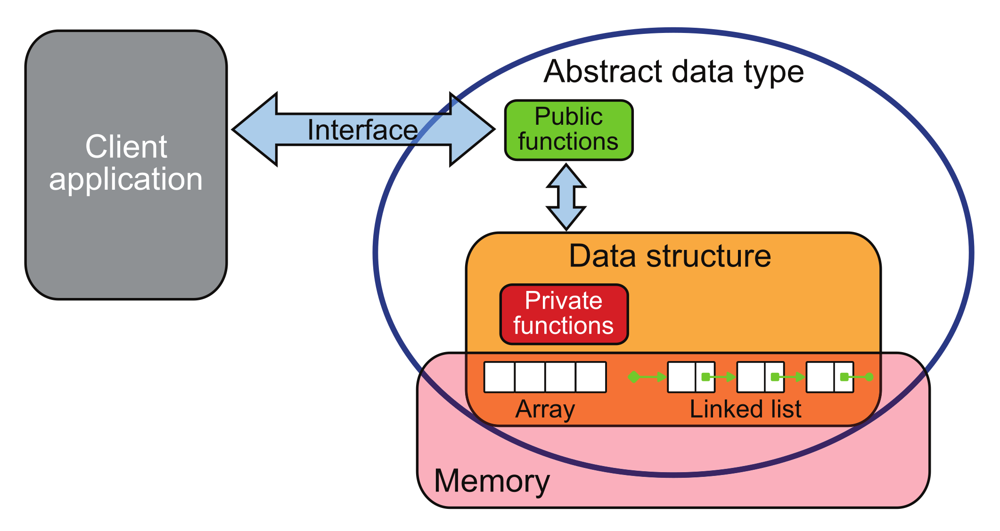
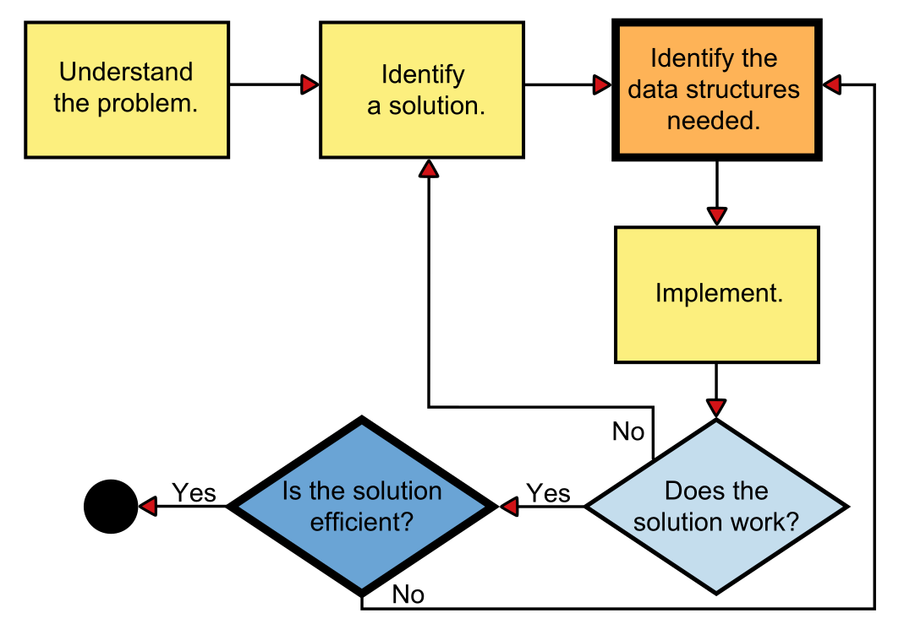

# Aula 9: Tipos Abstratos de Dados (TAD)

## 1. O que são TADs?

Até agora, na linguagem C, manipulamos principalmente tipos de dados simples (inteiros, pontos flutuantes, caracteres, booleanos), os quais chamamos de "primitivos", pois possuem uma representação direta em memória.

No entanto, quando estudamos Python, vimos outros tipos de dados mais complexos, como listas, tuplas, conjuntos e dicionários (ou mapas), correto?

Ao utilizar esses tipos, normalmente não nos preocupamos com a forma como eles são implementados ou organizados em memória.

Nosso foco está em entender:
- quais propriedades esses tipos possuem;
- e quais operações podemos realizar sobre eles.

Essa forma de pensar nos leva a uma ideia mais fundamental:
a de **Tipo Abstrato de Dados (TAD)**.

Um **TAD** é uma forma de descrever um tipo de dado a partir de:
- quais valores ele pode assumir;
- quais operações podem ser realizadas;
- e qual o comportamento esperado dessas operações;

**sem especificar como esses dados são armazenados em memória ou como essas operações são implementadas.**

Ou seja, ao trabalhar com um TAD, estamos interessados **no que ele faz**, e não em **como ele é implementado**.

### 1.1 Exemplo: Conjunto (Set)

Por exemplo, um conjunto em Python (e em outras linguagens) representa o conceito de conjunto da Teoria dos Conjuntos.

Ou seja, temos:
- **Propriedades:**
  - elementos únicos
  - ausência de ordem

- **Operações:**
  - inserção
  - remoção
  - verificação de pertencimento
  - união, interseção, etc.

```python
a = {1, 2, 3}
b = {3, 4, 4}
print(a.union(b)) # {1, 2, 3, 4}
```

Observe que, ao utilizar um conjunto, **não precisamos saber como ele é implementado internamente**, apenas como ele se comporta.

### 1.2 Outro exemplo: Tupla

Outro exemplo é a tupla: um tipo de dado que armazena uma sequência de elementos, mas que não permite modificação após sua criação.

```python
t = (1, 2, 3)
t[0] = 1 # TypeError
```

Nesse caso, o comportamento esperado inclui:

* acesso por índice
* imutabilidade

### 1.3 Ideia central

Esses exemplos ilustram dois pontos importantes:

1. Estamos interessados nas **operações disponíveis e nas regras de uso** do tipo;
2. Não nos preocupamos com **como os dados são armazenados ou manipulados internamente**.

Essa separação entre **comportamento** e **implementação** é o que caracteriza um TAD.

## 2. Níveis de abstração no projeto de estruturas de dados

O desenvolvimento de software, de forma geral, parte de uma ideia abstrata e, aos poucos, vamos refinando essa ideia até chegar a uma implementação em código.

No contexto de estruturas de dados, podemos organizar esse processo em **três níveis de abstração**:

### 2.1 Tipo Abstrato de Dados (TAD)

O **TAD** é o nível mais alto de abstração.

Nesse nível, definimos:
- quais valores o tipo pode assumir;
- quais operações são permitidas;
- e qual o comportamento esperado dessas operações.

Importante: **não nos preocupamos com como os dados são armazenados ou implementados**.

> Exemplo:
> Um conjunto (set) permite inserção, remoção e operações como união e interseção, mas não define como isso é feito internamente.

### 2.2 Estrutura de Dados

A **estrutura de dados** é um refinamento do TAD.

Aqui começamos a nos preocupar com:
- como os dados são organizados em memória;
- como as operações são realizadas;
- e qual o custo computacional dessas operações.

Exemplos:
- array (vetor)
- lista encadeada
- árvore
- tabela hash

Uma mesma ideia (TAD) pode ser implementada por diferentes estruturas de dados.

### 2.3 Implementação

No nível de **implementação**, traduzimos a estrutura de dados para código em uma linguagem específica.

Aqui entram detalhes como:
- sintaxe da linguagem;
- uso de ponteiros ou referências;
- alocação de memória;
- otimizações específicas.

> Exemplo:
> Uma lista encadeada em C pode usar ponteiros e `malloc`, enquanto em C++ pode usar classes e referências.

### 2.4 Relação entre os níveis

Esses três níveis formam uma hierarquia:

- Um mesmo **TAD** pode ser implementado por diferentes **estruturas de dados**;
- Uma mesma **estrutura de dados** pode ter várias **implementações** (em diferentes linguagens ou com diferentes técnicas).

Além disso, uma mesma estrutura de dados pode ser usada para implementar diferentes TADs.



## 3. Como escolhemos estruturas de dados?

Até agora, vimos:
- o que são TADs;
- e como eles se relacionam com estruturas de dados e implementações.

Mas, na prática, como decidimos qual usar?

O desenvolvimento de soluções costuma seguir um processo como o ilustrado abaixo:



### 3.1 Interpretando o processo

Podemos reinterpretar esse fluxo à luz do que vimos:

1. **Entender o problema**
   - Quais são os dados?
   - Quais operações são necessárias?

2. **Identificar uma solução**
   - Aqui modelamos o problema em termos de **TADs**
   - Ou seja, definimos:
     - quais dados precisamos representar
     - quais operações são necessárias
   - Ex: precisamos de acesso rápido? manter ordem? evitar duplicatas?

3. **Escolher a estrutura de dados**
   - Agora decidimos **como implementar o TAD**
   - Ex: array, lista, árvore, hash

4. **Implementar**
   - Código em C/C++

5. **Validar e otimizar**
   - Funciona?
   - É eficiente?

### 3.2 Exemplo simples

Problema: controlar reservas de uma sala ao longo do dia

Assuma que o dia é dividido em intervalos fixos (ex: de 30 minutos).

- **Dados:** horários disponíveis/ocupados
- **Operações:**
  - reservar horário
  - liberar horário
  - verificar disponibilidade

Possível TAD:
- conjunto de horários ocupados

Observe que aqui não estamos falando de como implementar,
mas apenas de:
- quais dados precisamos representar;
- quais operações são necessárias.

Possíveis estruturas de dados:
- vetor de booleanos  
- matriz

Esse é um exemplo de como podemos definir um **TAD específico para um problema**.

### 3.3 TADs clássicos

No exemplo anterior, definimos um TAD a partir de um problema específico.

No entanto, em muitos casos, não precisamos criar um TAD do zero.

Existem alguns TADs clássicos que aparecem com frequência em diversos problemas:

- Pilha (Stack)
- Fila (Queue)
- Lista
- Conjunto (Set)
- Mapa (Map)

Esses TADs representam padrões recorrentes de organização de dados e operações.

Ao longo da disciplina, vamos estudar esses TADs e entender:
- quais problemas eles ajudam a resolver;
- como podem ser implementados;
- e quais são os custos envolvidos.

### 3.4 TADs específicos e composição

Nem sempre um único TAD é suficiente para resolver um problema.

Na prática, é comum:
- definir TADs específicos para o problema;
- e combinar diferentes estruturas e TADs na implementação.

Exemplo: sistema de negociação de ações (livro de ordens)

- **Dados:**
  - ordens de compra e venda

- **Operações:**
  - inserir ordem
  - casar ordens
  - consultar melhor preço

Nesse caso, estamos definindo um TAD próprio, baseado nas necessidades do problema.

Além disso, sua implementação pode utilizar outras estruturas:

- filas de prioridade para ordens
- listas para armazenar histórico
- mapas para acesso rápido

Isso mostra que estruturas de dados podem ser combinadas para construir soluções mais complexas.

### 3.5 Do problema à implementação

Ao longo das próximas aulas, nosso objetivo será estudar alguns TADs fundamentais e entender como eles podem ser implementados utilizando diferentes estruturas de dados.

Vamos explorar, por exemplo:
- Pilhas (Stack)
- Filas (Queue)
- Listas
- Conjuntos e Mapas

Para cada um deles, vamos:
1. Entender o comportamento (TAD);
2. Discutir possíveis estruturas de dados;
3. Analisar diferentes implementações e seus custos.

Além disso, também veremos como definir TADs específicos para resolver problemas reais, como os trabalhos desenvolvidos ao longo da disciplina.