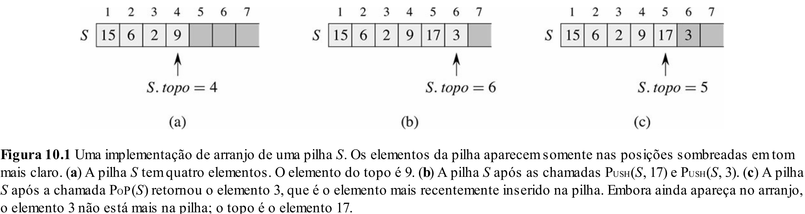
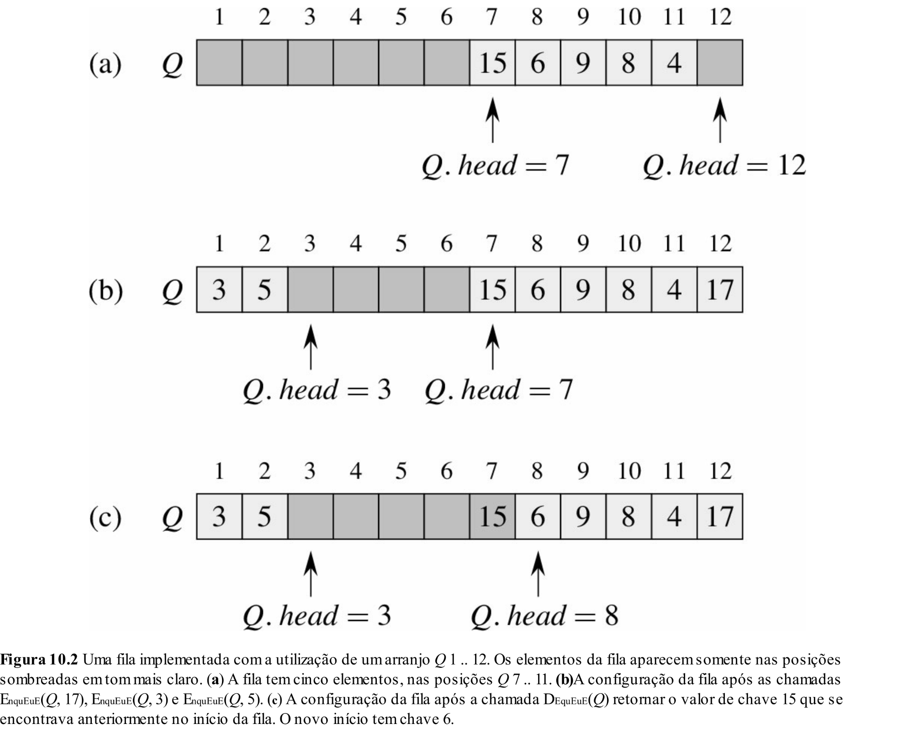

# Aula 9: Containers, Pilhas e Filas com Arrays

## 1. Containers

Anteriormente, apresentamos os Tipos Abstratos de Dados (TADs) e sua relação com estruturas de dados.

Discutimos que nosso objetivo ao longo do curso é estudar alguns TADs clássicos e suas implementações mais comuns.

Um ponto importante é que muitos desses TADs pertencem a uma categoria específica chamada **containers**.

**Containers** são estruturas de dados que:
- armazenam uma coleção de elementos;
- oferecem operações como inserção, remoção, acesso e busca.

Diferentes containers impõem diferentes restrições:

- Pilha: LIFO (Last In, First Out)
- Fila: FIFO (First In, First Out)
- Conjunto (Set): elementos únicos
- Dicionário (Map): associação chave → valor

Essas restrições definem o **TAD** sendo utilizado.

Nesta aula, estudaremos dois dos containers mais simples: **pilhas e filas**.

### Observação

Vale observar que **nem todo TAD é um container**.

Containers são um tipo específico de TAD cujo objetivo principal é **armazenar coleções de elementos**.

Exemplos de TADs que não são containers:

- **Série temporal**:
  - operações: consultar valor em um instante, calcular média em um intervalo, agregar dados
  - foco: acesso e análise ao longo do tempo

- **Intervalo de tempo (agenda/reserva)**:
  - operações: verificar sobreposição, adicionar intervalo, validar disponibilidade
  - foco: relações entre intervalos, não apenas armazenamento

Ou seja, um TAD pode representar:
- uma coleção de elementos (containers);
- ou uma entidade com comportamento específico (como os exemplos acima).

## 2. Pilhas (Stack)

### 2.1 O que é?

Uma **pilha** é uma estrutura de dados que segue a política **LIFO** (*Last In, First Out*), ou seja, o último elemento inserido é o primeiro a ser removido.
Podemos imaginar uma pilha de pratos: o prato mais recente colocado no topo será o primeiro a ser retirado.

### 2.2 Casos de uso

Pilhas são utilizadas em diversos contextos, como:
- **Controle de chamadas de funções** (pilha de execução do sistema operacional);
- **Desfazer/refazer ações** em editores de texto e backtracking;
- **Percursos em grafos** (como busca em profundidade, DFS).
- **Avaliação de expressões matemáticas (sintaxe de uma linguagem de programação)**;

### 2.2 Representação com array

A pilha pode ser implementada com:
- um array
- um índice `top`



### 2.3  Implementação em C++

```cpp
class Stack {

private:
    int* data;
    int capacity;
    int top;

public:
    Stack(int capacity) {
        this->capacity = capacity;
        this->data = new int[capacity];
        this->top = -1;
    }

    ~Stack() {
        delete[] data;
    }

    bool push(int value) {
        if (top == capacity - 1) return false;
        top++;
        data[top] = value;
        return true;
    }

    bool pop(int &value) {
        if (top < 0) return false;
        value = data[top];
        top--;
        return true;
    }

    bool peek(int &value) const {
        if (top == -1) return false;
        value = data[top];
        return true;
    }
};
```

## 3. Filas

### 3.1 O que é?

Uma **fila** é um TAD que segue a política **FIFO** (*First In, First Out*), ou seja, o primeiro elemento inserido é o primeiro a ser removido.
Podemos imaginar uma fila de atendimento bancário: o primeiro cliente a chegar será o primeiro a ser atendido.

### 3.2 Casos de uso

Filas são utilizadas em diversos contextos:

- **Processamento de eventos** (ordem de chegada);
- **Sistemas de fila** (atendimento, impressão, tarefas);
- **Buffers de dados** (streaming, redes);
- **Percursos em grafos** (busca em largura, BFS).

### 3.3 Interface (TAD)

Podemos definir a fila em termos de suas operações:

```cpp
class Queue {
public:
    virtual bool enqueue(int value) = 0;
    virtual bool dequeue(int &value) = 0;
    virtual bool front(int &value) = 0;
    virtual ~Queue() {}
};
```

Note que aqui não estamos dizendo **como** implementar, apenas **o que a estrutura faz**.

### 3.4 Implementação com array (primeira tentativa)

#### Estrutura de Dados

Uma primeira ideia é implementar a fila usando:

* um array
* uma variável `size` indicando quantos elementos estão na fila

#### Implementação

```cpp
class QueueWithArray : public Queue {
private:
    int* data;
    int capacity;
    int size;

public:
    QueueWithArray(int capacity) {
        this->capacity = capacity;
        this->data = new int[capacity];
        this->size = 0;
    }

    ~QueueWithArray() {
        delete[] data;
    }

    bool enqueue(int value) override {
        if (size == capacity) return false;
        data[size++] = value;
        return true;
    }

    bool dequeue(int &value) override {
        if (size == 0) return false;

        value = data[0];

        // deslocamento dos elementos
        for (int i = 1; i < size; i++) {
            data[i - 1] = data[i];
        }

        size--;
        return true;
    }

    bool front(int &value) override {
        if (size == 0) return false;
        value = data[0];
        return true;
    }
};
```

### 3.6 Fila com array circular

#### Ideia

Em vez de deslocar elementos, podemos:

* tratar o array como **circular**;
* reutilizar posições liberadas no início.



#### Estrutura de Dados

Agora usamos:

* `head` → início da fila
* `tail` → final da fila
* `size` → número de elementos

#### Implementação

```cpp
class QueueWithCircularArray : public Queue {
private:
    int* data;
    int capacity;
    int head;
    int tail;
    int size;

public:
    QueueWithCircularArray(int capacity) {
        this->capacity = capacity;
        this->data = new int[capacity];
        this->head = 0;
        this->tail = -1;
        this->size = 0;
    }

    ~QueueWithCircularArray() {
        delete[] data;
    }

    bool enqueue(int value) override {
        if (size == capacity) return false;

        tail = (tail + 1) % capacity;
        data[tail] = value;
        size++;

        return true;
    }

    bool dequeue(int &value) override {
        if (size == 0) return false;

        value = data[head];
        head = (head + 1) % capacity;
        size--;

        return true;
    }

    bool front(int &value) override {
        if (size == 0) return false;

        value = data[head];
        return true;
    }
};
```

## 4. Comparação

As estruturas de **Pilha**, **Fila com Array** e **Fila com Array Circular** têm diferentes comportamentos em termos de tempo de execução para suas operações principais: inserção, remoção e acesso ao primeiro elemento.
A **Pilha** segue o princípio LIFO (Last In, First Out), enquanto as **filas** seguem o princípio FIFO (First In, First Out).
A Fila com **Array Circular** oferece uma otimização significativa ao evitar o deslocamento de elementos, o que melhora a eficiência em comparação à Fila com Array tradicional.

| **Operação**   | **Pilha** | **Fila com Array**  | **Fila com Array Circular** |
|----------------|-----------|---------------------|-----------------------------|
| **Insert**     | O(1)      | O(1)                | O(1)                        |
| **Remove**     | O(1)      | O(n)                | O(1)                        |
| **Peek**       | O(1)      | O(1)                | O(1)                        |


### Possíveis limitações

* **Arrays Estáticos**: Todas as estruturas vistas até agora foram implementadas com arrays estáticos, o que pode resultar em:
    - **Superdimensionamento**: Uso excessivo de memória, alocando mais do que o necessário.
    - **Subdimensionamento**: Uso insuficiente de memória, necessitando de realocação dinâmica.
* **Array Circular**: Embora seja uma boa solução, a Array Circular adiciona complexidade devido à necessidade de gerenciar o fim do array corretamente.

Na próxima aula, abordaremos Listas Ligadas, uma estrutura alternativa ao array que busca resolver esses problemas de uso ineficiente de memória.