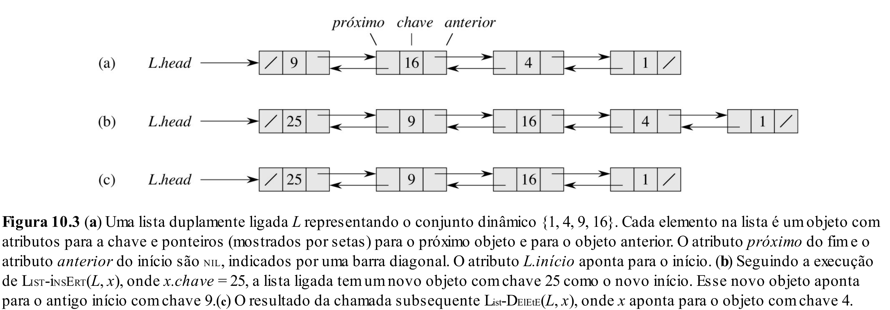

# Aula 11: Listas Encadeadas

## 1. Introdução

Até agora, em nossas TADs, sempre utilizamos um array para armazenar os dados.
A grande vantagem dessa escolha é que os dados estão organizados em sequência, facilitando o acesso a múltiplos elementos consecutivamente.

A desvantagem, no entanto, é que precisamos saber de antemão o tamanho máximo do array, o que é difícil em muitas situações.
Além disso, essa estimativa pode frequentemente estar incorreta, levando à reserva de espaço de memória que nunca será utilizado.

Já implementamos uma melhoria para o primeiro problema ao criarmos um array dinâmico cujo tamanho muda de acordo com o número de elementos inseridos e removidos.
O problema é que isso ainda não resolve completamente a questão, pois não há garantia de que será necessário todo esse espaço adicional.

Devido a isso, apresentaremos uma estrutura de dados alternativa ao array chamada **Lista Encadeada**, cujo objetivo é permitir a inserção e remoção de dados de forma mais eficiente.
Claro que, como veremos mais adiante, ela também apresenta suas próprias limitações.

## 2. Lista Encadeada Simples

### 2.1 O que é?

Durante as aulas de C/C++, aprendemos que é possível alocar dinamicamente estruturas de dados.
E se, em vez de alocarmos um array inteiro, criássemos uma estrutura que armazena um único elemento por vez?

Nesse modelo, a cada `inserção`, criamos um nó que armazena o dado desejado.

Essa abordagem resulta em um conjunto de nós independentes, permitindo inserção e remoção de elementos de forma mais flexível.

O desafio, então, é: como manter a ordem entre os elementos?
A solução é simples: cada nó armazena um ponteiro para o próximo.

### 2.2 Casos de uso

1. **Implementação de Filas e Pilhas**
   Inserções e remoções em uma única extremidade.

2. **Tabelas Hash com tratamento de colisão**
   Múltiplos elementos podem ocupar a mesma posição.

### 2.3 Estrutura de Dados

```cpp
class Node {
public:
    int value;
    Node* next;

    Node(int value) {
        this->value = value;
        this->next = nullptr;
    }
};

// Ou:
//
// struct Node {
//     int value;
//     Node* next;
// };

class SingleLinkedList {
private:
    Node* head;
    int size;

public:
    SingleLinkedList() {
        this->head = nullptr;
        this->size = 0;
    }

    int getSize() const {
        return size;
    }
```

### 2.4 Operações

#### Inserir

```cpp
    void insertFront(int value) {
        Node* newNode = new Node(value);
        newNode->next = head;
        head = newNode;
        size++;
    }

    void insertEnd(int value) {
        Node* newNode = new Node(value);

        if (head == nullptr) {
            head = newNode;
        } else {
            Node* temp = head;
            while (temp->next != nullptr) {
                temp = temp->next;
            }
            temp->next = newNode;
        }

        size++;
    }
```

#### Remover

```cpp
    void removeFront() {
        if (head == nullptr) return;

        Node* temp = head;
        head = head->next;
        delete temp;
        size--;
    }

    void remove(int value) {
        if (head == nullptr) return;

        if (head->value == value) {
            removeFront();
            return;
        }

        Node* current = head;
        while (current->next != nullptr && current->next->value != value) {
            current = current->next;
        }

        if (current->next == nullptr) return;

        Node* temp = current->next;
        current->next = current->next->next;
        delete temp;
        size--;
    }
```

#### Buscar

```cpp
    bool search(int value) const {
        Node* current = head;

        while (current != nullptr) {
            if (current->value == value) return true;
            current = current->next;
        }

        return false;
    }
};
```

### 2.5 Lista Circular

Para tornar a lista circular, basta fazer o último nó apontar novamente para o primeiro.

## 3. Lista Duplamente Encadeada

### 3.1 O que é?

Uma limitação da lista encadeada simples é que ela só possui acesso ao próximo elemento.
Isso dificulta operações como:

* Remoção de um nó intermediário
* Acesso ao elemento anterior

A solução é adicionar um ponteiro para o elemento anterior.



### 3.2 Casos de uso

1. **Editor de Texto**:
Um editor de texto pode armazenar cada linha como um nó em uma lista duplamente encadeada, permitindo edições eficientes no meio do texto.

2. **Implementação de Deques**:
Deques podem ser implementadas de forma eficiente com listas duplamente encadeadas, permitindo inserção e remoção em ambas as extremidades.

3. **Navegação em Aplicações (como Histórico de Navegação)**:
Navegadores podem utilizar listas duplamente encadeadas para permitir navegação para frente e para trás entre páginas.

### 3.3 Estrutura de Dados

```cpp
class Node {
public:
    int value;
    Node* next;
    Node* prev;

    Node(int value) {
        this->value = value;
        this->next = nullptr;
        this->prev = nullptr;
    }
};

class DoubleLinkedList {
private:
    Node* head;
    Node* tail;
    int size;

public:
    DoubleLinkedList() {
        this->head = nullptr;
        this->tail = nullptr;
        this->size = 0;
    }
```

### 3.4 Operações

#### Inserir

```cpp
    void insertFront(int value) {
        Node* newNode = new Node(value);

        if (head == nullptr) {
            head = tail = newNode;
        } else {
            newNode->next = head;
            head->prev = newNode;
            head = newNode;
        }

        size++;
    }

    void insertEnd(int value) {
        Node* newNode = new Node(value);

        if (tail == nullptr) {
            head = tail = newNode;
        } else {
            tail->next = newNode;
            newNode->prev = tail;
            tail = newNode;
        }

        size++;
    }
```

#### Remover

```cpp
    void removeFront() {
        if (head == nullptr) return;

        Node* temp = head;
        head = head->next;

        if (head != nullptr) {
            head->prev = nullptr;
        } else {
            tail = nullptr;
        }

        delete temp;
        size--;
    }

    void removeEnd() {
        if (tail == nullptr) return;

        Node* temp = tail;
        tail = tail->prev;

        if (tail != nullptr) {
            tail->next = nullptr;
        } else {
            head = nullptr;
        }

        delete temp;
        size--;
    }

    void remove(int value) {
        Node* current = head;

        while (current != nullptr && current->value != value) {
            current = current->next;
        }

        if (current == nullptr) return;

        if (current == head) {
            removeFront();
            return;
        }

        if (current == tail) {
            removeEnd();
            return;
        }

        current->prev->next = current->next;
        current->next->prev = current->prev;

        delete current;
        size--;
    }
};
```

## 4. Nó de Árvore

```cpp
class TreeNode {
public:
    int value;
    TreeNode* left;
    TreeNode* right;
    TreeNode* parent;

    TreeNode(int value) {
        this->value = value;
        this->left = nullptr;
        this->right = nullptr;
        this->parent = nullptr;
    }
        
};
```

## 5. Limitações

Embora listas encadeadas sejam flexíveis e eficientes para inserção e remoção, elas possuem algumas desvantagens:
- Maior uso de memória por elemento (devido aos ponteiros adicionais);
- Dados não estão ordenados sequencialmente, o que torna a busca linear mais demorada;
- Não é possivel acessar uma posição aleatória da lista de forma eficiente;
- Se tivéssemos uma lista ordenada... será que poderíamos executar uma busca binária?

## 6. Listas Encadeadas vs Arrays

### Arrays

* ✅ Boa escolha quando há uma estimativa da quantidade de elementos a serem inseridos.
* ✅ Permite acesso rápido a qualquer elemento via índice.
* ❌ Inserções e remoções no meio são custosas, pois exigem deslocamento de elementos.

### Listas Encadeadas

* ✅ Boa escolha quando a quantidade de elementos pode variar significativamente.
* ✅ Inserções e remoções são eficientes, pois não exigem deslocamento de elementos.
* ❌ Acesso a elementos individuais é mais lento, pois requer percorrer a lista.
