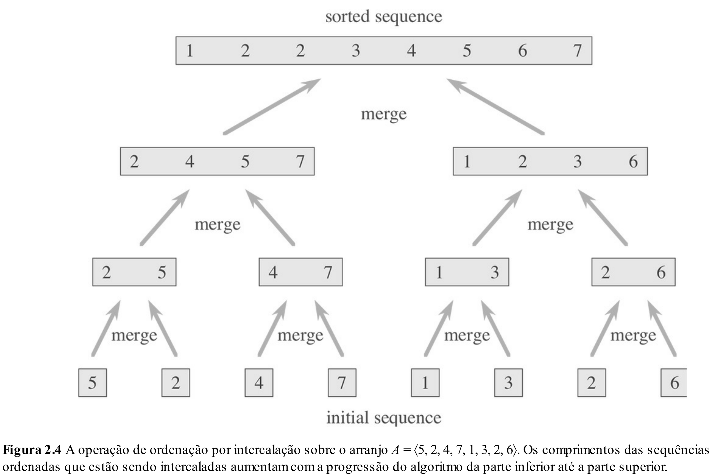
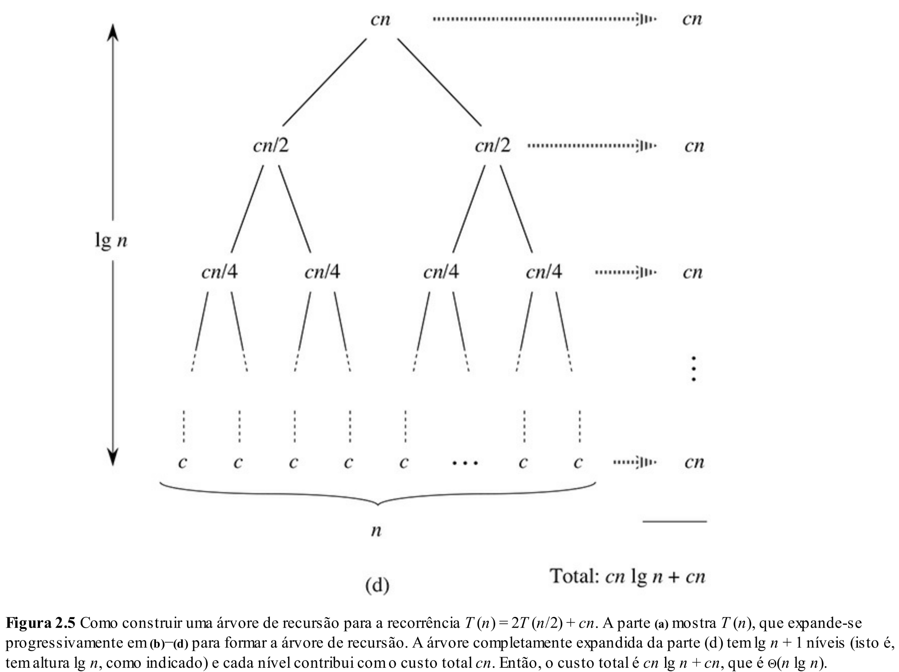

# Aula 15: Merge Sort

## 1. Motivação

Antes da semana de provas, discutimos as formas mais simples de ordenar uma lista, utilizando algoritmos como `Selection Sort`, `Bubble Sort` e `Insertion Sort`.

Embora esses algoritmos sejam intuitivos, eles têm algumas características importantes:

* São relativamente simples de implementar.
* Em alguns casos, usam memória adicional constante.
* Alguns deles podem ser estáveis, dependendo da implementação.
* Funcionam bem para entradas pequenas.

No entanto, esses algoritmos têm um problema principal: sua complexidade temporal, no pior caso, é $O(n^2)$.

Isso significa que, para listas maiores, o tempo de execução cresce muito rapidamente.

Por isso, o foco desta aula será apresentar um algoritmo de ordenação mais eficiente: o `Merge Sort`.

O `Merge Sort` é interessante porque combina três ideias importantes:

* Recursão;
* Divisão e Conquista;
* Análise de custo computacional por recorrência.

Na aula passada, já discutimos recursão com mais cuidado. Por isso, hoje vamos apenas relembrar rapidamente a ideia, usando um exemplo simples, e depois olhar para um caso em que a recursão precisa ser usada com atenção: o cálculo ingênuo de Fibonacci.

Esse cuidado será importante para entender por que o `Merge Sort`, apesar de também ser recursivo, é muito mais eficiente.

## 2. Relembrando Recursão com Soma de Vetor

Vamos começar com um exemplo simples: calcular a soma dos elementos de um vetor.

Considere o vetor:

```text
[4, 7, 2, 9]
````

Uma forma recursiva de pensar na soma é:

$$
soma([4, 7, 2, 9]) = 9 + soma([4, 7, 2])
$$

Depois:

$$
soma([4, 7, 2]) = 2 + soma([4, 7])
$$

Depois:

$$
soma([4, 7]) = 7 + soma([4])
$$

Até chegarmos ao caso base:

$$
soma([]) = 0
$$

Em C++, poderíamos escrever:

```cpp
int soma(int v[], int n) {
    if (n == 0) {
        return 0;
    }

    return v[n - 1] + soma(v, n - 1);
}
```

Observe novamente os dois elementos centrais de uma função recursiva:

* **Caso base**: quando `n == 0`, a resposta é conhecida diretamente.
* **Chamada recursiva**: o problema de tamanho `n` é reduzido para um problema de tamanho `n - 1`.

Nesse caso, a recursão é simples: a cada chamada, diminuímos o tamanho do problema em uma unidade.

O custo dessa função é linear, pois fazemos uma chamada para cada elemento do vetor.

Podemos escrever a recorrência:

$$
T(n) = T(n-1) + c
$$

Expandindo:

$$
T(n) = T(n-1) + c
$$

$$
T(n-1) = T(n-2) + c
$$

Substituindo:

$$
T(n) = T(n-2) + 2c
$$

Continuando:

$$
T(n) = T(n-k) + kc
$$

Quando chegamos ao caso base, temos $n-k = 0$, ou seja, $k = n$.

Logo:

$$
T(n) = T(0) + nc
$$

Como $T(0)$ é constante:

$$
T(n) = O(n)
$$

Portanto, nesse exemplo, a recursão gera um custo linear.

## 3. Recursão e Custo Computacional

Apesar de a recursão ser uma ferramenta poderosa, ela precisa ser usada com cuidado.

Nem toda solução recursiva é eficiente.

Um exemplo clássico é o cálculo recursivo ingênuo do número de Fibonacci.

A sequência de Fibonacci é definida como:

$$
F(0) = 0
$$

$$
F(1) = 1
$$

$$
F(n) = F(n-1) + F(n-2)
$$

Uma implementação direta seria:

```cpp
int fibonacci(int n) {
    if (n == 0) {
        return 0;
    }

    if (n == 1) {
        return 1;
    }

    return fibonacci(n - 1) + fibonacci(n - 2);
}
```

Essa implementação é simples e segue diretamente a definição matemática.

No entanto, ela é ineficiente.

Para calcular `fibonacci(5)`, por exemplo, fazemos:

```text
fibonacci(5)
= fibonacci(4) + fibonacci(3)
```

Mas `fibonacci(4)` também precisa calcular `fibonacci(3)`:

```text
fibonacci(4)
= fibonacci(3) + fibonacci(2)
```

Ou seja, `fibonacci(3)` é calculado mais de uma vez.

E isso acontece muitas vezes para valores maiores de `n`.

O problema principal é que a árvore de chamadas contém muitos subproblemas repetidos.

## 4. Analisando a Recorrência do Fibonacci

Para entender melhor o custo, podemos escrever a recorrência da função.

Cada chamada de `fibonacci(n)` faz duas chamadas recursivas:

* uma para `fibonacci(n - 1)`;
* outra para `fibonacci(n - 2)`.

Além disso, existe um custo constante para testar os casos base, fazer a soma e retornar o resultado.

Assim:

$$
T(n) = T(n-1) + T(n-2) + c
$$

Essa recorrência já mostra que o custo cresce rapidamente.

Para ter uma intuição simples do crescimento, podemos fazer uma análise aproximada por expansão.

Como $T(n-1)$ é maior que $T(n-2)$, podemos observar que o custo é limitado superiormente por:

$$
T(n) \leq 2T(n-1) + c
$$

Ignorando constantes para entender o termo dominante:

$$
T(n) \approx 2T(n-1)
$$

Expandindo:

$$
T(n) \approx 2T(n-1)
$$

$$
T(n-1) \approx 2T(n-2)
$$

Substituindo:

$$
T(n) \approx 2 \cdot 2T(n-2)
$$

$$
T(n) \approx 4T(n-2)
$$

Expandindo novamente:

$$
T(n) \approx 8T(n-3)
$$

Depois de várias expansões:

$$
T(n) \approx 2^kT(n-k)
$$

Quando chegamos ao caso base, temos $n-k = 0$, ou seja, $k = n$.

Logo:

$$
T(n) \approx 2^nT(0)
$$

Como $T(0)$ é constante:

$$
T(n) = O(2^n)
$$

Essa análise não é uma conta exata do número de chamadas, mas mostra a ideia principal: a árvore de chamadas cresce de forma exponencial.

A cada nível, o número de chamadas pode quase dobrar.

Por isso, a implementação recursiva ingênua de Fibonacci é muito ineficiente.

A lição importante é:

> Recursão não é automaticamente eficiente. Precisamos analisar como a árvore de chamadas cresce.

Existem duas formas comuns de analisar algoritmos recursivos:

* **Expandindo a recorrência**, como fizemos acima.
* **Desenhando a árvore de recursão**, somando o custo de cada nível.

A segunda forma será especialmente útil para analisar o `Merge Sort`.

## 5. Divisão e Conquista

Muitos algoritmos recursivos eficientes seguem uma estratégia chamada **Divisão e Conquista**.

A ideia geral é:

* **Dividir** o problema em subproblemas menores.
* **Conquistar** os subproblemas, geralmente de forma recursiva.
* **Combinar** as soluções dos subproblemas para resolver o problema original.

Esse paradigma é especialmente útil quando conseguimos dividir o problema em partes menores e combinar as respostas de forma eficiente.

### Exemplos clássicos de algoritmos que usam Divisão e Conquista

* **Busca Binária**: divide o vetor e busca em apenas uma das metades.
* **Merge Sort**: divide o vetor em duas metades, ordena recursivamente e depois faz a intercalação ordenada.
* **Quick Sort**: particiona o vetor ao redor de um pivô e ordena recursivamente os dois lados.
* **Multiplicação de Matrizes com Strassen**: divide matrizes grandes em blocos menores e reduz o número de multiplicações.
* **Problema da Menor Distância Entre Pontos**: divide o conjunto de pontos e combina analisando apenas pontos próximos da linha divisória.

No caso do `Merge Sort`, a ideia é aplicar divisão e conquista ao problema de ordenação.

## 6. Merge Sort

Como podemos aplicar a estratégia de Divisão e Conquista para ordenar uma lista?

Imagine que temos um array e fazemos o seguinte:

* Dividimos o array original em duas partes menores.
* Ordenamos a metade esquerda.
* Ordenamos a metade direita.
* Depois combinamos as duas metades ordenadas.

A pergunta principal é:

> Como combinar duas sublistas já ordenadas para formar uma lista ordenada maior?

É aqui que entra a operação de `merge`, ou intercalação.

Se temos duas listas ordenadas:

```text
A = [2, 4, 5, 7]
B = [1, 2, 3, 6]
```

Podemos combiná-las em uma única lista ordenada:

```text
C = [1, 2, 2, 3, 4, 5, 6, 7]
```

Para isso, basta comparar os primeiros elementos disponíveis de cada lista e copiar o menor para a lista final.

Abaixo está uma função para unir duas listas ordenadas:

```cpp
int* merge(int arr1[], int n, int arr2[], int m) {
    int* mArr = new int[m + n];

    int i = 0;
    int j = 0;

    while (i < n && j < m) {
        if (arr1[i] <= arr2[j]) {
            mArr[i + j] = arr1[i];
            i++;
        } else {
            mArr[i + j] = arr2[j];
            j++;
        }
    }

    while (i < n) {
        mArr[i + j] = arr1[i];
        i++;
    }

    while (j < m) {
        mArr[i + j] = arr2[j];
        j++;
    }

    return mArr;
}
```

Veja que:

* Enquanto existirem elementos nos dois arrays, comparamos os menores elementos disponíveis.
* Escolhemos o menor e avançamos no array correspondente.
* Se algum dos arrays acabar antes, copiamos o restante do outro.

Ou seja: sabemos como combinar duas listas ordenadas de maneira eficiente.

A operação de `merge` é linear no número total de elementos:

$$
O(n + m)
$$

Se o total de elementos for $n$, então o custo é:

$$
O(n)
$$

Agora vem a pergunta:

> Como garantir que os dois subarrays estejam ordenados?

A resposta é: aplicamos o mesmo processo recursivamente.

Dividimos o array original em duas partes, ordenamos cada parte separadamente usando `Merge Sort`, e então juntamos as duas partes usando `merge`.

E se quebrássemos o array em duas partes, depois quebrássemos essas partes novamente, e continuássemos quebrando até que cada pedaço tivesse apenas um único elemento?

Um array com apenas um elemento já está naturalmente ordenado.

A figura abaixo mostra essa ideia:



Observe que o algoritmo divide o problema até chegar em sequências de tamanho 1.

Depois, a resposta é construída de baixo para cima, intercalando sequências ordenadas cada vez maiores.

Essa é uma diferença importante em relação ao Fibonacci ingênuo.

No Fibonacci, a recursão gera várias chamadas repetidas.

No `Merge Sort`, cada chamada trabalha com uma parte diferente do array.

## 7. Implementação do Merge Sort

Uma implementação possível do `Merge Sort` é:

```cpp
int* mergeSort(int arr[], int n) {                  // Custo  | Vezes
    if (n == 1) {                                   // O(1)   | 1
        int* single = new int[1];                   // O(1)   | 1
        single[0] = arr[0];                         // O(1)   | 1
        return single;                              // O(1)   | 1
    }

    int mid = n / 2;                                // O(1)   | 1

    int* left = mergeSort(arr, mid);                // T(n/2) | 1
    int* right = mergeSort(arr + mid, n - mid);     // T(n/2) | 1

    int* sorted = merge(left, mid, right, n - mid); // O(n)   | 1

    delete[] left;                                  // O(n/2) | 1
    delete[] right;                                 // O(n/2) | 1

    return sorted;                                  // O(1)   | 1
}
```

O caso base ocorre quando `n == 1`.

Nesse caso, o array já está ordenado.

Caso contrário:

* calculamos o meio do array;
* ordenamos recursivamente a metade esquerda;
* ordenamos recursivamente a metade direita;
* intercalamos as duas metades ordenadas.

A estrutura da função segue exatamente a ideia de Divisão e Conquista:

* **Dividir**: separar o array em duas metades.
* **Conquistar**: ordenar cada metade recursivamente.
* **Combinar**: intercalar as duas metades ordenadas.

## 8. Análise de Complexidade do Merge Sort

Será que esse método é mais eficiente do que os algoritmos que vimos anteriormente, como `Selection Sort`, `Bubble Sort` e `Insertion Sort`?

Vamos analisar.

Em cada chamada do `Merge Sort`, fazemos duas chamadas recursivas:

$$
2T(n/2)
$$

Depois, fazemos o `merge`, que percorre todos os elementos do trecho atual.

Esse custo é linear:

$$
cn
$$

Portanto, a recorrência do `Merge Sort` é:

$$
T(n) = 2T(n/2) + cn
$$

Essa recorrência é diferente da recorrência do Fibonacci.

No Fibonacci ingênuo, tínhamos:

$$
T(n) = T(n-1) + T(n-2) + c
$$

O problema diminuía pouco a cada chamada, e vários subproblemas eram repetidos.

No `Merge Sort`, temos:

$$
T(n) = 2T(n/2) + cn
$$

Aqui, as chamadas recursivas são feitas sobre metades diferentes do array.

Ou seja, os subproblemas não são repetidos: cada elemento pertence a uma metade em cada nível da recursão.

Podemos visualizar o custo usando uma árvore de recursão:



A árvore mostra que:

* No primeiro nível, temos um problema de tamanho $n$, com custo $cn$.
* No segundo nível, temos dois problemas de tamanho $n/2$, cada um com custo $c(n/2)$.
* Somando os dois problemas do segundo nível, o custo total também é $cn$.
* No terceiro nível, temos quatro problemas de tamanho $n/4$.
* Somando os quatro problemas, o custo total novamente é $cn$.

Em geral, cada nível da árvore custa:

$$
cn
$$

Agora precisamos saber quantos níveis a árvore possui.

Como o tamanho do problema é dividido por 2 a cada nível, temos:

$$
n, \frac{n}{2}, \frac{n}{4}, \frac{n}{8}, \dots, 1
$$

Queremos saber quantas divisões por 2 são necessárias até chegar em 1.

Ou seja, queremos encontrar $k$ tal que:

$$
\frac{n}{2^k} = 1
$$

Logo:

$$
n = 2^k
$$

Aplicando logaritmo na base 2:

$$
k = \log_2 n
$$

Portanto, existem aproximadamente $\log_2 n$ níveis.

Como cada nível custa $cn$, o custo total é:

$$
cn \log_2 n
$$

Além disso, o último nível, com os casos base, também soma custo linear.

Assim, podemos escrever:

$$
T(n) = cn \log_2 n + cn
$$

Ignorando constantes e termos de menor impacto assintótico:

$$
T(n) = O(n \log n)
$$

Portanto, o `Merge Sort` é assintoticamente mais eficiente do que os algoritmos quadráticos.

## 9. Vantagens e Desvantagens

### Vantagens

* Complexidade de tempo $O(n \log n)$ garantida, independentemente da entrada.
* É estável, desde que o `merge` seja implementado escolhendo primeiro o elemento da esquerda em caso de empate.
* Tem uma análise de complexidade relativamente simples.
* É uma aplicação clara de Divisão e Conquista.

### Desvantagens

* Não é um algoritmo in-place na implementação tradicional.
* Precisa de memória adicional proporcional ao tamanho da entrada: $O(n)$.
* A gestão de memória, com alocação e desalocação de arrays auxiliares, pode impactar o desempenho.
* Para arrays pequenos, algoritmos mais simples podem ser competitivos na prática.
