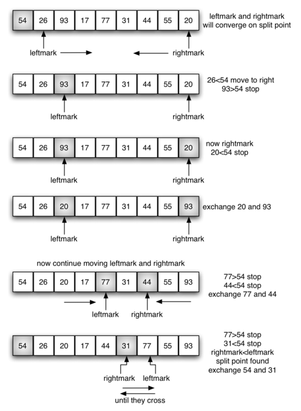
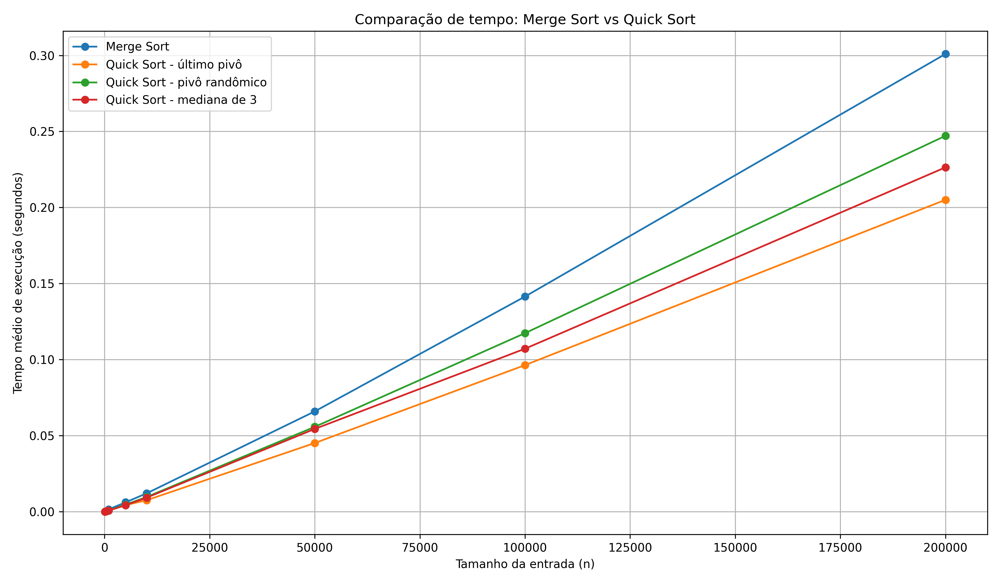
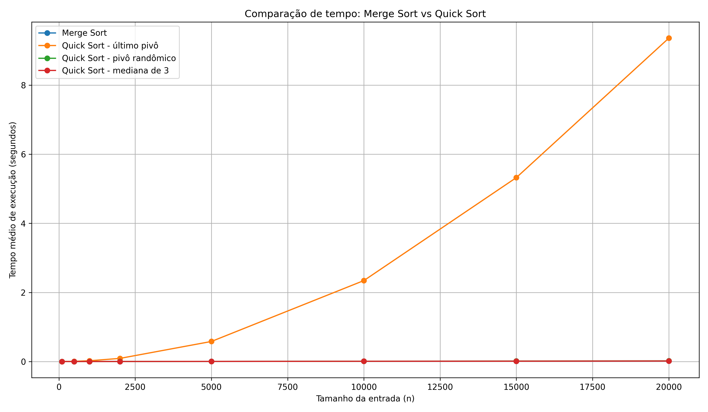

# Aula 16: Quick Sort

## 1. Retomando o Merge Sort

Na aula passada, estudamos o `Merge Sort`.

A ideia principal era aplicar Divisão e Conquista ao problema de ordenação:

* Dividir o array em duas metades.
* Ordenar recursivamente cada metade.
* Combinar as duas metades ordenadas usando `merge`.

A recorrência do `Merge Sort` é:

$$
T(n) = 2T(n/2) + cn
$$

Essa recorrência gera uma árvore de recursão com aproximadamente $\log_2 n$ níveis.

Como cada nível custa $O(n)$, o custo total é:

$$
O(n \log n)
$$

Portanto, o `Merge Sort` é muito mais eficiente, assintoticamente, do que algoritmos como `Bubble Sort`, `Selection Sort` e `Insertion Sort`, que têm pior caso $O(n^2)$.

## 2. Dificuldades do Merge Sort

Apesar de eficiente em tempo, o `Merge Sort` possui algumas dificuldades práticas.

A principal delas é o uso de memória auxiliar.

Na implementação tradicional, para intercalar duas metades ordenadas, criamos novos arrays auxiliares.

Por exemplo:

```cpp
int* left = mergeSort(arr, mid);
int* right = mergeSort(arr + mid, n - mid);

int* sorted = merge(left, mid, right, n - mid);
```

Isso significa que, além do array original, precisamos criar cópias temporárias durante o processo de ordenação.

Portanto, o `Merge Sort` não é in-place em sua implementação mais comum.

Sua complexidade de memória é:

$$
O(n)
$$

Então, embora o `Merge Sort` tenha uma análise elegante e tempo garantido $O(n \log n)$, ele paga um preço em memória.

A pergunta natural é:

> Existe outro algoritmo com desempenho médio $O(n \log n)$, mas que consiga ordenar o array de forma mais próxima de in-place?

Sim.

Essa é uma das motivações para estudar o `Quick Sort`.

## 3. Ideia do Quick Sort

O `Quick Sort` também é um algoritmo baseado em Divisão e Conquista.

Mas ele usa uma estratégia diferente do `Merge Sort`.

No `Merge Sort`, fazemos:

```text
1. Divide o array em duas metades.
2. Ordena as duas metades.
3. Combina as duas metades usando merge.
```

No `Quick Sort`, fazemos:

```text
1. Escolhe um elemento chamado pivô.
2. Reorganiza o array ao redor do pivô.
3. Ordena recursivamente os elementos à esquerda e à direita do pivô.
```

A ideia central é escolher um elemento do array e colocá-lo em sua posição correta.

Esse elemento é chamado de **pivô**.

Depois que o pivô está em sua posição correta:

* todos os elementos menores ou iguais ao pivô ficam à esquerda;
* todos os elementos maiores que o pivô ficam à direita.

Essa etapa é chamada de **particionamento**, ou `partition`.

Depois do particionamento, o pivô não precisa mais ser movido.

Ele já está exatamente na posição que ocupará no array ordenado.

O restante do problema é ordenar a parte esquerda e a parte direita.

## 4. O Papel do Pivô

O pivô é o elemento usado para dividir o array em duas regiões:

* elementos menores ou iguais ao pivô;
* elementos maiores que o pivô.

Por exemplo, considere o array:

```text
[5, 2, 8, 1, 7, 3]
```

Se escolhermos `5` como pivô, queremos reorganizar o array de forma que:

```text
[2, 1, 3]  5  [8, 7]
```

A ordem interna dos elementos à esquerda e à direita ainda não precisa estar correta.

O importante, nesse momento, é garantir que:

* tudo à esquerda é menor ou igual ao pivô;
* tudo à direita é maior que o pivô;
* o pivô está em sua posição final.

Depois disso, podemos aplicar o mesmo raciocínio recursivamente para os dois lados.

Essa é a grande diferença em relação ao `Merge Sort`.

No `Merge Sort`, a parte mais importante acontece na combinação final, com o `merge`.

No `Quick Sort`, a parte mais importante acontece antes das chamadas recursivas, no particionamento.

## 5. Particionamento

A etapa de particionamento recebe um trecho do array e escolhe um pivô.

Uma estratégia simples é escolher o primeiro elemento do trecho como pivô.

Depois, usamos dois índices:

* `left`: começa logo depois do pivô e avança da esquerda para a direita.
* `right`: começa no final do trecho e recua da direita para a esquerda.

A ideia é encontrar elementos que estão do lado errado.

O índice `left` procura um elemento maior que o pivô.

O índice `right` procura um elemento menor ou igual ao pivô.

Quando encontramos esses dois elementos, trocamos suas posições.

Esse processo continua até os índices se cruzarem.

Quando os índices se cruzam, colocamos o pivô em sua posição correta.

A figura abaixo ilustra a ideia do particionamento:



(Fonte: [https://runestone.academy/ns/books/published/pythonds/SortSearch/TheQuickSort.html](https://runestone.academy/ns/books/published/pythonds/SortSearch/TheQuickSort.html))

## 6. Exemplo Manual de Partition

Considere o array:

```text
[5, 2, 8, 1, 7, 3]
```

Vamos escolher o primeiro elemento como pivô:

```text
pivô = 5
```

Inicialmente:

```text
[5, 2, 8, 1, 7, 3]
    L              R
```

O índice `left` anda enquanto encontra elementos menores ou iguais ao pivô.

Ele passa pelo `2`, mas para no `8`, pois `8 > 5`.

O índice `right` anda enquanto encontra elementos maiores que o pivô.

Ele para no `3`, pois `3 <= 5`.

Agora temos:

```text
[5, 2, 8, 1, 7, 3]
       L        R
```

O `8` está do lado errado, pois é maior que o pivô e está à esquerda.

O `3` também está do lado errado, pois é menor que o pivô e está à direita.

Então trocamos os dois:

```text
[5, 2, 3, 1, 7, 8]
```

Continuamos.

O `left` avança passando pelo `3` e pelo `1`, mas para no `7`.

O `right` recua passando pelo `8` e pelo `7`, e para no `1`.

Agora os índices se cruzaram:

```text
[5, 2, 3, 1, 7, 8]
          R  L
```

Quando isso acontece, trocamos o pivô com o elemento na posição `right`:

```text
[1, 2, 3, 5, 7, 8]
```

Agora o pivô `5` está em sua posição correta.

Observe que:

* à esquerda do `5`, todos os elementos são menores ou iguais a ele;
* à direita do `5`, todos os elementos são maiores que ele.

A partir daqui, aplicamos o `Quick Sort` recursivamente nos dois lados:

```text
[1, 2, 3]  5  [7, 8]
```

## 7. Implementação do Partition

Uma implementação possível do particionamento é:

```cpp
int partition(int arr[], int low, int high) {
    int pivot = arr[low];

    int left = low + 1;
    int right = high;

    while (true) {
        while (left <= right && arr[left] <= pivot) {
            left++;
        }

        while (left <= right && arr[right] > pivot) {
            right--;
        }

        if (left > right) {
            break;
        }

        std::swap(arr[left], arr[right]);
    }

    std::swap(arr[low], arr[right]);

    return right;
}
```

Nessa versão:

* escolhemos o primeiro elemento como pivô;
* avançamos `left` até encontrar um elemento maior que o pivô;
* recuamos `right` até encontrar um elemento menor ou igual ao pivô;
* se `left` ainda está antes de `right`, trocamos os dois elementos;
* ao final, colocamos o pivô em sua posição correta;
* retornamos a posição final do pivô.

Essa posição é importante porque ela divide o problema em dois subproblemas:

* os elementos antes do pivô;
* os elementos depois do pivô.

## 8. Implementação do Quick Sort

Com a função `partition`, a implementação do `Quick Sort` fica curta.

```cpp
void quickSort(int arr[], int low, int high) {
    if (low < high) {
        int pi = partition(arr, low, high);

        quickSort(arr, low, pi - 1);
        quickSort(arr, pi + 1, high);
    }
}
```

O caso base ocorre quando o trecho tem zero ou um elemento.

Se `low < high`, ainda há pelo menos dois elementos.

Nesse caso:

* particionamos o array;
* obtemos a posição final do pivô;
* ordenamos recursivamente a parte esquerda;
* ordenamos recursivamente a parte direita.

O ponto principal é:

> Depois do `partition`, o pivô já está no lugar certo. Não precisamos mexer nele novamente.

## 9. Análise de Complexidade do Quick Sort

O custo do `Quick Sort` depende muito de como o pivô divide o array.

A etapa de particionamento percorre o trecho do array uma vez.

Portanto, o custo do `partition` é linear:

$$
O(n)
$$

A diferença entre os casos está no tamanho dos subproblemas gerados depois do particionamento.

### Melhor Caso

O melhor caso ocorre quando o pivô divide o array em duas partes aproximadamente iguais.

Nesse caso, a recorrência fica:

$$
T(n) = 2T(n/2) + cn
$$

Essa recorrência é parecida com a do `Merge Sort`.

Portanto:

$$
T(n) = O(n \log n)
$$

Nesse caso, a árvore de recursão tem altura $\log n$, e cada nível custa $O(n)$.

### Pior Caso

O pior caso ocorre quando o pivô é sempre o menor ou o maior elemento do trecho.

Nesse caso, uma das partes fica vazia, e a outra parte fica com quase todos os elementos.

A recorrência fica:

$$
T(n) = T(n-1) + cn
$$

Expandindo:

$$
T(n) = T(n-1) + cn
$$

$$
T(n-1) = T(n-2) + c(n-1)
$$

Substituindo:

$$
T(n) = T(n-2) + c(n-1) + cn
$$

Continuando, obtemos uma soma do tipo:

$$
cn + c(n-1) + c(n-2) + \dots + c
$$

Essa soma é proporcional a:

$$
1 + 2 + 3 + \dots + n
$$

Logo:

$$
T(n) = O(n^2)
$$

Portanto, no pior caso:

$$
T(n) = O(n^2)
$$

Um exemplo clássico ocorre quando o array já está ordenado e escolhemos sempre o primeiro elemento como pivô.

### Caso Médio

Na prática, se os pivôs forem razoavelmente balanceados, o `Quick Sort` costuma ter desempenho médio:

$$
O(n \log n)
$$

Por isso, ele é muito usado na prática.

Mesmo que nem todo pivô divida exatamente o array ao meio, basta evitar divisões muito desequilibradas com frequência.

## 10. Como Escolher o Pivô?

Escolher um bom pivô é essencial.

Algumas estratégias comuns são:

* **Primeiro elemento**: simples, mas pode ser ruim para arrays já ordenados.
* **Último elemento**: também simples, com problema semelhante.
* **Elemento aleatório**: reduz a chance de cair sempre no pior caso.
* **Mediana de três**: escolhe a mediana entre o primeiro, o meio e o último elemento.

A escolha aleatória é uma estratégia bastante comum, pois evita muitos casos degenerados com alta probabilidade.

A ideia é que, se o pivô for escolhido aleatoriamente, é improvável que ele seja sempre o pior elemento possível.

O pivô não precisa ser perfeito.

Ele só precisa evitar, com frequência, divisões extremamente desbalanceadas.

## 11. Complexidade de Memória

À primeira vista, o `Quick Sort` parece ter complexidade de memória $O(1)$, já que não usamos arrays auxiliares como no `Merge Sort`.

De fato, o particionamento pode ser feito in-place.

No entanto, ainda usamos recursão.

Cada chamada recursiva ocupa espaço na pilha de execução.

No pior caso, quando as partições são muito desequilibradas, podemos ter até $O(n)$ chamadas empilhadas.

No melhor caso, quando as partições são bem balanceadas, a profundidade da recursão é:

$$
O(\log n)
$$

Portanto:

* Melhor caso de memória: $O(\log n)$;
* Pior caso de memória: $O(n)$.

Mesmo assim, o `Quick Sort` costuma usar menos memória auxiliar do que o `Merge Sort` em sua implementação tradicional.

## 12. Comparação Final

Agora podemos comparar os algoritmos vistos.

| Algoritmo      |        Melhor Caso |    Caso Médio |     Pior Caso |        Memória Extra | Estável?                         |
| -------------- | -----------------: | ------------: | ------------: | -------------------: | -------------------------------- |
| Bubble Sort    | $O(n)$ ou $O(n^2)$ |      $O(n^2)$ |      $O(n^2)$ |               $O(1)$ | Sim, dependendo da implementação |
| Selection Sort |           $O(n^2)$ |      $O(n^2)$ |      $O(n^2)$ |               $O(1)$ | Não, em geral                    |
| Insertion Sort |             $O(n)$ |      $O(n^2)$ |      $O(n^2)$ |               $O(1)$ | Sim                              |
| Merge Sort     |      $O(n \log n)$ | $O(n \log n)$ | $O(n \log n)$ |               $O(n)$ | Sim                              |
| Quick Sort     |      $O(n \log n)$ | $O(n \log n)$ |      $O(n^2)$ | $O(\log n)$ em média | Não, em geral                    |

O `Merge Sort` tem a vantagem de garantir tempo $O(n \log n)$ mesmo no pior caso.

Por outro lado, ele usa memória auxiliar $O(n)$.

O `Quick Sort` tem pior caso $O(n^2)$, mas costuma ser muito eficiente na prática, especialmente quando usamos boas estratégias para escolher o pivô.

A diferença principal entre os dois é:

```text
Merge Sort:
divide o array em duas metades,
ordena as metades,
e depois combina usando merge.

Quick Sort:
escolhe um pivô,
particiona o array,
e depois ordena os dois lados.
```

No `Merge Sort`, o trabalho principal está na etapa de combinação.

No `Quick Sort`, o trabalho principal está na etapa de particionamento.

## 13. Comparação Experimental

Além da análise assintótica, também podemos comparar os algoritmos na prática, medindo o tempo de execução para diferentes tamanhos de entrada.

É importante lembrar que esses tempos dependem de vários fatores:

* linguagem de programação;
* implementação utilizada;
* máquina onde o teste foi executado;
* tipo de entrada;
* estratégia de escolha do pivô.

Mesmo assim, esse tipo de experimento ajuda a visualizar alguns comportamentos importantes.

### Entrada aleatória

A figura abaixo mostra uma comparação entre `Merge Sort` e diferentes versões de `Quick Sort` usando entradas aleatórias.



Nesse caso, observamos que todas as versões se comportam de forma relativamente eficiente.

Isso faz sentido, pois em entradas aleatórias o `Quick Sort` tende a escolher pivôs razoavelmente bons com frequência, especialmente quando usamos pivô aleatório ou mediana de três.

Mesmo escolhendo o último elemento como pivô, se a entrada estiver aleatória, a chance de cair repetidamente no pior caso é pequena.

Por isso, na prática, o `Quick Sort` costuma apresentar desempenho próximo de $O(n \log n)$ em entradas aleatórias.

### Entrada já ordenada

Agora observe o comportamento quando a entrada já está ordenada.



Nesse caso, a versão do `Quick Sort` que usa o último elemento como pivô apresenta um crescimento muito maior.

Isso acontece porque, em um array já ordenado, escolher sempre o último elemento como pivô faz com que o pivô seja sempre o maior elemento do trecho.

Assim, o particionamento fica extremamente desbalanceado:

```text
[ todos os outros elementos ] [ pivô ] [ vazio ]
````

Ou seja, em vez de dividir o problema em duas partes parecidas, o algoritmo reduz o problema apenas de `n` para `n - 1`.

A recorrência fica:

$$
T(n) = T(n - 1) + O(n)
$$

E isso leva ao pior caso:

$$
O(n^2)
$$

Por outro lado, o `Merge Sort` mantém um comportamento estável, pois ele sempre divide o array ao meio, independentemente da ordem inicial dos elementos.

As versões do `Quick Sort` com pivô aleatório ou mediana de três também evitam esse comportamento degenerado com mais frequência.