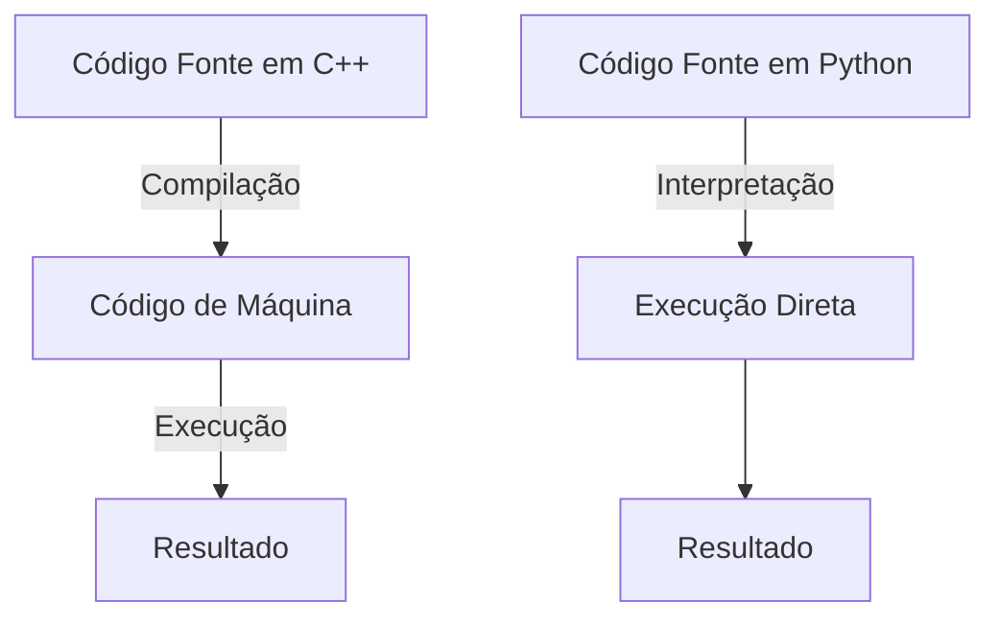
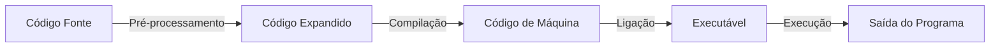

# Aula 1: Introdução à Linguagem C++

Até agora, utilizamos apenas a linguagem **Python** nas disciplinas anteriores.
No entanto, para aprender corretamente **Estruturas de Dados**, é interessante utilizar a linguagem **C++**, pois ela nos dá maior controle / visibilidade sobre memória e desempenho.
Diferente de Python, que é interpretado e dinamicamente tipado, C++ é uma linguagem compilada e de tipagem estática, o que permite maior eficiência e otimização do código.

---

## 1. Diferenças entre C++ e Python

### Tipagem
- **C++**: Linguagem de tipagem estática, onde o tipo de cada variável deve ser declarado explicitamente.
  ```cpp
  int numero = 10; // Variável inteira
  double pi = 3.14; // Número decimal
  char letra = 'A'; // Caractere
  ```
- **Python**: Linguagem de tipagem dinâmica, onde o tipo é inferido automaticamente.
  ```python
  numero = 10   # Inteiro
  pi = 3.14     # Decimal
  letra = 'A'   # Caractere
  ```

### Sintaxe
- **C++** requer o uso de ponto e vírgula (`;`) no final de cada instrução e blocos de código são delimitados por `{}`.
  ```cpp
  if (x > 0) {
      cout << "Número positivo";
  }
  ```
- **Python** usa indentação para definir blocos de código.
  ```python
  if x > 0:
      print("Número positivo")
  ```

### Compilação vs. Interpretação
- **C++** é compilado: precisa ser convertido em um executável antes de rodar.
- **Python** é interpretado: o código é executado linha por linha.

#### Processo de Compilação vs. Interpretação
- Em uma linguagem compilada como C++, o código fonte passa por várias etapas antes de ser executado.
- Em Python, o código é traduzido e executado diretamente pelo interpretador, linha por linha.

**Fluxo de execução:**



---

## 2. Escolha de IDEs

Para escrever e executar código em C++, podemos utilizar:

1. **Plataforma online**: [Replit](https://replit.com/) (permite compilar e rodar código C++ diretamente no navegador).
2. **IDE local**: Visual Studio Code com a extensão para C/C++.

---

## 3. Primeiro Código em C++

Vamos escrever um programa simples que imprime uma mensagem na tela e recebe uma entrada do usuário:

### C++
```cpp
#include <iostream>
using namespace std;

int main() {
    cout << "Olá, mundo!" << endl;
    int numero;
    cout << "Digite um número: ";
    cin >> numero;
    cout << "Você digitou: " << numero << endl;
    return 0;
}
```

### Python (comparação)
```python
print("Olá, mundo!")
numero = int(input("Digite um número: "))
print(f"Você digitou: {numero}")
```

---

## 4. Como Compilar um Programa em C++

Podemos compilar e rodar um programa de C++ utilizando a linha de comando.

### Passo a passo da compilação:
1. **Escrever o código** e salvar em um arquivo chamado `programa.cpp`.
2. **Compilar o código**:
   ```sh
   g++ programa.cpp -o programa
   ```
   Isso gera um arquivo executável chamado `programa`.
3. **Executar o programa**:
   ```sh
   ./programa
   ```
4. **Se houver erros**, o compilador exibirá mensagens indicando o problema no código.

### Etapas da Compilação:
1. **Pré-processamento**: O compilador processa diretivas como `#include`.
2. **Compilação**: O código-fonte é transformado em código de máquina.
3. **Ligação (Linking)**: As bibliotecas são adicionadas ao programa final.
4. **Geração do executável**: Um arquivo pronto para rodar é criado.



## 5. Abordagem da Disciplina: C++ com Estilo de C

Apesar de estarmos utilizando C++, nós trataremos boa parte do código como se fosse C.
Isto quer dizer que não utilizaremos orientação a objetos nessa disciplina.
Contudo, aproveitaremos algumas das facilidades trazidas pelo C++, como:  

- **Possibilidade de declarar as variáveis em qualquer ponto do código**  
  No C, todas as variáveis devem ser declaradas no início de um bloco. Em C++, podemos declará-las onde for mais conveniente, tornando o código mais organizado e legível.  

- **Maior facilidade de manipulação de strings**  
  O C++ oferece algumas facilidades na manipulação de strings comparado ao C.

- **Uso de structs no lugar de classes**  
  No lugar de classes e métodos, utilizaremos `structs`, que funcionam basicamente como classes sem métodos. Dessa forma, os dados continuarão organizados, mas sem a complexidade da Programação Orientada a Objetos. 