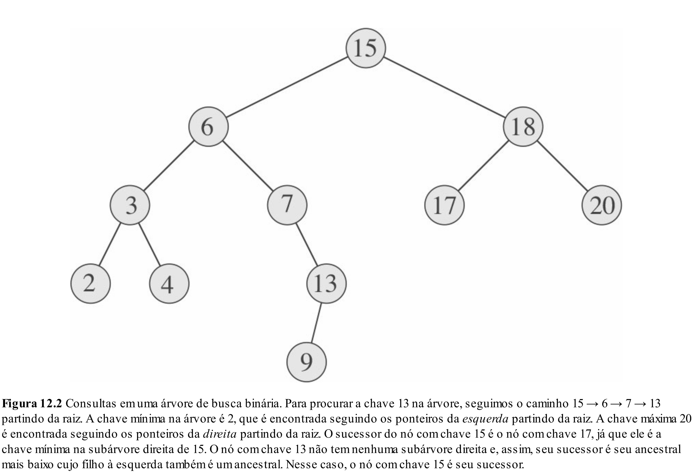
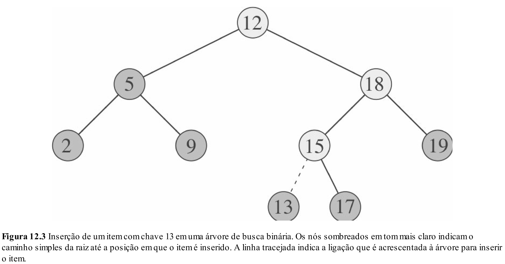
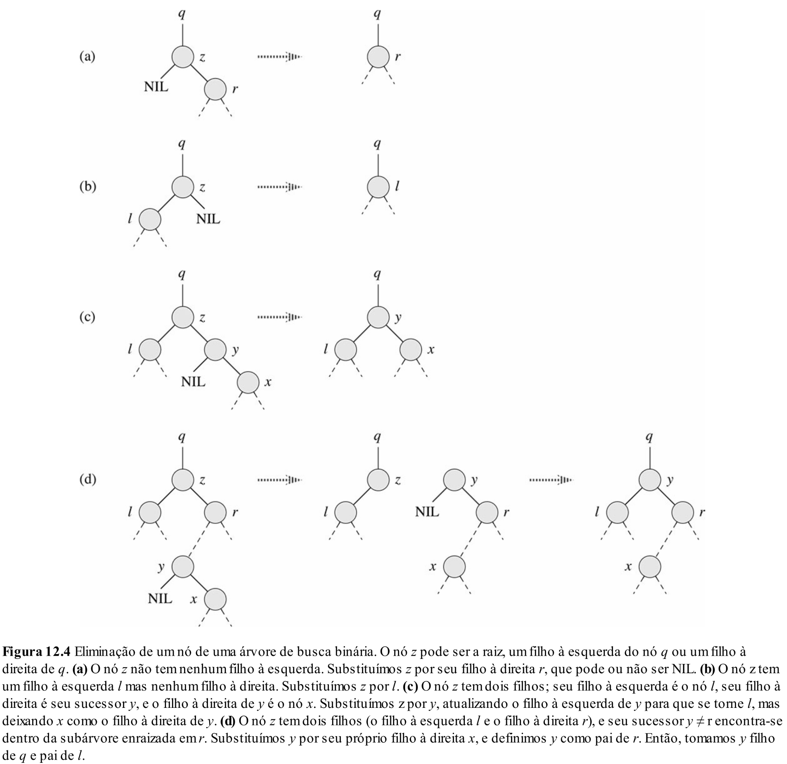

# Aula 18: Árvores Binárias de Busca (BST)

## 1. Introdução e Motivação

Até agora, exploramos os fundamentos das árvores binárias e vimos como elas podem ser úteis para representar dados de forma hierárquica. No entanto, nossa disciplina tem um foco maior: como projetar estruturas de dados eficientes para manipular informações.

Quando pensamos em eficiência, geralmente estamos interessados em três operações fundamentais:
* Inserção
* Remoção
* Busca

E, além delas, algumas operações relacionadas também são comuns e úteis, como:
* Encontrar o valor mínimo
* Encontrar o valor máximo
* E outras variações, como sucessor e antecessor

**Agora, pare e pense: com o que vimos até agora sobre árvores binárias, como implementaríamos essas operações?**

Provavelmente você concluiria que, no pior caso, teríamos que percorrer a árvore inteira — ou seja, visitar todos os nós. Isso levaria a um custo de O(n), o que não é melhor do que uma lista encadeada.

**Mas e se pudéssemos melhorar isso?**

Imagine que, ao construirmos a árvore, impuséssemos uma nova regra de ordenação:

    Para qualquer nó, todos os valores à esquerda são menores e todos os valores à direita são maiores.

Essa pequena mudança na estrutura tem um grande impacto.
Ela transforma a árvore binária em uma árvore binária de busca (BST) - uma estrutura que nos permite realizar busca, inserção e remoção de forma muito mais eficiente, chegando a $O(\log n)$ no melhor caso.

Nesta aula, vamos entender como essa propriedade funciona, como ela afeta o comportamento das operações básicas, e por que ela é tão poderosa.

## 2. Definição de BST

Uma árvore binária de busca (Binary Search Tree - BST) é uma árvore binária com uma propriedade especial de ordenação, que a torna ideal para buscas eficientes.

### Propriedade fundamental:

Para cada nó da árvore, considerando que ele armazena uma chave (key):
* Todos os nós na subárvore esquerda contêm chaves menores que a chave do nó.
* Todos os nós na subárvore direita contêm chaves maiores que a chave do nó.

Formalmente, se `node` é um nó qualquer:
* `node->left->key < node->key`
* `node->right->key > node->key`

Essa propriedade deve valer recursivamente em toda a árvore.

### Exemplo visual

```mathematica
      8
     / \
    3   10
   / \    \
  1   6    14
     / \   /
    4   7 13
```

Analisando:
* A subárvore à esquerda de 8 (com raiz 3) contém apenas valores menores que 8.
* A subárvore à direita de 8 (com raiz 10) contém apenas valores maiores que 8.
* Essa propriedade se mantém em todos os níveis.

### Aplicações práticas

* **Mapas e dicionários**:
Estruturas como map e set em C++ ou TreeMap em Java podem ser implementadas com BSTs (ou suas variantes balanceadas).
* **Sistemas de indexação**:
BSTs podem ser usadas para organizar dados em memória ou em disco, facilitando buscas por faixas de valores.
* **Autocompletar e ranking**:
Aplicações que precisam manter dados ordenados dinamicamente se beneficiam da estrutura de uma BST.

## 3. Consultas

Agora que entendemos a estrutura da BST, podemos aproveitar sua propriedade de ordenação para fazer consultas de forma eficiente.
As consultas mais comuns em uma BST são:
* Busca por um valor específico;
* Encontrar o valor mínimo / máximo;
* Encontrar o sucessor / antecessor de um nó.



### Busca

Para buscar um valor $x$ em uma BST, basta seguir a lógica de comparação com a raiz:
* Se $x$ for menor que a chave do nó atual, buscamos na subárvore esquerda.
* Se $x$ for maior, buscamos na subárvore direita.
* Se $x$ for igual, encontramos o elemento.

```cpp
Node* treeSearch(Node* root, int x) {
    if (root == nullptr || root->key == x) {
        return root;
    }

    if (x < root->key) {
        return treeSearch(root->left, x);
    } else {
        return treeSearch(root->right, x);
    }
}
```

Essa função tem complexidade $O(h)$, onde $h$ é a altura da árvore.

### Mínimo e máximo

Para encontrar o menor (ou maior) valor em uma BST, basta ir sempre para a esquerda (ou direita), pois os menores valores estão no fundo da subárvore esquerda, e os maiores na subárvore direita.

```cpp
Node* treeMinimum(Node* node) {
    Node* current = node;
    while (current->left != nullptr) {
        current = current->left;
    }
    return current;
}
```

Essa funçãotambém têm complexidade $O(h)$.

Obs: O algoritmo para encontrar o máximo é analogo.

### Sucessor e antecessor

O sucessor de um nó em uma BST é o próximo nó na ordem crescente - ou seja, o próximo valor em um percurso in-order.

Existem dois casos para encontrar o sucessor de um nó node:
* Se `node->right` não for nulo:
    → O sucessor está no menor valor da subárvore direita.
* Se `node->right` for nulo:
    → O sucessor está acima na árvore - é o primeiro ancestral do nó que contém node na subárvore esquerda.

```cpp
Node* treeSuccessor(Node* node) {
    if (node->right != nullptr) {
        return treeMinimum(node->right);
    }

    Node* current = node;
    Node* parent = current->parent;
    while (parent != nullptr && current == parent->right) {
        current = parent;
        parent = parent->parent;
    }
    return parent;
}
```

O antecessor é o nó que vem antes na ordem crescente. A lógica é análoga:
* Se `node->left` não for nulo:
    → O antecessor é o maior valor da subárvore esquerda.
* Caso contrário:
    → Subimos pela árvore até encontrar o primeiro ancestral para o qual node esteja na subárvore direita.

Essas operações são importantes, por exemplo, na remoção de nós com dois filhos, e em consultas por faixas de valores.

## 4. Inserção

Além das consultas, também é do nosso interesse adicionar novos elementos a árvore.
A operação de inserção de novos valores em uma BST deve seguir diretamente a propriedade fundamental da estrutura,
isto é, ela deve ser inserida uma posição que garanta a continuidade da regra da ordenação

* Dado um valor $x$ que queremos inserir, comparamos com a raiz e seguimos à esquerda se $x$ for menor, ou à direita se for maior. 
* Repetimos esse * processo até encontrar um espaço nullptr onde o novo nó pode ser colocado.



### Algoritmo

A inserção funciona como uma busca até encontrar um local vazio.
A posição final de $x$ será aquela onde ele mantém a propriedade de ordenação da BST.

```cpp
Node* createNode(int x) {
    Node* n = new Node();
    n->key = x;
    n->left = nullptr;
    n->right = nullptr;
    n->parent = nullptr;
}

Node* insert(Node* root, int x) {
    if (root == nullptr) { // Encontramos a posição
        return createNode(x);
    }

    if (x < root->key) {
        Node* leftChild = insert(root->left, x);
        root->left = leftChild;
        leftChild->parent = root;
    } else if (x > root->key) {
        Node* rightChild = insert(root->right, x);
        root->right = rightChild;
        rightChild->parent = root;
    }
    // Se x == root->key, ignoramos (ou tratamos duplicatas de outra forma)
    return root;
}
```

Observações:
* A função acima assume que não permitimos duplicatas. Se a chave já existir na árvore, nada é feito;
* A função acima assume que já existe pelo menos um nó raiz.

## 5. Remoção

Por fim, a ultima operação fundalmente em um BST é a remoção de um nó.
Como veremos, ela é um pouco mais complexa que a inserção, pois precisamos manter a propriedade de ordenação da árvore após retirar um nó.

A remoção depende da quantidade de filhos do nó a ser removido:
* Caso 1: Nó folha (sem filhos)
    - Basta remover o nó diretamente.
    - Nenhuma reorganização é necessária.
* Caso 2: Nó com um único filho
    - Removemos o nó e ligamos seu pai diretamente ao filho.
    - Isso mantém a ordem dos elementos.
* Caso 3: Nó com dois filhos
    - Esse é o caso mais complexo.
    - Precisamos substituir o nó por um valor equivalente que preserve a estrutura da BST.
    - A solução mais comum é:
        - Encontrar o sucessor (menor elemento da subárvore direita) ou o antecessor (maior da subárvore esquerda).
        - Substituir o conteúdo do nó a ser removido por esse valor.
        - Em seguida, remover o sucessor/antecessor original, que estará em um dos casos simples anteriores.



### Algoritmo

Usamos uma função auxiliar `transplant` para substituir um nó $u$ por um nó $v$ na árvore - ou seja, fazer o pai de $u$ passar a apontar para $v$.
Essa função é importante porque deixa o código da remoção bem mais limpo e fácil de entender.

```cpp
void transplant(Node* u, Node* v) {
    if(u->parent == nullptr) {
        // Caso especial: u é a raiz — depende de como você gerencia a raiz externamente
    } else if(u == u->parent->left) {
        u->parent->left = v;
    } else {
        u->parent->right = v;
    }

    if(v != nullptr) {
        v->parent = u->parent;
    }
}
```

Dessa forma, a função de remoção fica:

```cpp
void treeDelete(Node* z) {
    if(z->left == nullptr) {
        transplant(z, z->right);
    } else if(z->right == nullptr) {
        transplant(z, z->left);
    } else {
        Node* y = treeMinimum(z->right);
        if(y->parent != z) {
            transplant(y, y->right);
            y->right = z->right;
            y->right->parent = y;
        }
        transplant(z, y);
        y->left = z->left;
        y->left->parent = y;
    }
}
```

Observações:
* A função `treeDelete` presume que o ponteiro da raiz está sendo mantido externamente.
    * Se $z$ for a raiz, será necessário atualizar o ponteiro da raiz após o `transplant`.
* O nó $y$, que substitui $z$, vem da subárvore direita e é o menor daquela subárvore (o sucessor in-order).
* Usar `transplant` facilita bastante o código, pois centraliza a lógica de substituição.

## 6. Complexidade

Como vimos, a eficiência das operações de busca, inserção e remoção em uma BST depende diretamente da altura da árvore:
* No **melhor caso**, quando a árvore está relativamente balanceada, sua altura é proporcional a $\log n$, e todas as operações podem ser feitas em $O(\log n)$.
* No **pior caso**, se a árvore for desequilibrada - como ocorre ao inserir elementos já ordenados - ela pode se degenerar em uma lista encadeada, fazendo com que as operações tenham custo $O(n)$.

Esse comportamento nos mostra uma limitação importante da BST: ela não garante desempenho eficiente em todos os casos.

Por isso, nas próximas aulas, veremos árvores balanceadas - variantes das árvores binárias de busca que mantêm a altura da árvore controlada e próxima de $O(\log n)$, mesmo no pior caso.