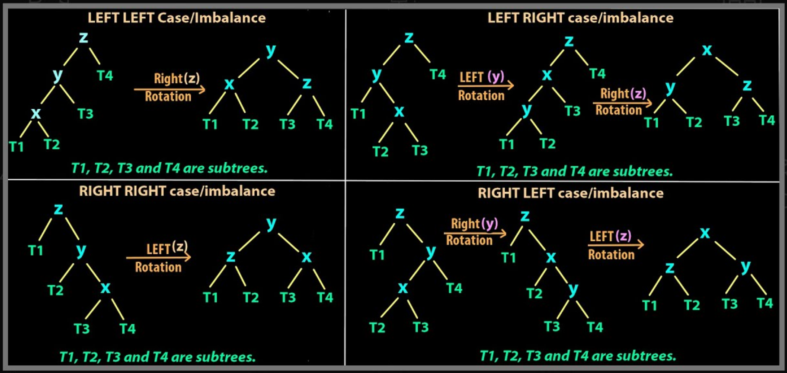

# Aula 20: Árvores AVL - Árvores Binárias de Busca Balanceadas

## 1. Introdução

Na semana passada, apresentamos uma nova estrutura de dados chamada Arvores binárias de busca (BST), uma árvore com 2 propriedades fundamentais:
* Primeiro: O grau máximo (ignorando o pai) de cada nó é 2;
* Segundo: Dado uma chave associada ao nó, todos os nós contidos na sub-arvore a esquerda nó tem valor inferior à chave enquanto todos os nós na sub-arvore da direita tem valor superior à chave;

A partir dai, implementamos as funcionalidades básicas e vimos que seu custos computacionais eram:
* **Inserção** → $O(h)$
* **Remoção** → $O(h)$
* **Busca** → $O(h)$
Onde $h$ é a altura da árvore.

Como o custo é proporcional à altura da árvore, temos que:
* No **melhor caso**, uma árvore perfeitamente balanceada tem altura $O(\log n)$;
* No **pior caso**, uma árvore degenerada (sem balanceamento) tem altura $O(n)$ - vira uma lista encadeada

### Problema prático: é muito fácil uma BST se degenerar.

Por exemplo, se inserirmos uma sequência de elementos ordenados, como 1 > 2 > 3 > 4. Temos:

```mathematica
1
 \
  2
   \
    3
     \
      4
```

## 2. Árvores AVL

A proposta das árvores AVL, então, é oferecer uma solução para esse problema de desequilíbrio das BSTs.
Elas fazem isso implementando um mecanismo automático que **mantém a árvore balanceada** após cada **inserção** ou **remoção** de elementos.

### 2.1. O que é uma árvore balanceada?

De forma geral, dizemos que uma árvore está "balanceada" quando suas subárvores esquerda e direita têm **alturas próximas**, o que evita que ela se torne muito inclinada para um lado só (o que levaria a desempenho ruim, como vimos nas BSTs degeneradas).

No caso das **árvores AVL**, essa ideia é formalizada com uma regra clara:

> Uma árvore AVL exige que, para **todo nó `n`**, a diferença entre as alturas das subárvores esquerda e direita seja **no máximo 1**.

Essa diferença é chamada de **fator de balanceamento (BF)**, e é definida assim:

$$\text{BF}(n) = \text{altura(subárvore direita)} - \text{altura(subárvore esquerda)}$$

Então, para que uma árvore esteja **balanceada no estilo AVL**, ela deve respeitar:

$$-1 \leq \text{BF}(n) \leq 1 \quad \text{(para todo nó n)}$$

#### Exemplos

##### Exemplo balanceado
```mathematica
     D
    / \
   C   G
  /
 B 
```
* Altura da subárvore esquerda de D = 1 (C → B)
* Altura da subárvore direita de D = 0 (G)
* $BF(D) = 0 - 1 = -1$ → válido


##### Exemplo não-balanceado

```mathematica
        D
      /   \
     C     G
          / \ 
         F   D
        /
       E
```

* Altura da subárvore direita de D = 2 (G → F → E)
* Altura da subárvore esquerda de D = 0 (C)
* $BF(D) = 2 - 0 = 2$ → inválido

### 2.2. Qual é a altura máxima de uma árvore AVL com n nós?

Uma dúvida natural que surge ao estudar árvores AVL é:

> **"Essa propriedade de balanceamento garante que a altura da árvore será proporcional a log(n)?"**  
> Ou, mais diretamente:  
> **"Qual é a altura máxima que uma árvore AVL pode ter com `n` nós?"**

À primeira vista, essa pergunta parece simples. Mas na prática, **não é nada fácil** encontrar uma fórmula fechada que relacione diretamente:

$$\text{altura } h \longleftrightarrow \text{número de nós } n$$

**Por quê isso é difícil?**

- Porque uma árvore AVL pode assumir **muitas formas diferentes**, todas válidas.
- Para um mesmo número de nós `n`, podem existir árvores com alturas bem diferentes (dentro dos limites de balanceamento).
- Ou seja, **não há uma fórmula direta para dizer, dado `n`, qual é a maior altura possível de uma AVL**.

Para responder essa pergunta diretamente, teríamos que analisar **todas** as configurações possíveis de árvores AVL com `n` nós e escolher a de maior altura — um problema **combinatorial e muito complexo**.

### 2.3 Uma mudança de estratégia: o problema complementar

Quando um problema direto é muito difícil, uma boa estratégia é inverter a pergunta.
Isso é conhecido como **resolver o problema complementar (ou dual)**.

#### Exemplo prático do problema complementar

Para entender melhor o que é resolver o problema complementar, aqui vão dois exemplos mais cotidianos:

##### Exemplo 1: Combustível e distância

> "Qual é o **tempo máximo** que consigo dirigir com `x` litros de gasolina?"

Essa pergunta pode ser difícil, porque depende de vários fatores.

Mas você pode inverter:

- "Com esse tempo, **qual seria o consumo mínimo de gasolina** necessário?"

Essa inversão facilita o raciocínio. Depois, com ajustes, você pode responder à pergunta original.

##### Exemplo 2: Senhas com restrições

> "Quantas senhas de 6 caracteres existem com **pelo menos uma letra maiúscula**?"

É complicado contar diretamente todos os casos possíveis.

Mas podemos inverter:

- Total de senhas possíveis (sem restrição)
- Menos o total de senhas **sem nenhuma letra maiúscula**

A subtração resolve o problema original com mais facilidade.

### 2.4 Voltando à árvore AVL

Vamos usar essa mesma ideia para nosso problema.

Como é difícil saber a **altura máxima para `n` nós**, podemos inverter o problema e perguntar:

> **"Qual o número **mínimo** de nós necessários para que uma árvore AVL tenha altura `h`?"**

Esse problema é bem mais fácil de abordar, pois esse número mínimo ocorre quando a árvore está o mais "esticada" possível **sem violar o balanceamento AVL**.

Para isso, usamos a seguinte fórmula recursiva:

$$N(h) = 1 + N(h-1) + N(h-2)$$

Onde:
- `N(h)` é o número mínimo de nós em uma árvore AVL de altura `h`
- A árvore mais "estirada" ainda precisa manter o balanceamento, ou seja:
  - Um lado com altura `h-1`
  - O outro com altura `h-2`

#### Analisando a fórmula

Vamos explorar o crescimento de `N(h)`:

$$
\begin{align*}
N(h) & = 1 + N(h-1) + N(h-2) \\
     & > 2 \cdot N(h-2) \quad \text{(ignorando o 1 e considerando } N(h-1) > N(h-2)) \\
     & = 2 \cdot (2 \cdot N(h-4)) = 4 \cdot N(h-4) \\
     & = 2^{h/2} \cdot 1 \\
     & \Rightarrow N(h) > 2^{h/2} \\
     & \Rightarrow \log N(h) > h/2 \Rightarrow h < 2 \cdot \log N(h)
\end{align*}
$$

Ou seja, voltando a pergunta original, podemos afirmar que a altura de uma árvore AVL com `n` nós é, no **pior caso**, no máximo **proporcional a `2 * log₂(n)`**.

## 3. Inserção

Sabemos que uma árvore AVL mantém sua altura proporcional a \$\log(n)\$, o que é essencial para garantir eficiência nas operações de busca, inserção e remoção.

Mas como garantir esse balanceamento automaticamente?

A resposta está no **ajuste da estrutura da árvore após cada inserção**, por meio de **rotações**.

### 3.1 Um exemplo simples de desbalanceamento

Vamos inserir os valores `A`, `B` e `C` em uma árvore inicialmente vazia:

1. Inserimos `A`:

```mathematica
     A
```

Árvore com 1 nó - naturalmente balanceada.

2. Inserimos `B` (à direita de `A`):

```mathematica
     A
      \
       B
```

Ainda balanceada: \$BF(A) = 1\$

3. Inserimos `C` (à direita de `B`):

```mathematica
     A
      \
       B
        \
         C
```

Agora temos um problema: \$BF(A) = 2\$
A árvore **violou a condição AVL**!

#### Corrigindo com rotação

Esse desbalanceamento é resolvido com uma **rotação simples à esquerda em `A`**, fazendo `B` subir e `A` se tornar seu filho à esquerda:

```mathematica
     B
    / \
   A   C
```

Agora todos os nós têm fator de balanceamento entre -1 e 1. A árvore está balanceada novamente!

#### Implementação da rotação à esquerda

```cpp
int getHeight(Node* n) {
    return n == nullptr ? 0 : n->height;
}

void recomputeHeight(Node* n) {
    n->height = 1 + max(getHeight(n->left), getHeight(n->right));
}

void rotateLeft(Node* root) {
    Node* newRoot = root->right;

    transplant(newRoot, newRoot->left);
    transplant(root, newRoot);
    newRoot->left = root;
    root->parent = newRoot;

    recomputeHeight(root);      // atualiza o nó que foi para baixo
    recomputeHeight(newRoot);  // atualiza a nova raiz da subárvore
}
```

### 3.2 Casos possíveis de rotação

A rotação à esquerda resolve o caso em que inserimos **à direita do filho direito** (como `A → B → C`). Mas existem outros tipos de desbalanceamentos que exigem soluções diferentes.

Para cada nó que se desbalanceia, temos **quatro casos possíveis** dependendo de onde a inserção ocorreu:

#### Casos de Desbalanceamento

| Caso   | Situação                                         | Tipo de Rotação Necessária            |
| ------ | ------------------------------------------------ | ------------------------------------- |
| **LL** | Inserção na subárvore esquerda do filho esquerdo | Rotação simples à **direita**         |
| **RR** | Inserção na subárvore direita do filho direito   | Rotação simples à **esquerda**        |
| **LR** | Inserção na subárvore direita do filho esquerdo  | Rotação dupla: **esquerda + direita** |
| **RL** | Inserção na subárvore esquerda do filho direito  | Rotação dupla: **direita + esquerda** |

#### Exemplo visual de cada caso

##### LL (Left-Left):

```mathematica
     C
    /
   B
  /
 A
```

Rotação à direita em `C` resulta em:

```mathematica
     B
    / \
   A   C
```

##### RR (Right-Right):

```mathematica
 A
  \
   B
    \
     C
```

Rotação à esquerda em `A` resulta em:

```mathematica
     B
    / \
   A   C
```

##### LR (Left-Right):

```mathematica
     C
    /
   A
    \
     B
```

Primeiro, rotação à esquerda em `A`, depois rotação à direita em `C`:

```mathematica
     B
    / \
   A   C
```

##### RL (Right-Left):

```mathematica
 A
  \
   C
  /
 B
```

Primeiro, rotação à direita em `C`, depois rotação à esquerda em `A`:

```mathematica
     B
    / \
   A   C
```

## 3.3 Tabela de análise dos casos

Vamos analisar em termos de altura antes e depois da inserção para decidir se a árvore ficou balanceada ou não, e que tipo de rotação é necessária.

Assumindo que temos essa subárvore:

```mathematica
          N1
        /    \
       N2     T3
      /  \
     T1  T2
```

Onde:

* `N1` tem altura `h`
* `N2` tem altura `h-1`
* `N3` tem altura `h-2`

| Inserção       | Alturas antes (T1, T2, N2, N1) | Alturas depois       | Estado        | Ação Necessária           |
| -------------- | ------------------------------ | -------------------- | ------------- | ------------------------- |
| Inserção em T1 | h-3, h-2, h-1, h               | h-2, h-2, h-1, h     | Balanceada    | Nenhuma                   |
| Inserção em T2 | h-3, h-2, h-1, h               | h-2, h-1, h, **h+1** | Desbalanceada | Rotação dupla (esq + dir) |
| Inserção em T1 | h-2, h-3, h-1, h               | h-1, h-2, h, **h+1** | Desbalanceada | Rotação simples à direita |
| Inserção em T2 | h-2, h-3, h-1, h               | h-2, h-2, h-1, h     | Balanceada    | Nenhuma                   |



(Fonte: https://www.youtube.com/watch?v=_nyt5QYel3Q)

### 3.4 TLDR

* Toda vez que uma inserção causa desbalanceamento, **apenas um nó (o mais profundo desbalanceado) precisa ser corrigido**.
* Existem **4 tipos de situações** que mapeiam diretamente para **2 tipos de rotação**: simples ou dupla.
* Saber identificar o **caso (LL, RR, LR, RL)** é o passo essencial para restaurar o balanceamento corretamente.

## 4. Remoção

A operação de remoção em uma árvore AVL é **análogo** à de inserção no que diz respeito ao rebalanceamento:

* Existem **apenas quatro casos possíveis** de desbalanceamento (LL, RR, LR, RL).
* As **mesmas rotações** (simples ou duplas) são utilizadas para restaurar o balanceamento.

A principal **diferença entre inserção e remoção** está no comportamento da **altura das subárvores após o rebalanceamento**:

### Inserção: no máximo 1 rotação

Após uma inserção que causa desbalanceamento:

* A rotação aplicada faz com que a altura da subárvore volte ao que era **antes da inserção**.
* Portanto, o desbalanceamento **não se propaga** para os ancestrais.

> Por isso, basta aplicar **uma rotação (simples ou dupla)** no primeiro nó desbalanceado encontrado ao subir após a inserção.

### Remoção: pode exigir várias rotações

Na remoção, é possível que **após o rebalanceamento a altura da subárvore diminua**.

Se isso acontecer:

* O nó pai pode **também se desbalancear**.
* Mesmo após uma rotação, a nova subárvore pode continuar com altura menor.
* O problema **pode se propagar até a raiz**, exigindo **várias rotações sucessivas**.

> A diferença fundamental é essa: **na inserção a altura volta ao normal**, enquanto **na remoção a altura pode cair**.

### Exemplo

```mathematica
          50
        /    \
      30      70
     /   \   /  \
   20    40 60   80
  /  \   /         \
 10  25 35          90
     /
    22  
```

Vamos remover o nó `60`:

```mathematica
          50
        /    \
      30      70
     /  \       \
   20    40      80
  /  \   /         \
 10  25 35          90
     /
    22  
```

* O nó `70` fica desbalanceado (FB = 2).
* Aplicamos uma rotação simples à esquerda em `70`.
* Mas a nova subárvore à direita de `50` diminui de altura, o que **desbalancea o próprio `50`**.

Nesse cenário, uma **única remoção gerou dois desbalanceamentos sucessivos**.
