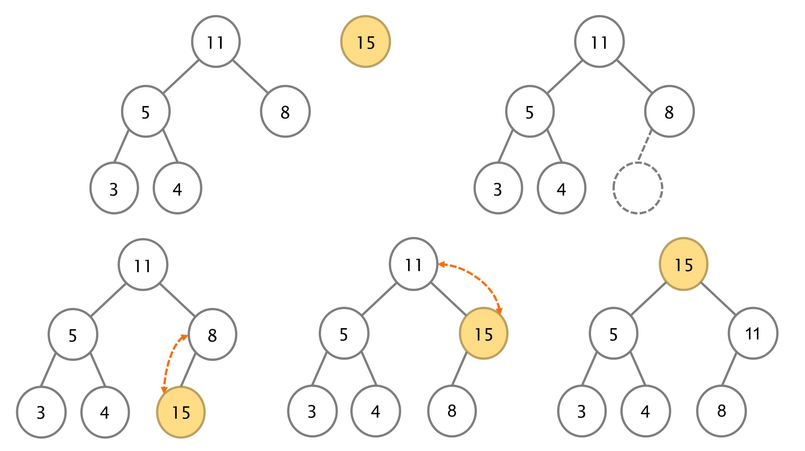
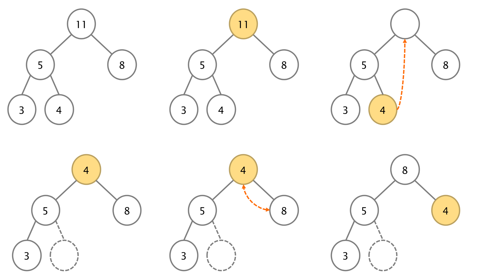
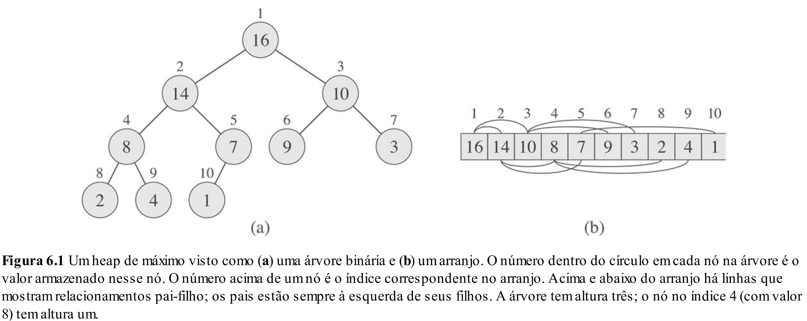
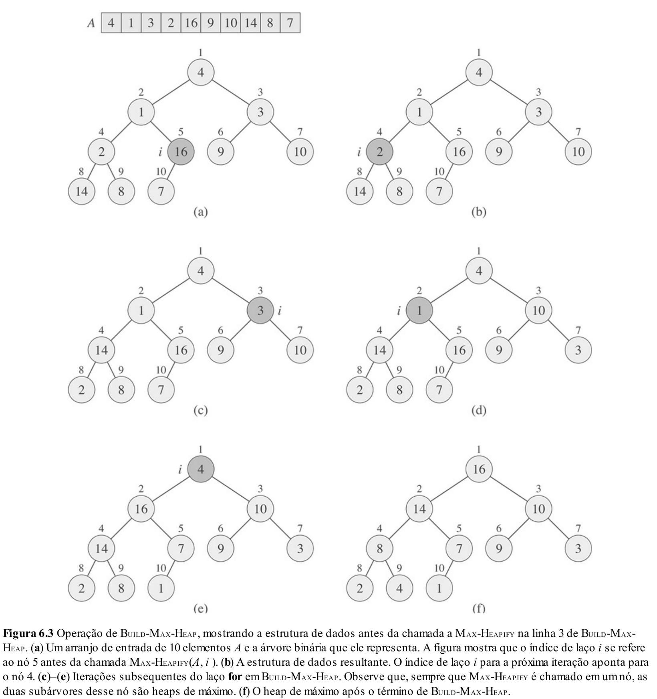

# Aula 24: Heaps

## 1. Introdução

Bom, continuando nossa saga por estruturas de dados eficientes, nas últimas duas semanas nos concentramos nas árvores **AVL** e **Rubro-Negra**, onde vimos que elas conseguem executar as operações:

* **Inserção** → $O(\log n)$  
* **Remoção** → $O(\log n)$  
* **Busca** → $O(\log n)$

E a pergunta que tiramos daí é: **acabou?** Finalmente encontramos as estruturas de dados mais eficientes possíveis?

A resposta é: **não, nossa saga continua.**

Assim como vimos no início do período, é possível criar estruturas ainda mais eficientes quando o **escopo da aplicação é bem definido e limitado**, como foi o caso das **filas** e **pilhas**.

A verdade é que, a partir dessas estruturas baseadas em árvores, conseguimos construir outras ainda mais otimizadas para **tarefas específicas**.

E hoje vamos ver um desses casos: situações em que estamos **majoritariamente interessados no maior (ou menor) valor** de uma lista de elementos.  
Para isso, existe uma estrutura mais eficiente do que a AVL e Rubro-Negra: as **heaps**.

## 2. Heap Binário

Suponha que desejamos obter o **maior** (ou **menor**) elemento de um conjunto. Como faríamos isso com as estruturas que já conhecemos?

* **Opção 1: Lista encadeada ordenada**
  - Inserção: $O(n)$  
  - Remoção: $O(1)$  
  - Maior elemento: $O(1)$

* **Opção 2: Árvores auto-balanceadas (AVL, Rubro-Negra)**
  - Inserção: $O(\log n)$  
  - Remoção: $O(\log n)$  
  - Maior elemento: $O(\log n)$

Ou seja, a melhor escolha depende de quais operações serão mais frequentes no nosso uso.

Mas... **teria como fazer melhor?**  
A resposta é **sim!** E a estrutura que nos permite isso é a **heap binária**.

### 2.1 O que é uma Heap Binária?

* Uma estrutura semelhante a uma **árvore binária**, mas com **propriedades específicas**.
* Diferente da **árvore binária de busca (BST)**, onde:
  - `esquerda < pai < direita`
* Na **heap binária**, temos:

  - Em uma **max heap**: `pai >= filhos`
  - Em uma **min heap**: `pai <= filhos`

* Ou seja, em uma **max heap**, o maior elemento **sempre está na raiz** → acesso ao máximo em $O(1)$.
* Em uma **min heap**, o menor elemento sempre está na raiz.
* A questão agora é: como manter essa propriedade ao inserir ou remover elementos?
  - Veremos que é possível fazer isso em **$O(\log n)$** com os algoritmos certos.

### 2.2 Exemplo

#### Max Heap:
```mathematica
          99
        /    \
      37      50
     /   \   /  \
   31    15 2    25
  /  \   /
 1   27 10
```

#### Min Heap:
```mathematica
          1
        /    \
       2      10
     /   \   /  \
   27    25 15    50
  /  \   /
 37  31 99
```

### 2.3 Aplicações

Heaps binárias são muito úteis em situações que envolvem acesso rápido ao maior ou menor valor:

* Filas de prioridade - onde o elemento com maior prioridade deve ser tratado primeiro.
* Heapsort - algoritmo de ordenação eficiente em tempo $O(n \log n)$.
* Algoritmos de grafos, como:
    - Dijkstra (menor caminho)
    - Prim (árvore geradora mínima)
* Sistemas de agendamento - como escalonadores de processos.

## 3. Operações (Conceitualmente)

Como vimos nos exemplos, uma Heap é implementada como uma **árvore binária completa**, ou seja:

- Todas as folhas estão localizadas no penúltimo ou último nível.
- As folhas do último nível são preenchidas **da esquerda para a direita**, sem buracos.

Essa estrutura garante que a **altura da árvore seja O(log n)**, o que torna as operações eficientes.

Com isso em mente, vamos entender como funcionam as principais operações sobre uma Heap:

- Acesso ao Máximo / Mínimo (dependendo do tipo da Heap)
- Inserção
- Remoção

### 3.1 Acesso ao Máximo / Mínimo

Essa operação é direta:  
O valor máximo (em uma **Max-Heap**) ou mínimo (em uma **Min-Heap**) está sempre na **raiz da árvore** (índice 0, se a heap for armazenada em vetor).

### 3.2 Inserção

A inserção pode ser dividida em duas etapas:

1. **Inserir o novo elemento na próxima posição livre**, ou seja, **ao final da heap** (mantendo a árvore completa).
2. **Subir (heapify-up ou sift-up)** esse elemento para restaurar a propriedade da heap:
    - Compare o novo nó com seu pai.
    - Se a ordem estiver correta (por exemplo, em uma Max-Heap: pai ≥ filho), **paramos**.
    - Caso contrário, **trocamos o pai com o filho** e repetimos o processo com o novo pai.
    - O processo termina quando:
      - A posição correta for encontrada, ou
      - O nó chegar à raiz.

> Intuição: estamos "subindo" o novo elemento até que ele encontre uma posição onde a propriedade da heap não seja mais violada.



### 3.3 Remoção

A única remoção permitida diretamente em uma heap é a **remoção do elemento da raiz** - que é o maior (ou menor) valor da árvore.

Após remover a raiz, precisamos **reorganizar** a heap para manter suas propriedades. O processo é dividido em duas etapas:

1. **Mover o último elemento da heap para a raiz**. Isso preserva o formato de árvore completa.
2. **Descer (heapify-down ou sift-down)** esse elemento para restaurar a propriedade da heap:
    - Compare o novo valor da raiz com seus filhos.
    - Troque com o **maior (ou menor, no caso de Min-Heap)** dos filhos, **caso necessário**.
    - Repita o processo com o novo valor até:
      - Encontrar a posição correta, ou
      - Chegar a uma folha.

> Intuição: como inserimos um possível “valor errado” no topo, vamos empurrá-lo para baixo até que a hierarquia da heap seja restaurada.



## 4. Implementação (via arrays)

Existem duas formas principais de implementar uma heap binária:

1. **Via nós/ponteiros**, como fizemos com árvores nas aulas anteriores.
2. **Via arrays**, que é a forma mais comum e eficiente na prática, pois heaps são árvores **quase completas**, o que permite representar sua estrutura diretamente em um vetor sem desperdiçar espaço.

Dado isso, implementaremos a heap **utilizando arrays**.

### 4.1 Representação de árvores com arrays

Como heaps são árvores cheias (ou quase cheias), seus elementos podem ser armazenados sequencialmente em um vetor, obedecendo a seguinte propriedade:

Se um nó está no índice $i$ do vetor, então:

- **Filho à esquerda** → índice `2*i + 1`
- **Filho à direita** → índice `2*i + 2`
- **Pai** → índice `(i - 1) / 2` (arredondando para baixo)

Essa fórmula deriva da estrutura de níveis da árvore:

* Nível 0: $2^0 = 1$ nó → posição 0  
* Nível 1: $2^1 = 2$ nós → posições 1 e 2  
* Nível 2: $2^2 = 4$ nós → posições 3 a 6  
* Nível $k$: $2^k$ nós  
* Total de nós até o nível $k$: $2^{k+1} - 1$

#### Por que isso funciona?

Se o pai está no índice $i = 2^x + y$, então:

- Filho à esquerda → índice $2^{x+1} + 2y + 1 = 2(2^x + y) + 1 = 2i + 1$

Isso confirma a relação entre os índices dos nós em uma árvore cheia.



### 4.2 Estrutura da Heap

```cpp
struct Heap {
    int *data;      // Vetor que armazena os elementos
    int size;       // Número atual de elementos
    int capacity;   // Capacidade máxima da heap
};
```

### 4.3 Inserção

```cpp
void insert(Heap* heap, int value) {
    if (heap->size == heap->capacity) {
        // Heap cheia, fazer tratamento adequado
        return;
    }

    heap->data[heap->size] = value;
    siftUp(heap, heap->size);
    heap->size++;
}

void heapifyUp(Heap* heap, int current) {
    while (current > 0) {
        int parent = (current - 1) / 2;
        if (heap->data[parent] < heap->data[current]) {
            swap(heap->data, parent, current);
            current = parent;
        } else {
            break;
        }
    }
}

void swap(int* arr, int i, int j) {
    int tmp = arr[i];
    arr[i] = arr[j];
    arr[j] = tmp;
}
```

### 4.4 Remoção

```cpp
int remove(Heap* heap) {
    if (heap->size == 0) {
        // Heap vazia
        return -1; // ou outro valor sentinela
    }

    int maxValue = heap->data[0];

    // Substitui a raiz pelo último elemento
    heap->data[0] = heap->data[heap->size - 1];
    heap->size--;

    // Corrige a posição com sift down
    heapifyDown(heap, 0);

    return maxValue;
}

void heapifyDown(Heap* heap, int current) {
    int largest = current;
    int left = 2 * current + 1;
    int right = 2 * current + 2;

    // Verifica se o filho da esquerda é maior que o pai
    if (left < heap->size && heap->data[left] > heap->data[largest]) {
        largest = left;
    }

    // Verifica se o filho da direita é maior que o maior até agora
    if (right < heap->size && heap->data[right] > heap->data[largest]) {
        largest = right;
    }

    // Se algum dos filhos for maior, faz a troca e continua
    if (largest != current) {
        swap(heap->data, current, largest);
        heapifyDown(heap, largest);
    }
}
```

## 5. Construindo Heaps

É muito comum, ao desejarmos trabalhar com heaps, já termos em mãos todos os elementos e querermos transformá-los rapidamente em uma estrutura válida de heap - ou seja, uma árvore onde cada elemento respeita a propriedade de heap (max-heap ou min-heap).

Por isso, é importante analisarmos o custo computacional de **construir uma heap** a partir de um vetor de elementos arbitrários.

### 5.1 Algoritmo Ingênuo

**Estratégia:**
- Insira um a um todos os `n` elementos usando a operação de inserção vista anteriormente.
- Cada elemento é colocado no final e sobe até encontrar sua posição (via `heapifyDown`).

**Custo:**   $O(n \cdot \log n)$

**Intuição:**  
- Cada inserção pode levar até `O(log n)` comparações.
- Inserindo `n` elementos → $O(n \cdot \log n)$

### 5.2 Algoritmo Eficiente: Bottom-Up

**Ideia central:**
- As folhas da árvore (últimos elementos do array) **já obedecem** à propriedade de heap, pois não têm filhos.
- Se corrigirmos todos os nós internos (índices `n/2 - 1` até `0`) usando `heapifyDown`, garantimos que a estrutura resultante é um heap.
- Fazemos isso de **baixo para cima**, garantindo que ao ajustarmos um nó, seus filhos já estejam corretos.



### 5.3 Análise do Custo (Manipulação)

Vamos calcular o custo total de `heapifyDown` para todos os nós internos.

Considere uma árvore cheia com altura $h$. Ela terá:

$$
n = 2^{h+1} - 1
$$

Agora, vejamos quantos nós há em cada nível e quanto custa ajustar cada um deles:

- A raiz (nível 0): $1 \cdot h$
- Nível 1: $2 \cdot (h - 1)$
- Nível 2: $4 \cdot (h - 2)$
- ...
- Nível $h - 1 $: $2^{h-1} \cdot 1$

Logo, temos a soma:

$$
T(n) = 1 \cdot h + 2 \cdot (h - 1) + 4 \cdot (h - 2) + \dots + 2^{h-1} \cdot 1
$$

#### Reescrevendo a soma:

$$
T(n) = \sum_{k=0}^{h-1} 2^k \cdot (h - k)
$$

### 5.4 Manipulação para estimar a ordem

Vamos manipular a soma para estimar sua ordem de complexidade:

$$
\begin{align*}
T(n)   &= 1 \cdot h + & 2 \cdot (h - 1) + 4 \cdot (h - 2) + \dots + 2^{h-1} \cdot 1 & \\
2T(n)  &=             & 2 \cdot (h - 0) + 4 \cdot (h - 1) + \dots + 2^{h-1} \cdot 2 & + 2^h \cdot 1 \\
\end{align*}
$$

Subtraindo as duas expressões:

$$
\begin{align*}
2T(n) - T(n) &= -h + (2^1 + 2^2 + \dots + 2^{h-1}) + 2^h\\
             &= \sum_{i=0}^{h} 2^i - h - 1 \\
             &= 2^{h+1} - 1 - h - 1
\end{align*}
$$

Como sabemos que o número de nós $n = 2^{h+1} - 1$, então:

$$
T(n) = n - h - 1= O(n)
$$

Portanto, construir uma heap usando o algoritmo **bottom-up** tem custo linear.

## 6. HeapSort

Considere o seguinte algoritmo:

```cpp
void heapSort(int* arr, int n) {
    Heap* heap = buildMaxHeap(arr, n); // Função mágica que constroi um max-heap

    for(int i = n - 1; i >= 0; i++) {
        int top = heap->data[0];
        remove(heap)
        arr[i] = top;
    }
    
    destroy(heap);
}
```

Esse algoritmo utiliza a estrutura de Heap para realizar uma ordenação conhecida como **HeapSort**.

A ideia é a seguinte:
1. Construímos um max-heap com os elementos do array.
2. Repetidamente removemos o maior elemento (no topo da heap) e o colocamos no final do array.
3. Ao final, o array estará ordenado em ordem crescente.

### 6.1 Complexidade

A construção do heap (com o algoritmo bottom-up) leva tempo $O(n)$, e cada uma das $n$ remoções leva tempo $O(\log n)$. Portanto, a complexidade total do HeapSort é:

$$
O(n + n \log n) = O(n \log n)
$$

Ou seja, sua complexidade é semelhante à do Merge Sort e do Quick Sort (no melhor caso).

### 6.2 Implementação in-place

Apesar de muitas implementações utilizarem uma abordagem **out-of-place** (isto é, alocando uma nova estrutura de heap), o HeapSort pode ser implementado **in-place**.
Isso é possível porque a representação em array da heap permite reaproveitar o próprio vetor original para manter a estrutura de heap durante as operações.

Essa característica faz com que o HeapSort seja uma alternativa interessante quando não podemos gastar memória extra para realizar a ordenação.

## 7. Fila de Prioridade

Ao introduzir heaps, mencionamos que um dos seus principais usos é na Fila de Prioridade.

### 7.1 O que é?

Durante a A1, falamos por cima sobre o que eram filas de prioridade, porém sendo um pouco mais formal:

Uma fila de prioridade é uma estrutura de dados que - como o nome diz - processa uma sequência de elementos de acordo com a prioridade associada a cada um deles.
Em outras palavras, é como se ordenássemos os elementos por ordem de prioridade e retirássemos sempre o mais prioritário.

Uma informação que estava faltando, no entanto, é que na prática **a prioridade é mutável**.

**Exemplos:**
- Um sistema operacional que altera a prioridade de processos com base em uso de CPU.
- Um jogo em que a urgência de ações muda com o tempo ou com o contexto.

### 7.2 Mudando a prioridade

Para lidar com mudanças de prioridade, precisamos de uma nova operação: `changeKey`.

```cpp
void changeKey(Heap* heap, int i, int newKey) {
    int key = heap->data[i];
    heap->data[i] = newKey;
    if (newKey > key) {
        heapifyUp(heap, i);
    } else {
        heapifyDown(heap, i);
    }
}
```

Assim como as demais operações, `changeKey` tem um custo computacional de $O(\log n)$.

**Mas existe um detalhe importante:**  
Como saber a posição `i` do elemento cuja prioridade precisa ser alterada?

Descobrir essa posição pode custar $O(n)$ no pior caso, se precisarmos varrer todo o heap para encontrar o elemento.

### 7.3 Possível abordagem

Para resolver isso, uma solução comum é **usar uma estrutura auxiliar junto ao heap** que mantém um mapeamento entre algum identificador único do elemento e sua posição atual no vetor.

Essa estrutura auxiliar pode ser um **mapa** (`map`), implementado com:
- Árvores balanceadas (como AVL ou Rubro-Negra, vistas em aula)
- Tabelas de espalhamento (hash tables)

**Exemplo ilustrativo:**

```cpp
Heap {
    CustomElement* data;
    int capacity;
    int size;
    Map map;
}
```

O vetor `data` poderia conter:

```json
[
    {"priority": 99, "name": "Evento A"},
    {"priority": 50, "name": "Evento B"},
    {"priority": 30, "name": "Evento C"},
    {"priority": 15, "name": "Evento D"}
]
```

E o mapa associado seria:

```json
{
    "Evento A": 0,
    "Evento B": 1,
    "Evento C": 2,
    "Evento D": 3
}
```

Assim, ao querermos alterar a prioridade de "Evento C", consultamos o mapa e encontramos rapidamente sua posição no vetor.

Com isso, garantimos que a operação changeKey permaneça eficiente mesmo com prioridades mutáveis.
