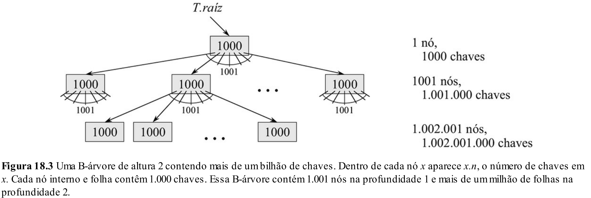
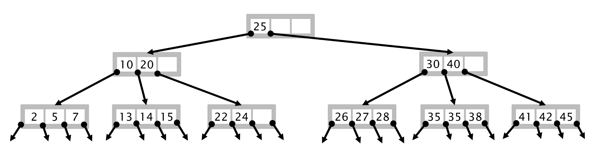
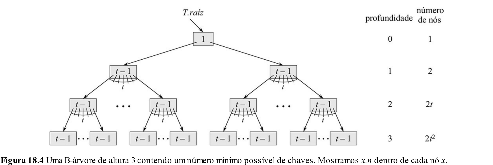
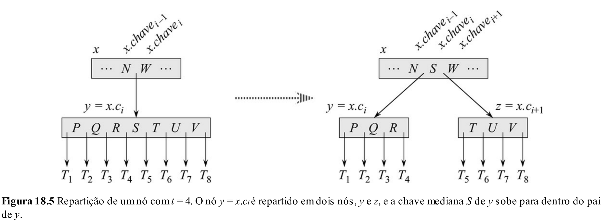
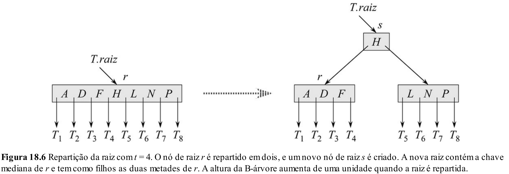
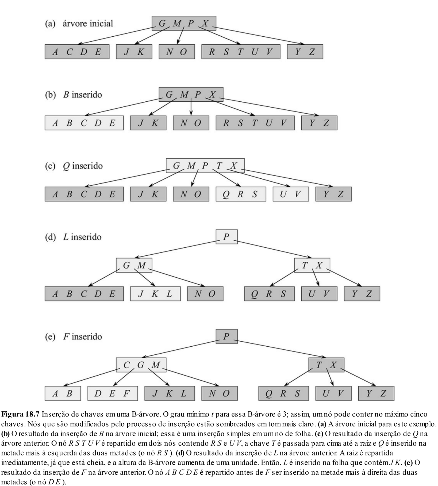
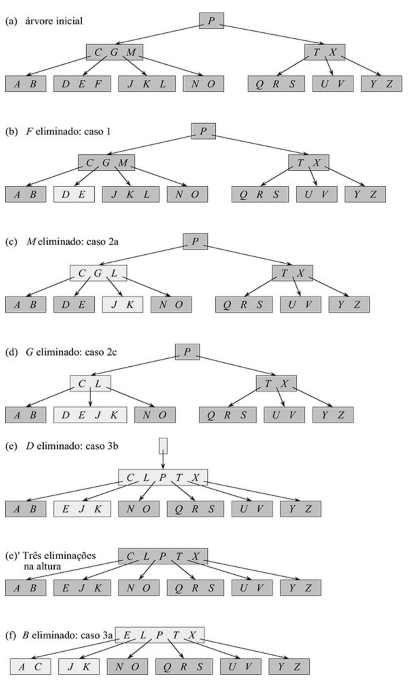

# Aula 26: Árvore B

## 1. Introdução

### 1.1 Quanto de memória precisamos?

Vamos fazer um pequeno exercício mental: **quanto espaço de memória RAM é necessário para armazenar uma árvore?**

Até agora, temos usado uma representação clássica de nó de árvore mais ou menos assim:

```cpp
struct Node {
    int key;       // 4 bytes: chave usada na ordenação
    Record* value; // 8 bytes: ponteiro para o dado armazenado
    Node* left;    // 8 bytes: ponteiro para o filho à esquerda
    Node* right;   // 8 bytes: ponteiro para o filho à direita
    Node* parent;  // 8 bytes: ponteiro para o pai
    int height;    // 4 bytes: altura da subárvore
};
```

Ou seja, estamos usando cerca de **40 bytes por nó**.

Isso parece pouco à primeira vista…  
Mas e se tivermos **1 milhão de nós**?

> `10⁶ × 40 bytes = 40 MB`

Ainda parece razoável, certo?

Mas com **10 milhões de nós**, já estaríamos gastando cerca de **400 MB**, o que começa a chamar atenção.

E essa memória toda é para armazenar **uma única árvore**, que geralmente representa **um único índice** - por exemplo, o índice de uma tabela em um banco de dados.

Agora pense: **quantas tabelas e índices existem em um sistema real?**  
Em aplicações profissionais, é comum termos **centenas de tabelas** e **múltiplos índices por tabela**.

Nem todas terão milhões de registros, mas várias terão.
Estamos falando de dados de usuários, produtos, compras, atendimentos, localizações… e por aí vai.

Ou seja, **é fácil consumir dezenas de gigabytes apenas para armazenar índices!**  
E isso sem contar os próprios dados.

### 1.2 Memória primária vs memória secundária

O que isso tudo significa?

Significa que **não é viável armazenar todos os dados e todos os índices de um sistema em memória RAM**.  
Sistemas de larga escala precisam lidar com **dados armazenados tanto na memória principal (RAM) quanto na secundária (disco/SSD)**.

#### Eficiência

Hoje, é comum encontrarmos computadores com **8 a 64 GB de RAM**, e discos rígidos ou SSDs com **512 GB a 4 TB**. Ou seja, **espaço em disco não é o problema**.

O verdadeiro gargalo está em outro lugar: **a velocidade de acesso**.

| Tipo         | Tempo de acesso (aproximado)  | Comparação com RAM           |
|--------------|-------------------------------|-------------------------------|
| RAM          | 50 ns                         | **1x**                        |
| SSD (NVMe)   | 50 μs                         | **~1.000x mais lento**        |
| SSD (SATA)   | 250 μs                        | **~5.000x mais lento**        |
| HDD          | 10 ms                         | **~200.000x mais lento**      |

A diferença é **brutal**.

### 1.3 Conclusão

O que aprendemos com isso?

Que o problema de eficiência em estruturas de dados **não é apenas computacional**, mas também **estrutural e físico**:

> **Precisamos de algoritmos e estruturas que minimizem os acessos à memória secundária.**

De nada adianta termos algoritmos com boa complexidade teórica se eles exigem muitos acessos a disco - isso anula completamente os ganhos em desempenho.

É aí que entram as **árvores B**: estruturas projetadas **especificamente para reduzir o número de acessos a disco**, ao mesmo tempo em que mantêm os dados ordenados e rapidamente acessíveis.

## 2. Árvore B

### 2.1 Motivação

É nesse contexto — de limitações de acesso à memória secundária — que surgem as **árvores B** (*B-trees*), uma estrutura de dados **projetada para minimizar o número de acessos a disco** durante operações de busca, inserção e remoção.

A ideia principal é simples:  
> **Se acessar o disco é lento, vamos acessar o disco o mínimo possível.**

Para isso, as árvores B:

- **Deixam de ser binárias** (cada nó com no máximo dois filhos),
- E se tornam **árvores $n$-árias**, onde o número de filhos por nó (o grau) é **definido com base no tamanho de uma página de disco**.

Quanto mais chaves pudermos armazenar em um único nó, **mais dados conseguimos ler de uma só vez** do disco — e com isso, **menos nós da árvore precisamos acessar.**

### 2.2 O que é uma página?

Como vimos anteriormente, **acessar o disco é muito mais lento** do que acessar a memória RAM. Para reduzir o número de acessos, sistemas operacionais e discos rígidos adotam uma estratégia chamada **leitura em bloco**.

Em vez de buscar um único valor, o sistema lê um **bloco contíguo de dados** de uma vez só — mesmo que apenas parte dele seja imediatamente necessário.

Esse bloco é chamado de **página** (ou setor), e seu tamanho típico varia entre **2 KB e 16 KB**.

A ideia da árvore B é **encaixar um nó inteiro dentro de uma única página**. Assim, **cada acesso à árvore equivale a um único acesso ao disco**.

Exemplo:

- Suponha que uma página tenha 4 KB (4096 bytes),
- E cada chave ocupe cerca de 16 bytes (chave + ponteiro),
- Então conseguimos armazenar cerca de **255 chaves por nó**,
- Com isso, **cada nó pode ter até 256 filhos**.

Ou seja: em vez de ter que descer muitos níveis em uma árvore binária, conseguimos **reduzir drasticamente a altura da árvore**, o que é fundamental para o desempenho em disco.

> **Menos altura = menos acessos ao disco.**



### 2.3 Representação de um nó

Em termos gerais, um nó de árvore B contém:

```cpp
struct Node {
    int numKeys;     // Número `n` de chaves
    int* keys;       // Vetor de `n` chaves ordenadas
    Node* children;  // Vetor de `n+1` ponteiros para subárvores (caso não seja folha)
    Node* parent;    // Um ponteiro para o nó pai (opcional, depende da implementação),
    bool isLeaf;     // Indicador booleano para saber se o nó é folha.
}
```

### 2.4 Definição e Propriedades

Uma **árvore B de ordem $t$** (ou grau mínimo $t$) é uma árvore enraizada que obedece às seguintes propriedades:

1. **Cada nó $x$ possui os seguintes atributos:**
   - `x.numKeys`: número de chaves armazenadas,
   - `x.keys[0..x.numKeys - 1]`: vetor de chaves, armazenadas em ordem crescente,
   - `x.isLeaf`: booleano que indica se o nó é uma folha.

2. **Se $x$ não é folha, então ele possui $x.numKeys + 1$ ponteiros para os filhos:**
   - `x.children[0], x.children[1], ..., x.children[x.numKeys]`
   - Os ponteiros separam as faixas de chaves:
     $$\text{Se } k \text{ está na subárvore } x.children[i], \text{ então } x.keys[i - 1] < k \le x.keys[i]$$

3. **Todas as folhas estão no mesmo nível**, ou seja, a árvore é perfeitamente balanceada.

4. **Limites de chaves por nó:**
   - Cada nó (exceto a raiz) deve conter pelo menos **$t - 1$ chaves**,
   - E no máximo **$2t - 1$ chaves**,
   - A raiz pode ter **entre 1 e $2t - 1$ chaves** (ou até 0 se a árvore estiver vazia).

5. **Número de filhos:**
   - Um nó com $n$ chaves possui **$n + 1$ filhos**,
   - Portanto, um nó pode ter entre $t$ e $2t$ filhos (exceto a raiz).

> **Observação:** Quando $t = 2$, temos uma **árvore 2-3-4**, com nós de 2, 3 ou 4 filhos.

Na prática, porém, usamos valores muito maiores para $t$ — por exemplo, $t = 128$ — para aproveitar melhor as páginas de disco e manter a altura da árvore pequena.



### 2.5 Altura de uma árvore B

Quanto maior o valor de $t$, **mais "largos" os nós** — ou seja, mais chaves e mais filhos por nó — e, consequentemente, **menor a altura da árvore**.

A altura da árvore B, no pior caso, é proporcional a:

$$
h = O(\log_t n)
$$

Ou seja, a altura cresce de forma **logarítmica em relação ao número total de chaves $n$**, com base $t$ — o grau mínimo da árvore.

#### Por que isso acontece?

Vamos considerar o pior caso:  
A árvore está o mais cheia possível em termos de altura, mas cada nó tem **o número mínimo de chaves**, ou seja, $t - 1$.

Nesse cenário:

- Cada **nó interno** tem **no mínimo $t$ filhos**,
- A raiz pode ter entre **1 e $2t - 1$ chaves**, mas assumimos que ela também tem no mínimo dois filhos para uma árvore não trivial,
- O número total de chaves armazenadas cresce **exponencialmente com a altura** da árvore.

No pior caso, o número máximo de chaves armazenadas em uma árvore de altura $h$ (com raiz não folha) é:

$$
n \le 2t^h - 1
$$

Isolando $h$:

$$
h \ge \log_t \left( \frac{n + 1}{2} \right)
$$

Ou seja:

$$
h = O(\log_t n)
$$



#### O que isso significa na prática?

Se usarmos, por exemplo, uma árvore B com grau mínimo $t = 100$, podemos armazenar mais de **um milhão de chaves** com **apenas 3 ou 4 níveis** de altura.

Isso é extremamente vantajoso quando cada nível da árvore representa **um acesso ao disco** — pois conseguimos **localizar qualquer chave com apenas 3 ou 4 acessos**, mesmo em volumes de dados imensos.

> Resumindo: **a árvore cresce muito lentamente em altura, o que a torna ideal para armazenar grandes quantidades de dados em memória secundária**.

### 3. Operações

Assim como em outras estruturas de dados, nosso foco nas árvores B será entender como executar as operações fundamentais de:

- **Busca**  
- **Inserção**  
- **Remoção**  

Nosso objetivo é garantir que **todas as propriedades estruturais da árvore B** (como altura balanceada, número mínimo/máximo de chaves por nó, e profundidade uniforme das folhas) **sejam sempre preservadas** após cada modificação.

#### Um enfoque mais conceitual

Ao contrário de estruturas anteriores — como listas encadeadas, árvores binárias ou AVL — a **implementação prática das operações em árvores B** é **bastante complexa**. Envolve detalhes como:

- Alocação e manipulação de vetores dinâmicos de chaves e ponteiros;
- Divisão e fusão de nós;
- Realocação de ponteiros entre nós pais e filhos;
- Controle de casos especiais envolvendo a raiz.

Por esse motivo, **não iremos implementar essas operações em C nesta disciplina**. Em vez disso, vamos **focar na lógica e nos algoritmos em alto nível**, por meio de:

- **Exemplos passo a passo** de cada operação;
- **Representações visuais** das transformações na árvore;
- **Pseudocódigos didáticos**, que ajudam a entender o funcionamento das operações sem se perder em detalhes de linguagem.

> O mais importante aqui é entender como **a estrutura se adapta dinamicamente** para manter suas propriedades — e não memorizar regras específicas.

## 3. Busca

A **busca** é a mais simples das operações em uma árvore B — e funciona de maneira muito parecida com a busca em uma árvore binária de busca (BST), mas com generalização para múltiplas chaves por nó.

### 3.1 Pseudo-código

1. Em cada nó `x`, percorremos as chaves ordenadas para encontrar a posição em que a chave `k` **deveria estar**:
   - Se encontrarmos a chave, retornamos imediatamente.
   - Se não encontrarmos e `x` for uma **folha**, a chave **não está** na árvore.
   - Se `x` **não for folha**, seguimos para o filho correspondente `x.children[i]`.

2. Esse processo se repete recursivamente, **descendo na árvore** até encontrar a chave ou atingir uma folha.

### 3.2 Complexidade

Cada nó pode conter até `2t - 1` chaves. Então, no pior caso, percorremos **O(t)** chaves em cada nível da árvore.

Como a **altura** da árvore é `O(log_t n)`, a complexidade da busca é:

$$
O(t \cdot \log_t n)
$$

Ou, em termos mais intuitivos:  
- **Mais chaves por nó** (maior `t`) significa **menos altura**, mas **mais trabalho dentro de cada nó**.
- A escolha do `t` ideal depende do custo de acesso ao disco e do tamanho das páginas (como vimos na seção 2).

## 4. Inserção

A operação de **inserção** em uma B-árvore segue uma lógica bastante natural: navegamos pela árvore, como na busca, até encontrarmos a folha onde a nova chave deve ser inserida.

### 4.1 Caso simples

Se a folha ainda possui **menos de 2t - 1 chaves**, simplesmente inserimos a nova chave no local correto (preservando a ordenação) e terminamos.

### 4.2 Caso complexo — nó cheio

Se a folha já contém **exatamente 2t - 1 chaves**, ela está **cheia**, e não podemos simplesmente inserir uma nova chave ali.

Nesse caso, fazemos o seguinte:

1. **Dividimos o nó cheio em dois nós**:
   - As chaves **menores que a mediana** vão para um novo nó à esquerda.
   - As chaves **maiores que a mediana** vão para um novo nó à direita.
2. A **chave mediana** é **movida para o nó pai**.
3. Os ponteiros filhos também são redistribuídos entre os dois novos nós.
4. Se o **nó pai também estiver cheio**, a divisão se propaga recursivamente até a raiz.
5. Se a **raiz for dividida**, criamos uma **nova raiz**.



### 4.3 Melhor abordagem: split antes de descer

Para evitar a propagação de divisões **depois** da inserção, o algoritmo eficiente faz o seguinte:

> **Antes de descer para um filho**, verificamos se ele está cheio.  
> Se estiver, **dividimos esse nó antecipadamente**.  
> Isso garante que, quando chegarmos à folha, haverá espaço para a nova chave.



### 4.4 Algoritmo de inserção

Para inserir uma chave em uma árvore B, seguimos dois princípios básicos:

1. **Nunca descemos para um nó cheio** — se um nó cheio for encontrado no caminho, ele é dividido antes de descer;
2. A inserção final ocorre em uma **folha com espaço livre**, o que garante que o processo é sempre seguro.

A ideia central é que, antes de tentar inserir uma chave em um nó, garantimos que ele tem espaço.

### 4.5 Exemplo visual



### 4.6 Complexidade da inserção

A complexidade da operação de inserção em uma árvore B depende de dois fatores principais:

- A **altura da árvore**, que é $O(\log_t n)$ como vimos anteriormente;
- O **custo de dividir nós cheios**, que é constante por nível.

Como cada divisão ocorre no caminho da raiz até uma folha e há, no máximo, uma divisão por nível, o custo total da inserção é:

$$
O(t \cdot \log_t n)
$$

Aqui, o fator $t$ vem da inserção ordenada no vetor de chaves de um nó, que tem tamanho no máximo $2t - 1$.

Na prática, como $t$ é um valor fixo e geralmente grande (como 50, 100, 200...), a inserção é bastante eficiente, e a profundidade pequena da árvore minimiza os acessos a disco.

## 5. Remoção

A remoção de uma chave em uma árvore B é mais complexa que em outras estruturas, pois precisamos garantir que **todas as propriedades da árvore B** continuem válidas após a operação. Em especial, precisamos assegurar que **todos os nós (exceto a raiz)** permaneçam com **pelo menos $t - 1$ chaves**.

A operação de remoção pode ser dividida em três categorias principais:

### 5.1 Caso 1 — Remoção simples (folha)

Se a chave $k$ está presente em um nó $x$, **e $x$ é uma folha**, então basta remover $k$ diretamente.

- Esse é o caso mais direto e não exige nenhuma modificação estrutural.

### 5.2 Caso 2 — Remoção em nó interno

Se a chave $k$ está presente em um **nó interno**, não podemos simplesmente removê-la.
Precisamos substituí-la por uma chave válida que mantenha a ordem da árvore.

Existem duas opções:

- **Caso 2.A — Substituição pela predecessora**: Substituímos $k$ pela **maior chave** da subárvore à esquerda.
- **Caso 2.B — Substituição pela sucessora**: Substituímos $k$ pela **menor chave** da subárvore à direita.

Depois disso, removemos essa chave (predecessora ou sucessora) **recursivamente**, o que nos leva de volta ao caso de remoção em folha.

### 5.3 Caso 3 — Conserto após remoção

Se, durante a remoção, **um nó folha ficar com menos de $t - 1$ chaves**, precisamos **reorganizar a árvore** para restaurar as propriedades da B-árvore. Há dois subcasos possíveis:

- **Caso 3.A — Redistribuição (empréstimo de um irmão):**  
  Se o nó tem um irmão adjacente com pelo menos $t$ chaves, fazemos uma **rotação**:
  - Movemos uma chave do irmão adjacente para o pai.
  - Movemos a chave do pai para o nó deficiente.
  - Assim, o nó volta a ter pelo menos $t - 1$ chaves, e a estrutura se mantém equilibrada.

- **Caso 3.B — Concatenação com irmão:**  
  Se **nenhum irmão adjacente tem chaves de sobra**, então precisamos **concatenar**:
  - Juntamos o nó deficiente com um de seus irmãos adjacentes e a chave do pai que os separava.
  - Isso forma um único nó com até $2t - 1$ chaves.
  - O pai perde uma chave, o que pode recursivamente gerar a necessidade de fusão ou redistribuição em níveis superiores — inclusive podendo reduzir a altura da árvore.

> No *Cormen*, esse caso é chamado de **Caso 2.C**, mas conceitualmente é uma fusão, como descrito aqui.

#### Observação

É importante destacar que uma abordagem eficiente **não espera o nó ficar deficiente** para só então corrigir a estrutura.
Em vez disso, garantimos, já durante a descida pela árvore, que todos os nós visitados **tenham ao menos $t$ chaves antes de continuarmos**.
Isso assegura que, ao chegar no nó onde a remoção ocorrerá, ele já estará em uma condição segura, e **não será necessário subir recursivamente para fazer reparos**.
Ou seja, ao descer pela árvore, sempre que encontrarmos um nó com $t - 1$ chaves, aplicamos imediatamente os casos 3.A ou 3.B, se necessário.

### 5.4 Exemplo visual

