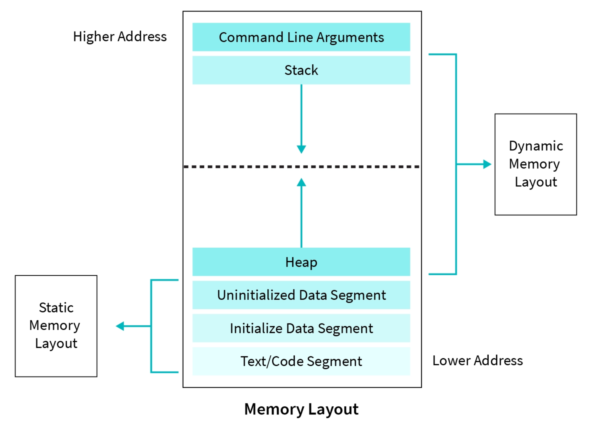

# Aula 5: Alocação Dinâmica e Structs em C++

## 1. Structs

### 1.1 Definição e Uso
Em C++, uma `struct` (estrutura) é um tipo de dado que permite agrupar variáveis de diferentes tipos. Exemplo:

```cpp
#include <iostream>
using namespace std;

struct Pessoa {
    string nome;
    int idade;

    void exibir() {
        cout << "Nome: " << nome << ", Idade: " << idade << endl;
    }
};

int main() {
    Pessoa p = {"Carlos", 25};
    p.exibir();
    return 0;
}
```

### 1.2 Structs vs. Classes
A diferença principal entre `struct` e `class` em C++ está no padrão de visibilidade:
- `struct`: Público por padrão
- `class`: Privado por padrão

Embora `structs` sejam geralmente usadas apenas para agrupar dados, elas podem conter métodos, construtores e até mesmo herança, assim como classes.

### 1.3 Structs Dentro de Structs e Ponteiros Dentro de Structs
Podemos definir structs que contêm outras structs ou ponteiros para structs:

```cpp
struct Data {
    int dia, mes, ano;
};

struct Evento {
    string descricao;
    Data data;
};

struct Pessoa {
    string nome;
    int idade;
    Pessoa* amigo; // Ponteiro para outra struct Pessoa
};
```
---

## 2. Enums

Enums são usados para representar um conjunto de valores nomeados, tornando o código mais legível.

```cpp
enum DiaDaSemana {
    Domingo,
    Segunda,
    Terca,
    Quarta,
    Quinta,
    Sexta,
    Sabado
};

int main() {
    DiaDaSemana hoje = Segunda;
    if (hoje == Segunda) {
        cout << "Hoje é segunda-feira!" << endl;
    }
    return 0;
}
```

Enums também permitem você alterar o valor associado a cada `nome`:

```cpp
enum Level {
    LOW    = 25,
    MEDIUM = 50,
    HIGH   = 75
}; 
  
int main() {
    int lv = 15;
    if (lv <= LOW) {
        std::cout << "Beginner level" << std::endl;
    } else if (LOW < lv && lv <= MEDIUM) {
        std::cout << "Low level" << std::endl;
    } else if (MEDIUM < lv && lv <= HIGH) {
        std::cout << "Medium level" << std::endl;
    } else if (HIGH < lv) {
        std::cout << "High level" << std::endl;
    }
    return 0;
}
```

---

## 3. Memória Dinâmica

### 3.1 Por Que Usar `new` e `delete`?
A memória automática (stack) tem limitações de tamanho e dura apenas durante a execução da função.
Com `new`, podemos alocar memória no heap, permitindo persistência além do escopo da função.

### 3.2 Como C++ Estrutura a Memória
A memória de um programa C++ é dividida em:
- **Stack**: Armazena variáveis locais e chamadas de funções
- **Heap**: Armazena objetos alocados dinamicamente
- **Data segment**: Armazena variáveis globais e estáticas
- **Code segment**: Contém o código do programa



### 3.3 `new` e `delete`
Usamos `new` para alocar memória dinamicamente e `delete` para liberar:

```cpp
int* p = new int(5);
cout << *p << endl; // 5
delete p;
```

#### Caso com Struct

```cpp
Pessoa* ptr = new Pessoa{"Ana", 30, nullptr};
cout << "Nome: " << ptr->nome << ", Idade: " << ptr->idade << endl;
delete ptr;
```

Também podemos alocar arrays dinamicamente:

```cpp
Pessoa* grupo = new Pessoa[3]{{"João", 20}, {"Maria", 22}, {"Carlos", 25}};
for (int i = 0; i < 3; i++) {
    cout << grupo[i].nome << " tem " << grupo[i].idade << " anos." << endl;
}
delete[] grupo;
```

### 3.4 Alocação Dinâmica de Arrays

```cpp
int* v = new int[10];
for (int i = 0; i < 10; i++) {
    v[i] = i * 2;
}
delete[] v;
```

### 3.5 Alocação Dinâmica de Structs
Se quisermos criar structs dinamicamente e evitar vazamentos de memória, devemos gerenciar corretamente a alocação e liberação de memória:

```cpp
struct Livro {
    string titulo;
    int paginas;
};

Livro* criarLivro(string titulo, int paginas) {
    Livro* novoLivro = new Livro;
    novoLivro->titulo = titulo;
    novoLivro->paginas = paginas;
    return novoLivro;
}

int main() {
    Livro* meuLivro = criarLivro("C++ Essencial", 300);
    cout << "Livro: " << meuLivro->titulo << ", Páginas: " << meuLivro->paginas << endl;
    delete meuLivro; // Importante para evitar vazamento de memória
    return 0;
}
```

### 3.6 Erros Comuns e Exemplos

- **Vazamento de memória**: 
  ```cpp
  int* p = new int(10);
  // Esqueci de chamar delete p;
  ```

- **Acesso a `nullptr`**:
  ```cpp
  int* p = nullptr;
  cout << *p; // Erro de segmentação
  ```

- **Uso de memória após `delete`**:
  ```cpp
  int* p = new int(5);
  delete p;
  cout << *p; // Comportamento indefinido
  ```

### 3.7 `malloc` e `free`
Em C, `malloc` e `free` são usados para alocação dinâmica:

```cpp
Pessoa* p = (Pessoa*) malloc(sizeof(Pessoa));
if(p == nullptr) {
    cout << "Não foi possível alocar o espaço de memória para a variável do tipo Pessoa" << endl;
    exit(1);
}
p->nome = "Joao";
p->idade = 40;
free(p);
```

Em C++, prefira `new` e `delete` pois eles chamam construtores e destrutores automaticamente.

### 3.8 Smart Pointers
Embora `new` e `delete` sejam úteis (e os ultilizaremos nas aulas), eles podem levar a vazamentos de memória na prática.
Em C++, é recomendado o uso de smart pointers como `std::unique_ptr` e `std::shared_ptr`.
A ideia dessas classes é controlar o número de referências (variáveis) apontando para a memória alocada.
Quando esse número chega a zero, o próprio smart pointer libera a memória de forma segura.

```cpp
#include <memory>

std::unique_ptr<Pessoa> p = std::make_unique<Pessoa>("Ana", 30);
cout << "Nome: " << p->nome << endl;
```

---

## 4. Voltando aos Ponteiros: Retornando Múltiplos Valores

### Opção 1: Retornar o Array e o Tamanho Separadamente

```cpp
int* criarArray(int tamanho, int& ref_tamanho) {
    ref_tamanho = tamanho;
    return new int[tamanho];
}
```

### Opção 2: Passar Ponteiros por Referência

```cpp
void criarArray(int tamanho, int** array_ptr, int* tamanho_ptr) {
    *tamanho_ptr = tamanho;
    *array_ptr = new int[tamanho];
}
```

### Uso no `main`

```cpp
int main() {
    int tamanho;
    int* array1 = criarArray(10, tamanho);
    delete[] array1;

    int* array2;
    criarArray(10, &array2, &tamanho);
    delete[] array2;

    return 0;
}
```

## 5. Exercícios

1. **Criando uma Struct Dinâmica**
   - Crie uma struct chamada `Aluno` com os atributos `nome` e `nota`.
   - Aloque dinamicamente um objeto dessa struct e preencha os valores.
   - Exiba os valores e libere a memória corretamente.

2. **Manipulando Arrays Dinâmicos**
   - Crie uma função que receba um número `n` e retorne um array dinâmico preenchido com os números de `1` a `n`.
   - Libere a memória corretamente no `main`.

3. **Enum e Structs**
   - Crie um enum chamado `Cargo` com valores `Estagiario`, `Junior`, `Pleno` e `Senior`.
   - Defina uma struct `Funcionario` que contenha um nome e um cargo.
   - Crie um vetor dinâmico para armazenar `n` funcionários e exiba os valores.