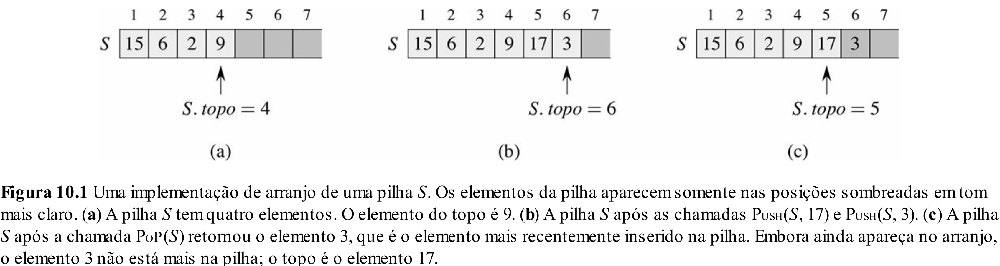

# Aula 9: Tipos Abstratos de Dados (TAD)

## 1. O que são TADs?

Até agora, na linguagem C, manipulamos apenas tipos de dados simples (inteiros, pontos flutuantes, caracteres, booleanos), os quais chamamos de "primitivos" por possuírem representações diretas em memória.
No entanto, quando estudamos Python, nos deparamos com diversos outros tipos de dados mais complexos, como listas, tuplas, conjuntos e dicionários (ou mapas), correto?

Esses tipos mais complexos são o que chamamos de "Tipos Abstratos de Dados" (TADs), estruturas de dados nas quais nos interessamos mais pelas funcionalidades do que por sua implementação interna.

### 1.1 Exemplo

Por exemplo, um conjunto em Python (e em outras linguagens) é um tipo de dado que simula o comportamento de um conjunto da Teoria dos Conjuntos.
Ou seja, uma variável desse tipo é formada por elementos únicos, e temos disponíveis funcionalidades relevantes, como verificação de pertencimento, união, interseção, entre outras.

```python
a = {1, 2, 3}
b = {3, 4, 4}
print(a.union(b)) # {1, 2, 3, 4}
```

Outro exemplo é a tupla: um tipo de dado que armazena uma sequência de elementos apenas para leitura, não sendo permitido modificar os elementos armazenados.

```python
t = tuple([1, 2, 3])
t[0] = 1 # TypeError: 'tuple' object does not support item assignment
```

Essas duas estruturas possuem dois aspectos principais em comum:
1. Estamos interessados nas funcionalidades e regras de uso fornecidas pela estrutura;
2. Não nos preocupamos com a forma exata como os dados são armazenados e manipulados internamente.

### 1.2 Abstração vs. Implementação

Embora TADs sejam definidos em termos de suas funcionalidades, no contexto de um curso de Estruturas de Dados, nosso foco também está em como eles são implementados.
O desenvolvedor que utiliza um conjunto em Python, por exemplo, não precisa saber que ele pode ser implementado internamente como uma tabela de dispersão (hash table).
No entanto, ao projetar e implementar nossos próprios TADs, precisamos considerar **qual estrutura utilizar para representar os dados e garantir que as operações sejam eficientes**.

Portanto, é essencial diferenciar **a especificação** do TAD (isto é, quais operações ele deve suportar) de sua **implementação concreta** (como essas operações são realizadas internamente).

### 1.3 Definição formal

Um Tipo Abstrato de Dados (TAD) é um modelo conceitual de uma estrutura de dados que define um conjunto de operações sem especificar como elas são implementadas.
Diferente dos tipos primitivos, que possuem uma representação direta na memória, um TAD é definido em termos de **comportamento** e **operações permitidas**, sem impor detalhes sobre sua implementação.

Na prática, para criar um TAD, utilizamos estruturas de dados concretas, como arrays e ponteiros, e definimos funções que respeitam a interface do TAD.

### 1.4 A Importância dos TADs e Principais Operações

Durante o curso, estudaremos diversos TADs clássicos, como Pilhas, Filas, Listas e Árvores (em suas diferentes variações).
No entanto, existem inúmeras variações e especializações dessas estruturas, muitas vezes criadas para atender requisitos específicos de desempenho e funcionalidades.

Por exemplo, podemos modificar uma Fila convencional para implementar uma Fila de Prioridade, que permite acessar rapidamente o elemento de maior prioridade. 
Embora a ideia geral da fila permaneça, sua implementação pode ser completamente diferente para otimizar determinadas operações.

Independente do TAD, as três operações fundamentais que sempre consideramos durante as aulas são:
1. **Inserir** elementos na estrutura;
2. **Remover** elementos da estrutura;
3. **Buscar** elementos dentro da estrutura.

Essas operações podem ter diferentes restrições e eficiências dependendo da estrutura de dados utilizada para implementá-las.

Além dessas operações de maior interesse, outras funções auxiliares poderão ser implementadas, como **inicialização**, **verificar se está vazio**, **obter dados**, **encontrar máximo / mínimo**, entre outras.

Nos próximos tópicos, estudaremos em detalhes Pilhas e Filas, vendo como suas operações podem ser implementadas na linguagem C / C++.

## 2. Pilhas

### 2.1 O que é?

Uma **pilha** é uma estrutura de dados que segue a política **LIFO** (*Last In, First Out*), ou seja, o último elemento inserido é o primeiro a ser removido. Podemos imaginar uma pilha de pratos: o prato mais recente colocado no topo será o primeiro a ser retirado.

### 2.2 Casos de uso

Pilhas são utilizadas em diversos contextos, como:
- **Controle de chamadas de funções** (pilha de execução do sistema operacional);
- **Desfazer/refazer ações** em editores de texto e backtracking;
- **Avaliação de expressões matemáticas (sintaxe de uma linguagem de programação)**;
- **Percursos em grafos** (como busca em profundidade, DFS).

### 2.3 Implementação com arrays

A pilha pode ser implementada com um array e um ponteiro indicando o topo.



#### Inicializar

Criamos um array de tamanho fixo e uma variável `top` que inicia em -1 para indicar que a pilha está vazia.

```cpp
typedef struct {
    int * data;
    int maxSize;
    int top;
} Stack;

Stack* initialization(int maxSize) {
    Stack * s = new Stack();
    s->data = new int[maxSize];
    s->maxSize = maxSize;
    s->top = -1;
    return s;
}

void destroy(Stack* s) {
    delete[] s->data;
    delete s;
}
```

#### Inserir (Push)

Para inserir um elemento, verificamos se a pilha está cheia e, se não estiver, incrementamos `topo` e armazenamos o novo valor.

```cpp
int push(Stack *s, int value) {
    if (s->top == s->maxSize - 1) {
        return 0; // Full stack
    }
    s->top += 1;
    s->data[s->data] = value;
    return 1;
}
```

#### Remover (Pop)

Para remover um elemento, verificamos se a pilha está vazia e, caso contrário, retornamos o elemento do topo e decrementamos `topo`.

```cpp
int pop(Stack *s, int *value) {
    if (s->top == -1) {
        return 0; // Empty stack
    }
    s->top -= 1;
    *value = s->data[s->data + 1];
    return 1;
}
```

#### Buscar (Topo)

Retorna o elemento do topo sem removê-lo.

```cpp
int peek(const Stack *s, int *value) {
    if (s->top == -1) {
        return 0; // Empty stack
    }
    *value = s->data[s->top];
    return 1;
}
```

---

## 3. Filas

### 3.1 O que é?

Uma **fila** é uma estrutura de dados que segue a política **FIFO** (*First In, First Out*), ou seja, o primeiro elemento inserido é o primeiro a ser removido. Podemos imaginar uma fila de atendimento bancário: o primeiro cliente a chegar será o primeiro a ser atendido.

### 3.2 Casos de uso

Filas são utilizadas em:
- **Processamento de eventos** (ordem de chegada);
- **Assistir mais tarde** (Youtube);
- **Percursos em grafos** (como busca em largura, BFS).

### 3.3 Implementação com arrays

A fila pode ser implementada com um array e variáveis `head` (frente) e `tail` (tras) indicando onde estão os elementos.

#### Inicializar

```cpp
typedef struct {
    int* data;
    int maxSize;
    int size;
} Queue;

Queue * initialization(int maxSize) {
    Queue * q = new Queue();
    q->data = new int[maxSize];
    q->maxSize = maxSize;
    q->size = 0;
    return q;
}

void destroy(Queue* q) {
    delete[] q->data;
    delete q;
}
```

#### Inserir (Enqueue)

```cpp
int enqueue(Queue *q, int value) {
    if (q->size == q->maxSize) {
        return 0; // Fila cheia
    }
    q->data[q->size] = value;
    q->size += 1;
    return 1;
}
```

#### Remover (Dequeue)

```cpp
int dequeue(Queue *q, int *value) {
    if (q->size == 0) {
        return 0; // Fila vazia
    }

    *value = q->data[0];
    for (int i = 1; i < q->size; i++) {
        q->data[i - 1] = q->data[i];
    }
    q->size -= 1;
    return 1;
}
```

#### Buscar (Primeiro elemento)

```cpp
int peek(const Queue *q, int *value) {
    int peek(const Queue *q, int *value) {
    if (q->size == 0) {
        return 0; // Fila vazia
    }
    *value = q->data[0];
    return 1;
}
```

### 3.4 Implementação com lista circular

O problema da implementação com arrays é o desperdício de espaço.
Quando `frente` avança, os espaços anteriores ficam inutilizados.
Uma solução é usar uma **fila circular**.


#### Inicializar

```cpp
typedef struct {
    int *data;
    int maxSize;
    int size;
    int head;
    int tail;
} CircularQueue;

CircularQueue * initialization(int maxSize) {
    CircularQueue * q = new CircularQueue();
    q->data = new int[maxSize];
    q->head = 0;
    q->tail = -1;
    q->size = 0;
}
```

#### Inserir

```cpp
int enqueue(CircularQueue *q, int value) {
    if (q->size == q->maxSize) {
        return 0; // Fila cheia
    }
    q->tail = (q->tail + 1) % q->maxSize;
    q->data[q->tail] = value;
    q->size++;
    return 1;
}
```

#### Remover

```cpp
int dequeue(CircularQueue *q, int *value) {
    if (q->size == 0) {
        return 0; // Fila vazia
    }
    *value = q->data[q->head];
    q->head = (q->head + 1) % q->maxSize;
    q->size--;
    return 1;
}
```

#### Buscar

```cpp
int peek(CircularQueue *q, int *value) {
    if (q->size == 0) {
        return 0; // Fila vazia
    }
    *value = q->data[q->head];
    return 1;
}
```

---

## 4. Comparação

As estruturas de **Pilha**, **Fila com Array** e **Fila com Array Circular** têm diferentes comportamentos em termos de tempo de execução para suas operações principais: inserção, remoção e acesso ao primeiro elemento.
A **Pilha** segue o princípio LIFO (Last In, First Out), enquanto as **filas** seguem o princípio FIFO (First In, First Out).
A Fila com **Array Circular** oferece uma otimização significativa ao evitar o deslocamento de elementos, o que melhora a eficiência em comparação à Fila com Array tradicional.

| **Operação**   | **Pilha** | **Fila com Array**  | **Fila com Array Circular** |
|----------------|-----------|---------------------|-----------------------------|
| **Insert**     | O(1)      | O(1)                | O(1)                        |
| **Remove**     | O(1)      | O(n)                | O(1)                        |
| **Peek**       | O(1)      | O(1)                | O(1)                        |


### Possíveis limitações

* **Arrays Estáticos**: Todas as estruturas vistas até agora foram implementadas com arrays estáticos, o que pode resultar em:
    - **Superdimensionamento**: Uso excessivo de memória, alocando mais do que o necessário.
    - **Subdimensionamento**: Uso insuficiente de memória, necessitando de realocação dinâmica.
* **Lista Circular**: Embora seja uma boa solução, a lista circular adiciona complexidade devido à necessidade de gerenciar o fim do array corretamente.

Na próxima aula, abordaremos Listas Ligadas, uma estrutura alternativa ao array que busca resolver esses problemas de uso ineficiente de memória.
