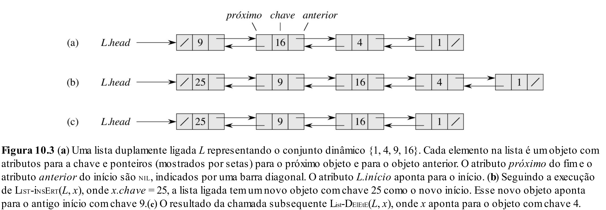

# Aula 11: Listas Encadeadas

## 1. Introdução

Até agora, em nossas TADs, sempre utilizamos um array para armazenar os dados.
A grande vantagem dessa escolha é que os dados estão organizados em sequência, facilitando o acesso a múltiplos elementos consecutivamente.

A desvantagem, no entanto, é que precisamos saber de antemão o tamanho máximo do array, o que é difícil em muitas situações.
Além disso, essa estimativa pode frequentemente estar incorreta, levando à reserva de espaço de memória que nunca será utilizado.

Já implementamos uma melhoria para o primeiro problema ao criarmos um array dinâmico cujo tamanho muda de acordo com o número de elementos inseridos e removidos.
O problema é que isso ainda não resolve completamente a questão, pois não há garantia de que será necessário todo esse espaço adicional.

Devido a essa limitação, uma nova estrutura de dados alternativa chamada **Lista Encadeada** foi criada, cujo objetivo é permitir a inserção e remoção de dados de forma eficiente.
Claro que, como veremos mais adiante, ela também apresenta suas próprias limitações.

---

## 2. Lista Encadeada Simples

Durante as aulas de C, vimos que é possível alocar qualquer estrutura de dados dinamicamente. Então, e se, em vez de alocarmos um array inteiro, alocássemos uma estrutura para armazenar apenas um elemento da lista por vez?

Ou seja, toda vez que desejássemos inserir um objeto, criaríamos um **nó** que armazena esse dado.

Dessa forma, teríamos um conjunto de nós independentes uns dos outros, o que facilita a inserção e remoção de elementos dessa estrutura.

A grande questão é: como indicar a ordem entre esses nós? Basta adicionar um ponteiro!

### 2.1 Casos de uso

1. **Implementação de Filas e Pilhas**:
Estruturas como filas e pilhas podem ser implementadas eficientemente com listas encadeadas simples, onde a inserção e remoção ocorrem em um único extremo.
2. **Tabelas Hash com Tratamento de Colisão**:
Algumas tabelas hash utilizam listas encadeadas simples para armazenar múltiplos valores que colidem na mesma posição.


### 2.2 Estrutura de Dados

```cpp
struct Node {
    int value;
    Node* next;
};

struct SingleLinkedList {
    Node* head;
    int size;
};
```

### 2.3 Operações

#### Inicialização
```cpp
SingleLinkedList* createList() {
    SingleLinkedList* list = new SingleLinkedList{nullptr, 0};
    return list;
}
```

#### Inserir no Início
```cpp
void insertFront(SingleLinkedList* list, int value) {
    Node* newNode = new Node{value, list->head};
    list->head = newNode;
    list->size++;
}
```

#### Remover do Início
```cpp
void removeFront(SingleLinkedList* list) {
    if (!list->head) {
        return;
    }

    Node* temp = list->head;
    list->head = list->head->next;
    delete temp;
    list->size--;
}
```

#### Remover do Meio
```cpp
void removeMiddle(SingleLinkedList* list, int value) {
    if (!list->head) {
        return;
    }
    
    Node* current = list->head;
    while (current->next && current->next->value != value) {
        current = current->next;
    }

    if (!current->next) {
        return;
    }

    Node* temp = current->next;
    current->next = current->next->next;
    delete temp;
    list->size--;
}
```

#### Busca
```cpp
bool search(SingleLinkedList* list, int value) {
    Node* current = list->head;
    while (current) {
        if (current->value == value) return true;
        current = current->next;
    }
    return false;
}
```

### 2.4 Lista Circular

Para torná-la circular, basta fazer o último nó apontar para o primeiro.

---

## 3. Lista Duplamente Encadeada

Uma limitação da lista encadeada simples é que ela só vê o próximo elemento, o que é problemático em situações como:
* Remoção de um nó;
* Verificação do elemento anterior.

Como resolver isso? Basta adicionar um segundo ponteiro para o nó anterior!

### 3.1 Casos de uso

1. **Editor de Texto**:
Um editor de texto pode armazenar cada linha como um nó em uma lista duplamente encadeada, permitindo edições eficientes no meio do texto.

2. **Implementação de Deques**:
Deques podem ser implementadas de forma eficiente com listas duplamente encadeadas, permitindo inserção e remoção em ambas as extremidades.

3. **Navegação em Aplicações (como Histórico de Navegação)**:
Navegadores podem utilizar listas duplamente encadeadas para permitir navegação para frente e para trás entre páginas.

### 3.2 Estrutura de Dados

```cpp
struct Node {
    int value;
    Node* next;
    Node* prev;
};

struct DoubleLinkedList {
    Node* head;
    Node* tail;
    int size;
};
```

### Operações



#### Inserir no Início

```cpp
void insertFront(DoubleLinkedList* list, int value) {
    Node* newNode = new Node{value, list->head, nullptr};
    if (list->head) {
        list->head->prev = newNode;
    }
    list->head = newNode;
    if (!list->tail) {
        list->tail = newNode;
    }
    list->size++;
}
```

#### Remover do Fim

```cpp
void removeEnd(DoubleLinkedList* list) {
    if (!list->tail) {
        return;
    }

    Node* temp = list->tail;
    list->tail = list->tail->prev;
    if (list->tail) {
        list->tail->next = nullptr;
    } else {
        list->head = nullptr;
    }
    delete temp;
    list->size--;
}
```

#### Remover do Meio
```cpp
void removeMiddle(DoubleLinkedList* list, int value) {
    if (!list->head) {
        return;
    }

    Node* current = list->head;
    while (current && current->value != value) {
        current = current->next;
    }

    if (!current) {
        return;
    }

    current->prev->next = current->next;
    if (current->next) {
        current->next->prev = current->prev;
    }

    delete current;
    list->size--;
}
```

---

## 4. Nó de Árvore

Além das listas, outra estrutura comum que utiliza nós encadeados são as **árvores**.
Um nó de árvore pode armazenar ponteiros para múltiplos filhos:

```cpp
struct TreeNode {
    int value;
    TreeNode* left;
    TreeNode* right;
    TreeNode* parent;
};
```

---

## 5. Limitações

Embora listas encadeadas sejam flexíveis e eficientes para inserção e remoção, elas possuem algumas desvantagens:

- Maior uso de memória por elemento (devido aos ponteiros adicionais);
- Dados não estão ordenados sequencialmente, o que torna a busca linear mais demorada;
- Não é possivel acessar uma posição aleatória da lista de forma eficiente;
- Se tivéssemos uma lista ordenada... será que poderíamos executar uma busca binária?

---

## 6. Listas Encadeadas vs Arrays

### Arrays

* ✅ Boa escolha quando há uma estimativa da quantidade de elementos a serem inseridos.
* ✅ Permite acesso rápido a qualquer elemento via índice.
* ❌ Inserções e remoções no meio são custosas, pois exigem deslocamento de elementos.

### Listas Encadeadas

* ✅ Boa escolha quando a quantidade de elementos pode variar significativamente.
* ✅ Inserções e remoções são eficientes, pois não exigem deslocamento de elementos.
* ❌ Acesso a elementos individuais é mais lento, pois requer percorrer a lista.

