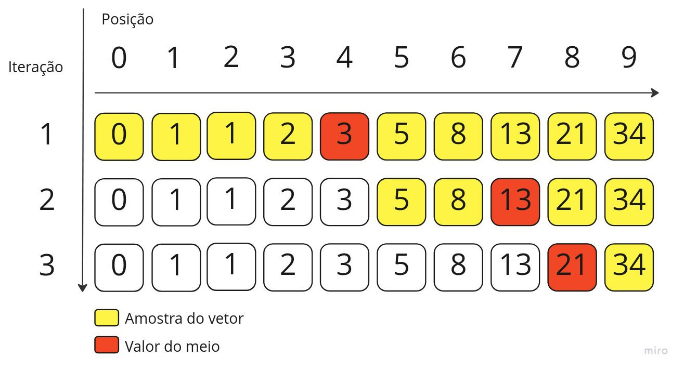
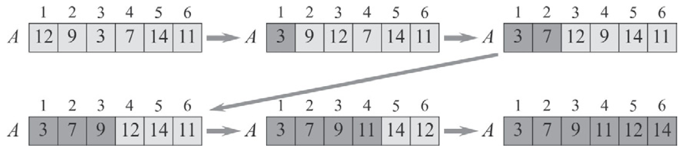
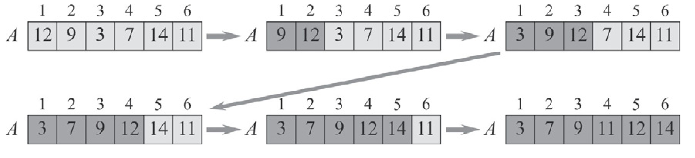
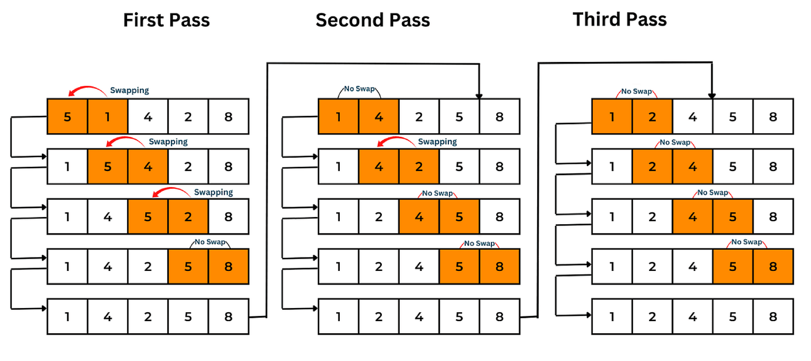

# Aula 13: Ordenação básica

## 1. Motivação

Até agora, estudamos diversas estruturas de dados como Filas, Pilhas e Listas, onde o foco era a inserção, remoção e busca de elementos de forma eficiente.
No entanto, há cenários onde a ordem dos elementos é mais importante do que a rapidez na inserção ou remoção.

### Por que ordenar é importante?

Imagine um sistema de busca de produtos em um e-commerce.
Se os produtos estiverem ordenados por preço ou relevância, a busca será muito mais eficiente e rápida.
Da mesma forma, um hospital pode ordenar pacientes por prioridade de atendimento.

Ordenar os dados é essencial para:
* Permitir buscas mais eficientes (utilizando busca binária, por exemplo);
* Definir uma ordem de prioridade;
* Facilitar a análise estatística dos dados (exemplo: encontrar a mediana).

### Relembrando a busca binária

A busca binária é um dos principais motivos para manter dados ordenados.
Diferente da busca linear, que verifica elemento por elemento, a busca binária segue os seguintes passos:

1. Verifica o elemento central da lista.
2. Se for o elemento buscado, retorna sua posição.
3. Se for menor, descarta a metade superior e repete o processo na metade inferior.
4. Se for maior, descarta a metade inferior e repete o processo na metade superior.



(Fonte: https://willsena.dev/algoritmo-de-busca-binaria-binary-search/)

#### Algoritmo

```cpp
int binarySearch(int arr[], int n, int x) {
    int left = 0;
    int right = n - 1;

    while (left <= right) {
        int mid = left + (right - left) / 2;

        // Verificar se o elemento alvo está no meio
        if (arr[mid] == x) {
            return mid; // Retorna o índice do elemento encontrado
        }

        // Ajustar os limites com base na comparação
        if (arr[mid] < x) {
            left = mid + 1; // Foco na metade direita
        } else {
            right = mid - 1; // Foco na metade esquerda
        }
    }

    return -1; // Retorna -1 se o elemento não for encontrado
}
```

#### Complexidade
- Melhor caso: $\Omega(1)$ (quando o elemento está no meio)
- Caso médio e pior caso: \( O(\log n) \)

#### Exemplo
Dado um array ordenado `[1, 3, 5, 7, 9, 11, 13]`, para encontrar o número `7`:
1. Olhamos para o meio (`7`). Como é o valor procurado, retornamos sua posição.

## 2. Casos de uso

A ordenação é fundamental em diversos cenários, tais como:
- **Busca eficiente**: Algoritmos como busca binária se tornam viáveis apenas em conjuntos ordenados.
- **Estatísticas**: Cálculo de percentis, mediana e outras métricas depende da ordenação.
- **Visualização de dados**: Apresentação ordenada de informações facilita a análise e interpretação.
- **Simplificação de algoritmos**: Muitos algoritmos têm versões mais eficientes quando os dados estão ordenados (E.g: Remoção de duplicatas).
- **Compressão de dados**: Dados ordenados podem ser compactados de forma mais eficiente (E.g: Run-Length Encoding (RLE)).
- **Machine Learning**: Alguns modelos e técnicas requerem dados ordenados para melhor desempenho (E.g: Clustering).

## 3. Características relevantes

A utilidade dos algoritmos de ordenação podem ser medidos através de diferentes critérios:

- **Complexidade de tempo**:
O mais natural, mede o desempenho do algoritmo em relação ao tamanho da entrada.

- **Complexidade de espaço**:
A quantidade de espaço adicional de memória necessária (além do array de entrada).

- **Estabilidade**:
Se mantém a ordem relativa de elementos iguais na entrada.

- **In-place vs Out-of-place**:
  - *In-place*: Não requer memória extra significativa.
  - *Out-of-place*: Requer uma estrutura auxiliar para armazenar os elementos ordenados.

- **Adaptabilidade**:
Algoritmos adaptáveis ajustam sua eficiência com base no nível de ordenação inicial dos dados.

- **Paralelização**:
Alguns algoritmos podem ser otimizados para processamento paralelo.

- **Performance em diferentes tamanhos de entrada**:
Alguns algoritmos são mais adequados para entradas pequenas, enquanto outros lidam melhor com grandes volumes de dados.

## 4. Algoritmos Simples de Ordenação

Vamos explorar três algoritmos fundamentais, destacando suas características e analisando sua complexidade computacional.

### 4.1 Selection Sort

#### Funcionamento
1. Percorre a lista e encontra o menor elemento.
2. Troca esse elemento com o primeiro da lista.
3. Repete o processo para os elementos restantes.



#### Algoritmo

```c
void selectionSort(int arr[], int n) {
    int minIndex, temp;

    // Percorrer o array
    for (int i = 0; i < n - 1; i++) {
        // Encontrar o menor elemento na parte não ordenada
        minIndex = i;
        for (int j = i + 1; j < n; j++) {
            if (arr[j] < arr[minIndex]) {
                minIndex = j;
            }
        }

        // Trocar o menor elemento com o primeiro elemento
        temp = arr[minIdx];
        arr[minIdx] = arr[i];
        arr[i] = temp;
    }
}
```

#### Características
- Complexidade de tempo: $O(n^2)$ no pior e no melhor caso.
- Complexidade de espaço: $O(1)$ (in-place).
- Estabilidade: Não é estável (trocas podem alterar a ordem de elementos iguais).
- Adaptabilidade: Não adaptável (Disclaimer: Apenas pensando na versão original).

### 4.2 Insertion Sort

#### Funcionamento
1. Considera o primeiro elemento como ordenado.
2. Insere o próximo elemento na posição correta dentro da parte ordenada.
3. Repete o processo para todos os elementos.



#### Algoritmo
```cpp
void insertionSort(int arr[], int n) {
    int current;
    for (int i = 1; i < n; i++) {
        current = arr[i];
        j = i - 1;

        // Mover os elementos maiores que "current" uma posição à frente
        while (int j >= 0 && arr[j] > current) {
            arr[j+1] = arr[j];
            j-=1;
        }
        arr[j+1] = current;
    }
}
```


#### Características
- Complexidade de tempo: $O(n^2)$ no pior caso, $\Omega(n)$ no melhor caso (quando já ordenado).
- Complexidade de espaço: $O(1)$ (in-place).
- Estabilidade: Sim.
- Adaptabilidade: Sim, eficiente para entradas parcialmente ordenadas.

### 4.3 Bubble Sort

#### Funcionamento
1. Percorre a lista e compara pares de elementos adjacentes, trocando-os se estiverem fora de ordem.
2. Repete o processo até que nenhuma troca seja necessária.




(Fonte: https://blog.suniltechtips.com/bubble-sort-algorithm-and-its-js-implementation-aa67fa406f62)

#### Algoritmo

```cpp
void bubbleSort(int arr[], int n) {
    int temp;
    for (int i = 0; i < n - 1; i++) {
        for (int j = 0; j < n - i - 1; j++) {
            if (arr[j] > arr[j + 1]) {
                // Trocar os elementos adjacentes se estiverem na ordem errada
                temp = arr[j];
                arr[j] = arr[j + 1];
                arr[j + 1] = temp;
            }
        }
    }
}
```

#### Características
- Complexidade de tempo: $O(n^2)$ no pior, $\Omega(n)$ no melhor caso.
- Complexidade de espaço: $O(1)$ (in-place).
- Estabilidade: Sim.
- Adaptabilidade: Sim, pois pode parar antecipadamente se os dados já estiverem ordenados.

Esses algoritmos, embora didáticos, são ineficientes para grandes conjuntos de dados. Em aulas futuras, abordaremos algoritmos mais avançados, como Merge Sort e Quick Sort, que possuem melhor desempenho.

### Comparação dos Algoritmos

| Algoritmo      | Complexidade (Melhor Caso) | Complexidade (Pior Caso) | Estável? | In-place? |
|----------------|----------------------------|--------------------------|----------|-----------|
| Selection Sort | $\Omega(n^2)$              | $O(n^2)$                 | Não      | Sim       |
| Insertion Sort | $\Omega(n)$                | $O(n^2)$                 | Sim      | Sim       |
| Bubble Sort    | $\Omega(n)$                | $O(n^2)$                 | Sim      | Sim       |

Esses algoritmos, embora didáticos, são ineficientes para grandes conjuntos de dados. Em aulas futuras, abordaremos algoritmos mais avançados, como Merge Sort e Quick Sort, que possuem melhor desempenho.

