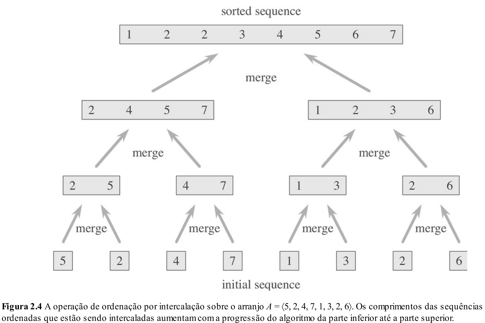
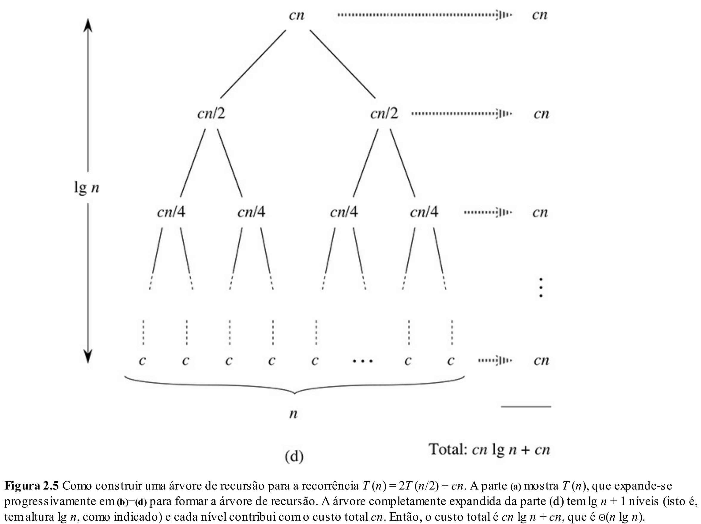

# Aula 15: Ordenação Avançada

## 1. Motivação

Antes da semana de provas, discutimos as formas mais simples de ordenar uma lista, utilizando algoritmos como `Selection Sort` e `Bubble Sort`.
Embora esses algoritmos sejam intuitivos, eles têm algumas características importantes:
* **Memória constante**: não é necessário fazer uma cópia do array.
* **Estabilidade**: mantêm a ordem relativa de elementos com o mesmo valor.

No entanto, esses algoritmos têm um problema principal: sua complexidade temporal é $O(n^2)$.
Isso significa que, para listas maiores, o tempo de execução cresce muito rapidamente.

Por isso, o foco dessa aula será apresentar um dos algoritmos de ordenação mais eficientes: `Merge Sort`.

Antes de explorarmos o Merge Sort, vamos revisar dois conceitos importantes que serão fundamentais para entendê-lo: `Recursão` e `Divisão e Conquista`.

## 2. Recursão

Vamos começar com um exemplo simples de recursão: construir uma pirâmide de caracteres `#`.

Queremos construir algo como:

```python
1: #
2: ##
3: ###
4: ####
5: #####
```

Uma forma natural de fazer isso é usando uma abordagem iterativa, percorrendo todos os andares:

```cpp
void exibirPiramide(int n) {
    for(int i = 0; i < n; i++) {          // Predio
        for(int j = 0; j < i + 1; j++) {  // Andar
            printf("#");
        }
        printf("\n");
    }
}
```

No entanto, podemos olhar para a pirâmide de uma forma diferente:
* Uma pirâmide de tamanho $n$ nada mais é do que uma pirâmide de tamanho $n-1$, seguida pelo andar número $n$.

Ou seja, podemos escrever a relação:

$$exibirPiramide(n) = exibirPiramide(n−1) + andar(n)$$

Essa é exatamente a ideia da **recursão**:
uma função que se define em termos de si mesma.

Cada nível da pirâmide chama a função para exibir a pirâmide menor até chegar em um caso base — a situação mais simples, que pode ser resolvida diretamente.

No nosso caso, o caso base seria exibir uma pirâmide vazia (tamanho $0$), ou ainda uma pirâmide de tamanho $1$.

Aqui está como ficaria a implementação recursiva:

```cpp

void exibirAndar(int n) {
    for(int j = 0; j < i + 1; j++) {  // Andar
        printf("#");
    }
    printf("\n");
}

void exibirPiramide(int n) {
    if(n == 0) {            // Caso base: pirâmide vazia
        return;
    }
    exibirPiramide(n - 1);  // Exibe a pirâmide menor
    exibirAndar(n);         // Depois adiciona o novo andar
}
```

### Como Funciona a Recursão

De forma geral, uma função recursiva é formada por duas partes essenciais:
* **Chamada Recursiva**: A função chama a si mesma para resolver uma versão menor do mesmo problema.
* **Caso Base**: A condição de parada da recursão — um problema pequeno o suficiente para ser resolvido diretamente, sem chamadas adicionais.

Se não existir um caso base, ou se ele nunca for alcançado, a recursão se tornará infinita, resultando em erro de execução (ex.: stack overflow).

### Exemplo prático: Busca Binária

Outro exemplo clássico de recursão é a Busca Binária.

A Busca Binária serve para encontrar um elemento em um vetor ordenado de forma eficiente:
* Dividimos o vetor no meio.
* Comparamos o elemento do meio com o que queremos encontrar.
* Dependendo do valor, buscamos recursivamente na metade esquerda ou direita.

Aqui está a versão recursiva da busca binária:

```cpp
int binarySearchRecursive(int arr[], int x, int i, int j) {
    if (i > j) {
        return 0;  // Elemento não encontrado
    }
    int mid = (i + j) / 2;
    if (arr[mid] == x) {
        return 1;  // Elemento encontrado
    } else if (arr[mid] < x) {   // Busca na metade direita
        return binarySearchRecursive(arr, x, mid + 1, j);
    } else {                     // Busca na metade esquerda
        return binarySearchRecursive(arr, x, i, mid - 1);
    }
}
```

Observe novamente a estrutura:
* **Caso base**: quando $i > j$ (não existe mais intervalo para buscar).
* **Chamada recursiva**: busca no subintervalo correto (esquerda ou direita).

## 3. Divisão e Conquista

Aproveitando o gancho do exemplo da busca binária, podemos observar que algoritmos recursivos muitas vezes resolvem problemas grandes lidando primeiro com subproblemas menores e intimamente relacionados.

No caso da **Busca Binária**, o objetivo é encontrar um número em uma lista ordenada.
Em vez de percorrer toda a lista, a busca binária divide o problema em três possibilidades:
* O elemento procurado é o do meio da lista (resolvemos imediatamente).
* O elemento está na metade esquerda da lista (chamamos a busca recursivamente para a metade esquerda).
* O elemento está na metade direita da lista (chamamos a busca recursivamente para a metade direita).

Essa estratégia de dividir o problema em partes menores é conhecida como o paradigma de **Divisão e Conquista**.

### O que é Divisão e Conquista?

Divisão e Conquista é uma forma poderosa de projetar algoritmos mais eficientes:
* Dividem o problema em vários subproblemas menores, semelhantes ao problema original.
* Resolvem os subproblemas recursivamente.
* Combinam as soluções dos subproblemas para resolver o problema maior.

Esse paradigma é especialmente útil para reduzir a complexidade temporal de algoritmos que, se resolvidos diretamente, seriam muito lentos.

### Três etapas fundamentais em Divisão e Conquista:
* **Dividir**: Particionar o problema em subproblemas menores (geralmente de tamanhos semelhantes).
* **Conquistar**: Resolver cada subproblema recursivamente. Quando os subproblemas são suficientemente simples, resolvemos diretamente (sem mais divisões).
* **Combinar**: Reunir as soluções dos subproblemas para formar a solução do problema original.

### Exemplos clássicos de algoritmos que usam Divisão e Conquista:

* **Busca Binária**: Divide o vetor e busca em uma das metades.
* **Merge Sort**: Divide o vetor em duas metades, ordena recursivamente e depois faz a junção ordenada (merge).
* **Multiplicação de Matrizes (Algoritmo de Strassen)**: Divide matrizes grandes em matrizes menores e combina os resultados com menos multiplicações.
* **Problema da Menor Distância Entre Pontos**: Divide o conjunto de pontos em duas partes e combina considerando pontos próximos da linha divisória.
* **Cálculo do Convex Hull (Casco Convexo)**: Divide o conjunto de pontos e constrói o casco convexo de maneira eficiente.

## 4. Merge sort

Como podemos aplicar a estratégia de Divisão e Conquista para ordenar uma lista?

Imagine que:
* Dividimos o array original em duas partes menores.
* De alguma forma mágica, conseguimos ordenar essas duas partes separadamente.

Agora, a pergunta é: **Como combinar duas sublistas já ordenadas para formar uma lista ordenada maior?**

É aqui que entra o merge.

Abaixo está uma função para unir (merge) duas listas ordenadas:

```cpp
int* merge(int arr1[], int n, int arr2[], int m) {
    int* mArr = new int[m+n];
    int i = 0, j = 0;
    while (i < n && j < m) {
        if (arr1[i] < arr2[j]) {
            mArr[i+j] = arr1[i];
            i++;
        } else {
            mArr[i+j] = arr2[j];
            j++;
        }
    }
    while (i < n) {
        mArr[i+j] = arr1[i];
        i++;
    }
    while (j < m) {
        mArr[i+j] = arr2[j];
        j++;
    }
    return mArr;
}
```

Veja que:
* Enquanto existirem elementos nos dois arrays, comparamos os menores elementos e escolhemos o menor para a posição atual.
* Se algum dos arrays acabar antes, simplesmente copiamos o restante do outro.

Ou seja: **sabemos como combinar duas listas ordenadas de maneira eficiente!**

Agora vem a pergunta:
**Como garantir que os dois subarrays estejam ordenados?**

A resposta é: aplicamos o mesmo processo recursivamente!
Dividimos o array original em duas partes, **ordenamos cada parte separadamente usando Merge Sort** (recursivamente), e então **juntamos** usando o `merge`.

E se quebrássemos o array em duas partes, depois quebrássemos essas partes novamente, e continuássemos quebrando... até que cada pedaço tivesse apenas um único elemento?

Um array com apenas um elemento já está naturalmente ordenado, certo?



### Implementação

```cpp
int* mergeSort(int arr[], int n) {                  // Custo  | Vezes
    if (n == 1) {                                   // O(1)   | 1 (caso base)
        int* single = new int[1];                   // O(1)   | 1
        single[0] = arr[0];                         // O(1)   | 1
        return single;                              // O(1)   | 1
    }
    
    int mid = n / 2;                                // O(1)   | 1
    int* left = mergeSort(arr, mid);                // T(n/2) | 1
    int* right = mergeSort(arr + mid, n - mid);     // T(n/2) | 1
    
    int* sorted = merge(left, mid, right, n - mid); // O(n)   | 1

    delete[] left;                                  // O(n/2) | 1
    delete[] right;                                 // O(n/2) | 1
    
    return sorted;                                  // O(1)   | 1
}
```

### Análise de Complexidade

Será que esse método é mais eficiente do que os algoritmos que vimos anteriormente, como Selection Sort e Bubble Sort?

Vamos calcular:
* A cada nível de recursão, o array é dividido em duas partes ($\log⁡(n)$ divisões).
* Em cada nível, o processo de merge percorre todos os elementos ($O(n)$).

Portanto, a complexidade é:
$$O(n\log⁡(n))$$

Muito melhor do que o $O(n^2)$ dos algoritmos básicos!



### Vantagens e Desvantagens do Merge Sort

Vantagens:
* Complexidade de tempo $O(n\log⁡(n))$ garantida, independentemente da entrada.
* É estável (mantém a ordem dos elementos iguais).
* Altamente paralelizável: as divisões podem ser feitas em paralelo.

Desvantagens:
* Não é um algoritmo in-place: precisa de memória adicional proporcional ao tamanho da entrada ($O(n)$).
* A gestão de memória (alocação e desalocação) pode impactar o desempenho para entradas muito grandes.

### E é possível fazer melhor?

Será que existe uma abordagem que:
* Seja tão eficiente quanto Merge Sort ($O(n\log⁡(n))$),
* Mas que use memória constante ($O(1)$)?

Sim!
Essa é justamente a ideia do Quick Sort, que vamos estudar na disciplina de Análise de Algoritmos.
